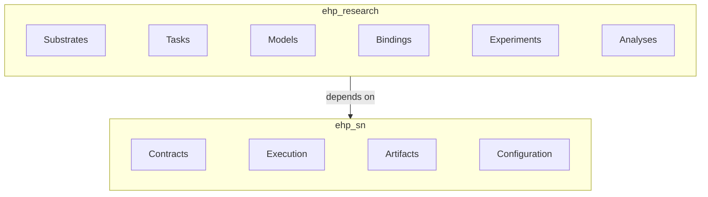

# EHP-SN

<div align="center">

[](https://www.gnu.org/licenses/gpl-3.0)
[](https://www.python.org/)
[](./README.md#current-status)
[](https://ehp-sn.readthedocs.io)

</div>

EHP-SN is a Python framework for developing and studying models of spatial navigation, relational memory, and structural reasoning. The name stands for Entorhinal–Hippocampal–Prefrontal Spatial Navigation, after the brain circuits that inspire its design.

It supports researchers working with TEM, HRM, and integrated EHP models — providing the substrates, tasks, training protocols, metrics, traces, and analyses needed to train and evaluate them.

EHP-SN is developed specification-first: the READMEs describe the intended workflow and architecture. Features documented here may not yet be implemented — see the status table for what is ready.

---

## Contents

- [Packages](#packages)
- [Quick Start](#quick-start)
- [Core Workflow](#core-workflow)
- [Current Status](#current-status)
- [Architecture](#architecture)
- [Repository Structure](#repository-structure)
- [Technology](#technology)
- [Installation](#installation)
- [Testing](#testing)
- [Documentation](#documentation)
- [Citation](#citation)
- [License](#license)

---

## Packages

The repository contains two installable Python packages.

### `ehp_sn`

The reusable framework package.

It defines the contracts and services for:

- scientific components and experiment composition;
- task–model compatibility;
- training and evaluation;
- reproducibility and artifact manifests;
- configuration and runtime integration;
- artifact inspection and analysis execution.

See [`packages/ehp-sn/README.md`](packages/ehp-sn/README.md).

### `ehp_research`

The concrete research package.

It contains:

- substrates such as OpenField and DagFlow;
- tasks such as Arena, Goaltrace, Prospect, Routebind, and Maze-Hard;
- TEM, HRM, and EHP model families;
- supported task–model bindings;
- experiment definitions;
- metrics and scientific analyses.

See [`packages/ehp-research/README.md`](packages/ehp-research/README.md).

The dependency direction is:

```text id="rotfve"
ehp_research → ehp_sn
```

`ehp_sn` must not depend on `ehp_research`.

## Quick start

The planned API for an Arena–TEM experiment:

```python id="ssxwh3"
from ehp_sn import evaluate, train
from ehp_sn.protocols import TrainingProtocol
from ehp_sn.reproducibility import SeedConfiguration
from ehp_research.experiments.arena_tem import arena_tem_v1

experiment = arena_tem_v1(
    training=TrainingProtocol(
        max_steps=50_000,
    ),
)

training = train(
    experiment,
    seeds=SeedConfiguration.from_master(42),
    runtime="cuda",
    tracking="local",
    output="runs/arena-tem-v1",
)

evaluation = evaluate(
    experiment,
    checkpoint=training.best_checkpoint,
    regime="test",
    seeds=SeedConfiguration.from_master(43),
)

print(evaluation.metrics)
```

The experiment factory supplies the standard Arena–TEM components, evaluation regimes, metrics, and traces.

The same workflow, expressed through the CLI:

```bash
ehp-sn train run experiment:arena-tem/v1 \
    --set protocol.training.max_steps=50000 \
    --seed 42 \
    --device cuda
```

See the [CLI reference](docs/docs/interfaces/cli/_index.md) for the full command grammar.

Both paths use the same constructors and validation. These examples show the target interface; they become runnable as each component is implemented.

## Core workflow

```text id="hgeas5"
compose an experiment
    ↓
train or evaluate it
    ↓
commit an authoritative artifact
    ↓
inspect or analyse recorded results
```

An experiment defines the scientific composition. Training and evaluation requests layer on runtime settings — hardware, seeds, tracking, checkpoints, and artifact destinations. Each execution produces a run record backed by an authoritative artifact manifest.

The [framework README](packages/ehp-sn/README.md) defines these concepts in detail.

## Current status

EHP-SN is currently in specification-first development.

| Area                                                 | Status                 |
| ---------------------------------------------------- | ---------------------- |
| Framework concepts and public workflow               | Specified              |
| Component identity and compatibility                 | Specified              |
| Training and evaluation interfaces                   | Specified              |
| Artifact and reproducibility boundaries              | Specified              |
| Lightning Fabric and Hydra integrations              | Specified              |
| Arena–TEM vertical integration                       | Specified              |
| Goaltrace–HRM vertical integration                   | Specified              |
| Generalized studies, reporting, and registry support | Provisional or planned |

**Specified**: the semantics and responsibilities are documented. Implementation and validation are separate, later stages.

The initial implementation sequence is:

```text id="2a4l14"
OpenField
→ Arena
→ TEM
→ Arena–TEM
```

followed by:

```text id="ov6g9f"
DagFlow
→ Goaltrace
→ HRM
→ Goaltrace–HRM
```

## Architecture



## Repository structure

```text id="c9qplu"
repository/
├── packages/
│   ├── ehp-sn/
│   └── ehp-research/
├── config/
├── experiments/
├── studies/
├── scripts/
├── tests/
└── docs/
```

| Path                     | Purpose                                                    |
| ------------------------ | ---------------------------------------------------------- |
| `packages/ehp-sn/`       | Framework: contracts, execution, configuration, artifacts  |
| `packages/ehp-research/` | Research: substrates, tasks, models, bindings, experiments |
| `config/`                | Workspace, reproduction, and study configuration           |
| `experiments/`           | Fixed reproduction assets                                  |
| `studies/`               | Optimisation-study assets                                  |
| `scripts/`               | Maintenance and operational scripts                        |
| `tests/`                 | Cross-package and workflow tests                           |
| `docs/`                  | Detailed scientific and framework documentation            |

## Technology

EHP-SN builds on:

- **PyTorch** for tensor computation and model definition;
- **Lightning Fabric** as the runtime backend (device placement, precision, distribution);
- **Hydra** as the configuration frontend;
- **Pydantic** at external and serialized boundaries;
- **MLflow Tracking** and **TorchMetrics** as optional adapters;
- **Typer** for the planned CLI.

These tools provide infrastructure behind EHP-SN-owned scientific contracts and artifact semantics.

## Installation

Requirements:

- Python 3.12 or later

Create and activate a virtual environment:

```bash id="j6hzvv"
python -m venv .venv
```

Install both packages in editable mode:

```bash id="6575e5"
python -m pip install -e packages/ehp-sn
python -m pip install -e packages/ehp-research
```

Development dependencies and optional integrations are defined in the repository and package configuration.

## Testing

Run the available tests from the repository root:

```bash id="757q5c"
python -m pytest
```

Tests are added alongside implemented components and workflows.

Documented quick starts become executable documentation or integration tests when the corresponding capabilities are implemented.

## Documentation

- [Framework concepts and public workflow](packages/ehp-sn/README.md)
- [Research components and experiment families](packages/ehp-research/README.md)
- [Project documentation](docs/)
- [Reproduction assets](experiments/)
- [Optimisation studies](studies/)

## Citation

A canonical software citation will be provided with the first reference release.

Until then, cite the scientific task, model, and experiment publications identified in the corresponding documentation.

## License

EHP-SN is licensed under the GNU General Public License v3.0. See [`LICENSE`](LICENSE).
