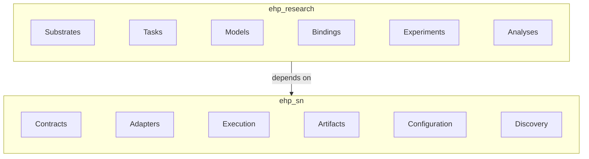

# EHP-SN

<div align="center">

[](https://www.gnu.org/licenses/gpl-3.0)
[](https://www.python.org/)
[](#current-status)
[](https://ehp-sn.readthedocs.io)

</div>

EHP-SN — Entorhinal–Hippocampal–Prefrontal Spatial Navigation — is a Python research framework for studying spatial navigation, relational memory, and structural reasoning.

The repository separates reusable framework contracts from concrete scientific components:

```text
ehp_research → ehp_sn
```

- [`ehp_sn`](packages/ehp-sn/README.md) provides the reusable framework.
- [`ehp_research`](packages/ehp-research/README.md) provides the concrete research programme.

EHP-SN is developed specification-first. READMEs provide orientation and examples; normative semantics live in the detailed specifications referenced from [`docs/authority.md`](docs/authority.md).

## Contents

- [Packages](#packages)
- [Core workflow](#core-workflow)
- [Quick start](#quick-start)
- [Architecture](#architecture)
- [Repository structure](#repository-structure)
- [Current status](#current-status)
- [Technology](#technology)
- [Installation](#installation)
- [Testing](#testing)
- [Documentation](#documentation)
- [Citation](#citation)
- [License](#license)

## Packages

### `ehp_sn`

`packages/ehp-sn/` contains the reusable framework.

Its responsibilities include:

- generic Task, Model, Adapter, Binding, Experiment, and request contracts;
- resource requirements and configuration resolution;
- training, evaluation, analysis, and reporting orchestration;
- generated-data and task-corpus contracts;
- artifact identity, provenance, validation, and inspection;
- public Python and CLI interfaces;
- component registration and discovery contracts.

See [`packages/ehp-sn/README.md`](packages/ehp-sn/README.md).

### `ehp_research`

`packages/ehp-research/` contains concrete scientific definitions.

It includes:

- task-neutral substrates;
- navigation and structural-reasoning tasks;
- TEM, HRM, and integrated EHP model families;
- resolved task–model bindings, composed from framework adapters;
- objectives, metrics, and analyses;
- reusable experiment definitions;
- research-specific study definitions.

See [`packages/ehp-research/README.md`](packages/ehp-research/README.md).

## Core workflow

EHP-SN distinguishes reusable task-neutral data from task-specific scientific corpora.

```text
external / procedural sources
        ↓
substrates
        ↓
TaskCorpus generation
        ↓
training / evaluation
        ↓
analysis
        ↓
reporting
```

The public CLI exposes the same lifecycle as:

```text
data → tasks → train → evaluate → analyze → report
```

### Data and task corpora

Substrates represent reusable domain structure and are stored under:

```text
data/interim/
```

Task builders compose compatible upstream resources and materialize self-contained task corpora under:

```text
data/processed/
```

Exact scientific resource selection is resolved through configuration so that plans and resulting artifacts remain reproducible.

Detailed substrate, corpus, identity, and configuration semantics are defined in the framework and research specifications rather than in this README.

## Quick start

The public CLI follows:

```text
ehp-sn COMMAND OPERATION [TARGET] [OPTIONS]
```

Common operations include:

```text
list
show
plan
validate
build
run
inspect
```

Examples:

```bash
ehp-sn data list
ehp-sn tasks list
ehp-sn train show experiment:arena-tem/v1
ehp-sn train plan experiment:arena-tem/v1
```

Operation-specific configuration may be supplied with the public configuration interface, for example:

```bash
ehp-sn train plan experiment:arena-tem/v1 --config PATH
```

The Python and CLI interfaces are intended to resolve through the same framework semantics rather than implementing separate execution models.

Concrete executable examples should be taken from the corresponding interface and experiment documentation because EHP-SN is still under specification-first development.

## Architecture



The framework defines reusable contracts and lifecycle mechanics while the research package implements concrete scientific definitions against those contracts.

Semantic ownership is documented in [`docs/authority.md`](docs/authority.md).

Cross-cutting architectural conditions are documented in [`docs/invariants.md`](docs/invariants.md).

Questions that are recorded but not yet decided are listed in [`docs/decisions.md`](docs/decisions.md).

## Repository structure

```text
repository/
├── .github/
├── artifacts/
├── config/
├── data/
│   ├── external/
│   ├── interim/
│   ├── processed/
│   └── raw/
├── docs/
│   ├── authority.md
│   ├── invariants.md
│   ├── decisions.md
│   ├── mkdocs.yml
│   └── docs/
├── logs/
├── models/
├── packages/
│   ├── ehp-sn/
│   └── ehp-research/
├── tests/
│   ├── architecture/
│   └── integration/
└── pyproject.toml
```

| Path                     | Purpose                                         |
| ------------------------ | ----------------------------------------------- |
| `packages/ehp-sn/`       | Reusable framework package                      |
| `packages/ehp-research/` | Concrete scientific package                     |
| `data/interim/`          | Committed reusable substrate artifacts          |
| `data/processed/`        | Committed task corpora                          |
| `config/`                | Workspace and operation configuration           |
| `artifacts/`             | Framework-produced execution/analysis artifacts |
| `tests/architecture/`    | Cross-package architecture invariants           |
| `tests/integration/`     | End-to-end workflow tests                       |
| `docs/`                  | Documentation project and governance            |
| `.github/`               | Repository automation and Copilot instructions  |

## Current status

EHP-SN is in specification-first development.

`Specified` means that intended semantics and responsibilities are documented. It does not by itself mean that a capability is implemented, validated, or supported as a stable user interface.

Component and capability status should be taken from the corresponding authoritative specifications rather than duplicated in this README.

## Technology

The project uses or plans to use infrastructure such as:

- PyTorch for tensor and model computation;
- Lightning Fabric for runtime execution;
- Hydra as an internal configuration/composition backend where appropriate;
- Pydantic for serialized and external-boundary validation;
- Typer for the CLI frontend;
- optional MLflow, TorchMetrics, and Optuna integrations.

These libraries support EHP-SN-owned contracts; they do not define the project’s scientific semantics.

## Installation

Requirements:

- Python 3.12 or later.

For editable development installation:

```bash
python -m pip install -e packages/ehp-sn
python -m pip install -e packages/ehp-research
```

## Testing

Run tests from the repository root:

```bash
python -m pytest
```

Architecture tests should enforce cross-package invariants such as the dependency direction and other deterministic repository contracts.

Run static checks (configured in [`pyproject.toml`](pyproject.toml) `[tool.ruff]`) from the repository root:

```bash
python -m ruff check packages
```

Run type checks (configured in [`pyproject.toml`](pyproject.toml) `[tool.mypy]`) from the repository root, one package at a time to avoid a duplicate top-level `src` module name across packages:

```bash
python -m mypy packages/ehp-sn/src
python -m mypy packages/ehp-research/src
```

## Documentation

Start with:

- [`docs/docs/index.md`](docs/docs/index.md) — published documentation entry point;
- [`docs/authority.md`](docs/authority.md) — semantic ownership and normative authority;
- [`docs/invariants.md`](docs/invariants.md) — repository-wide invariants and their checks;
- [`docs/decisions.md`](docs/decisions.md) — open architectural decisions;
- [`docs/README.md`](docs/README.md) — documentation contributor guide;
- [`packages/ehp-sn/README.md`](packages/ehp-sn/README.md) — framework orientation;
- [`packages/ehp-research/README.md`](packages/ehp-research/README.md) — research-package orientation.

## Citation

A canonical software citation will be provided with the first reference release.

Until then, cite the scientific task, model, and experiment publications identified in the corresponding research documentation.

## License

EHP-SN is licensed under the GNU General Public License v3.0. See [`LICENSE`](LICENSE).
