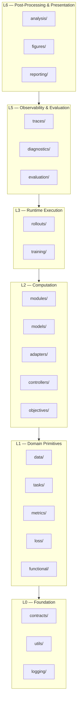

# Design Documents

<!-- canonical_package: ehp_sn  authority: canonical -->

> Architecture and design contracts for every subsystem in `ehp_sn`.

---

## Layer model



> **Note:** L4 is intentionally reserved for future layers (e.g. distributed execution, multi-agent coordination). The jump from L3 to L5 is intentional. L4 will be activated when ≥2 packages require it with distinct ownership boundaries.

**Backend adapters** (`lightning/`) form a sidecar boundary outside the domain layer stack. Lightning depends on domain packages; no domain package depends on Lightning.

## Canonical invocation chain

```
rollout runner → controller.step(step_input, carry, *)        ← StepController protocol (consumer-owned by rollouts)
    → adapter(model, task_input, model_state)                   ← BridgeAdapter protocol (consumer-owned by controllers)
        → model(input, model_state) → output, next_model_state ← direct call (adapters import models)
    → adapter.postprocess(output) → bridge_output
→ (carry, controller_output)
```

Concrete implementations are wired together in composition roots (`experiments/` — scaffold exists, target Q4 2026), not imported by the runtime packages that invoke them.

| Concern                     | Owner         |
| --------------------------- | ------------- |
| Repeated temporal iteration | `rollouts`    |
| One-step control transition | `controllers` |
| Task-to-model translation   | `adapters`    |
| Neural computation          | `models`      |

## Document index

| Layer | Document                                 | Package              | Summary                                                      |
| ----- | ---------------------------------------- | -------------------- | ------------------------------------------------------------ |
| L0    | [Contracts](contracts.md)                | `ehp_sn.contracts`   | Stable semantic boundaries, layer model, concept ownership   |
| L0    | [Logging](logging.md)                    | `ehp_sn.logging`     | Operational event infrastructure                             |
| L0    | [Utilities](utils.md)                    | `ehp_sn.utils`       | Domain-neutral tensor, tree, and graph primitives            |
| L1    | [Data](data.md)                          | `ehp_sn.data`        | Dataset identity, build/runtime planes, storage              |
| L1    | [Tasks](tasks.md)                        | `ehp_sn.tasks`       | Task identity, semantic contracts, target derivation         |
| L1    | [Metrics](metrics.md)                    | `ehp_sn.metrics`     | Metric formulas, sufficient statistics, catalogue            |
| L1    | [Loss](loss.md)                          | `ehp_sn.loss`        | Pure differentiable mathematical primitives                  |
| L2    | [Modules](modules.md)                    | `ehp_sn.modules`     | Reusable neural building blocks                              |
| L2    | [Models](models.md)                      | `ehp_sn.models`      | Complete parameterized architectures                         |
| L2    | [Adapters](adapters.md)                  | `ehp_sn.adapters`    | Task–model translation, bridge outputs                       |
| L2    | [Controllers](controllers.md)            | `ehp_sn.controllers` | One-step control transitions                                 |
| L2    | [Objectives](objectives.md)              | `ehp_sn.objectives`  | Differentiable scoring, composite objectives                 |
| L3    | [Rollouts](rollouts.md)                  | `ehp_sn.rollouts`    | Temporal execution kernel                                    |
| L3    | [Training](training.md)                  | `ehp_sn.training`    | Training execution policy                                    |
| —     | [Lightning](lightning.md)                | `ehp_sn.lightning`   | Backend adapter for PyTorch Lightning (sidecar, L3 boundary) |
| L5    | [Traces](traces.md)                      | `ehp_sn.traces`      | Scientific trace capture, storage, reading                   |
| L5    | [Diagnostics](diagnostics.md)            | `ehp_sn.diagnostics` | Model internals inspection, health checks                    |
| L5    | [Evaluation](evaluation.md)              | `ehp_sn.evaluation`  | Evaluation specification and orchestration                   |
| L6    | [Analysis](analysis.md)                  | `ehp_sn.analysis`    | Post-evaluation scientific interpretation                    |
| L6    | [Figures](figures.md)                    | `ehp_sn.figures`     | Deterministic visualization over analysis data               |
| L6    | [Reporting](reporting.md)                | `ehp_sn.reporting`   | Report composition, serialisation, publication               |
| L1    | `functional.md` (scaffold, impl Q3 2026) | `ehp_sn.functional`  | Stateless tensor encoding functions                          |
| —     | `experiments.md` (planned, scaffold)     | `ehp_sn.experiments` | Task–model–version composition roots, builder functions      |
