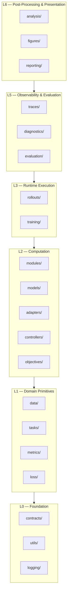

# Contract Architecture

<!-- canonical_package: ehp_sn  authority: canonical  status: accepted -->

> Canonical design for `ehp_sn.contracts` — the stable semantic boundaries between independently owned subsystems.

---

## 1. Layer model



**Rule:** Higher layer → same or lower layer. Packages may skip intermediate layers. Individual package allowlists are authoritative.

**Backend adapters** (`lightning/`) form a sidecar boundary. Lightning imports domain packages to wrap them; no domain package (L0–L3, L5–L6) may import from `lightning/`.

Every package in L1–L6 may import from `contracts/` (public API only) and `logging/` (logger acquisition only: `get_logger`, `logging_context`, `bind_context`). L0 packages depend only on stdlib + `structlog`.

---

## 2. Explicitly prohibited dependencies

| From          | To                                      | Reason                                                                                                                                      |
| ------------- | --------------------------------------- | ------------------------------------------------------------------------------------------------------------------------------------------- |
| `training`    | `lightning`                             | Training must remain backend-independent; Lightning implements `TrainingRuntime` protocol                                                   |
| `tasks`       | `models`                                | Tasks define semantics, not architecture                                                                                                    |
| `metrics`     | `models`                                | Metrics consume predictions, not models                                                                                                     |
| `figures`     | `evaluation`                            | Figures consume analysis data, not evaluation internals                                                                                     |
| `analysis`    | `evaluation` (execution)                | Analysis reads immutable artifacts via reader protocols. May import evaluation _contract types_ (`EvaluationResult`, `ArtifactRef`) as data |
| `objectives`  | `metrics`, `controllers`, `tasks`       | Objectives produce results; metrics consume them. Objectives consume `BridgeOutput` from adapters, not controller or task types directly    |
| `rollouts`    | `data`, `tasks`, `models`, `objectives` | Rollouts consumes abstract protocols (`Source`, `StepController`); never concrete domain implementations                                    |
| `controllers` | `models` (direct)                       | Controllers delegate model invocation to adapters through the `BridgeAdapter` protocol                                                      |

---

## 3. Concept ownership (authoritative)

| Concept                   | Owner         | Also referenced in                              | Notes                                                                                                                  |
| ------------------------- | ------------- | ----------------------------------------------- | ---------------------------------------------------------------------------------------------------------------------- |
| Metric definition         | `metrics`     | `evaluation`                                    | Metrics owns formulas; evaluation selects                                                                              |
| Rollout lifecycle         | `rollouts`    | `training`                                      | Rollouts owns carry; training owns TBPTT boundaries                                                                    |
| Task semantics            | `tasks`       | `adapters`, `evaluation`, `objectives`          | Tasks own meaning; `TaskRuntime` lives in `contracts/`, semantically task-owned                                        |
| Trace schema              | `traces`      | `analysis`, `figures`, `diagnostics`            | All read via `TraceArtifactReader` (consumer-owned by `analysis`) or `TraceStoreReader` (owned by `traces`)            |
| Artifact identity         | `contracts`   | `traces`, `evaluation`, `analysis`, `reporting` | `ArtifactKey`, `Provenance`, `ArtifactRef`                                                                             |
| Loss primitives           | `loss`        | `objectives`                                    | Loss owns pure math; objectives compose                                                                                |
| Model state               | `models`      | `controllers`, `rollouts`                       | Models own state type                                                                                                  |
| Controller state          | `controllers` | `rollouts`                                      | Controllers own decision state fields; rollouts own carry propagation                                                  |
| Model invocation          | `adapters`    | `controllers`                                   | Adapters own task→model translation; controllers delegate via `BridgeAdapter` protocol (consumer-owned by controllers) |
| Control decisions         | `controllers` | `rollouts`                                      | Controllers own halt/continue/action                                                                                   |
| Backward execution        | `training`    | `lightning`                                     | Training owns backward policy; Lightning executes primitive                                                            |
| Checkpoint emission       | `training`    | `lightning`, `evaluation`                       | Training owns when; Lightning owns storage integration; evaluation owns selection                                      |
| TBPTT boundaries          | `training`    | `rollouts`, `models`                            | Training owns when boundaries occur; rollouts owns carry transform; models own hooks                                   |
| Objective composition     | `objectives`  | `training`                                      | Objectives compute `ObjectiveResult`; training weights                                                                 |
| Validation scheduling     | `training`    | `lightning`                                     | Training owns validation config; Lightning owns callback hooks                                                         |
| Experiment wiring         | `experiments` | `lightning`, `evaluation`                       | Experiments own task–model–version composition                                                                         |
| Visualization             | `figures`     | `analysis`, `reporting`                         | Figures own visual encoding                                                                                            |
| Dataset identity          | `data`        | `tasks`, `training`                             | Data owns references; tasks own interpretation                                                                         |
| Operational logging       | `logging`     | All runtime packages                            | Logger acquisition only                                                                                                |
| Domain-neutral primitives | `utils`       | Multiple packages                               | Tensor validation, tree traversal, graph algorithms                                                                    |
| Backend adaptation        | `lightning`   | `training`, `models`, `objectives`              | Lightning is the consumer of domain APIs; domain never imports Lightning                                               |

---

## 4. Contract ownership categories

### 4.1 Foundation contracts (in `contracts/`)

Admission criteria: (1) multiple domain packages use it, (2) no single package semantically owns it, (3) no higher-level dependencies, (4) stable across implementations, (5) prevents a dependency cycle.

| Type                | Purpose                                                                                                                                                                                                                                                               |
| ------------------- | --------------------------------------------------------------------------------------------------------------------------------------------------------------------------------------------------------------------------------------------------------------------- |
| `ArtifactKey`       | Stable semantic identifier for one produced artifact                                                                                                                                                                                                                  |
| `ArtifactRef`       | Locator for one stored instance                                                                                                                                                                                                                                       |
| `Provenance`        | Immutable provenance metadata                                                                                                                                                                                                                                         |
| `RatioStat`         | Sufficient statistics for ratio-valued metrics (shared by `metrics`, `objectives`)                                                                                                                                                                                    |
| `SchemaVersion`     | Typed schema version identifier                                                                                                                                                                                                                                       |
| `TaskRuntime`       | Task-owned runtime boundary (semantically owned by `tasks`, placed here to avoid the cycle `tasks → contracts → tasks` that would occur if `TaskRuntime` lived in `tasks/` while `tasks/` imports `contracts/`). This is the only task-semantic type in `contracts/`. |
| `ContractViolation` | Contract error hierarchy                                                                                                                                                                                                                                              |

Capability protocols: `ArtifactReader`, `ArtifactWriter`, `Lifecycle`, `Resettable`.

### 4.2 Producer-owned contracts

| Producer      | Owns (producer-owned data types)                                  |
| ------------- | ----------------------------------------------------------------- |
| `rollouts`    | `StepRecord`, `RolloutResult`, `StepBoundary`                     |
| `objectives`  | `ObjectiveResult`, `TaskStepEvaluation`                           |
| `traces`      | `TraceSink`, `TraceArtifact`, `TraceObserver`, `TraceStoreReader` |
| `evaluation`  | `EvaluationPlan`, `EvaluationResult`                              |
| `analysis`    | `AnalysisPlan`, `AnalysisResult`                                  |
| `figures`     | `FigureId`, `FigureResult`                                        |
| `reporting`   | `ReportDefinition`, `ReportDataPackage`, `ReportArtifact`         |
| `controllers` | `ControllerOutput`                                                |
| `adapters`    | `BridgeOutput`                                                    |
| `models`      | `ModelOutput`, `ModelState`                                       |
| `training`    | `TrainingResult`, `CheckpointRef`, `TrainingUnit`, `LossTerm`     |
| `diagnostics` | `DiagnosticFinding`, `DiagnosticReport`                           |
| `metrics`     | `MetricResult`                                                    |
| `tasks`       | `TaskSpec`, `TaskScoringSpec`                                     |
| `data`        | `DatasetRef`, `DataSource`                                        |

`RatioStat` is a **foundation contract** (see §4.1) living in `contracts/statistics.py`. It is consumed by both `metrics` (aggregation/interpretation) and `objectives` (reduction in `TaskStepEvaluation`). Both packages import it from `contracts` to avoid a forbidden dependency.

### 4.3 Consumer-owned protocols

When the consumer defines the capability it needs, the protocol lives in the consumer package (dependency inversion). A consumer-owned Protocol does **not** create an import dependency from consumer to producer — the consumer defines the protocol locally and accepts any structurally-matching object via structural subtyping.

| Protocol              | Defined by (Consumer)      | Implemented by (Producer) | Notes                                                       |
| --------------------- | -------------------------- | ------------------------- | ----------------------------------------------------------- |
| `StepController`      | `rollouts/contracts.py`    | `controllers/`            | Rollouts never imports controllers                          |
| `BridgeAdapter`       | `controllers/contracts.py` | `adapters/`               | Controllers never imports adapters for invocation           |
| `TraceArtifactReader` | `analysis/contracts.py`    | `traces/` (via adapter)   | Consumer-owned by analysis; `open()` → `TraceView`          |
| `TraceView`           | `analysis/contracts.py`    | integration adapter       | Per-artifact field access; analysis never sees storage keys |
| `TraceStoreReader`    | `traces/readers.py`        | `traces/` (internal)      | Low-level keyed trace access; diagnostics and tooling       |
| `TrainingRuntime`     | `training/contracts.py`    | `lightning/`              | Training never imports Lightning                            |
| `Source`              | `rollouts/contracts.py`    | `data/`, evaluation       | Rollouts never imports data                                 |

### 4.4 Decision heuristic

- Multiple consumers + no single owner → `contracts/`
- Single producer defines meaning → producer's public module
- Consumer needs a capability → consumer's `contracts.py` as Protocol
- Implementation helper, no domain semantics → `utils/`

---

## 5. Contract mechanisms

| Boundary                        | Mechanism                           | Purpose                           |
| ------------------------------- | ----------------------------------- | --------------------------------- |
| Behavioral interface            | `typing.Protocol`                   | What a component can do           |
| In-memory exchange value        | Frozen `dataclass`                  | Runtime request/result shape      |
| Tensor structure                | TorchRL `TensorSpec` / `Composite`  | Shape, dtype, device, value range |
| Configuration/serialized schema | Pydantic (frozen, `extra="forbid"`) | TOML, JSON, artifact manifests    |
| Static conformance              | Pyright strict checking             | Signature compatibility           |
| Behavioral conformance          | `contracts.testing.*`               | Executable checks                 |

**Pydantic ↔ dataclass boundary:** Pydantic for configuration/serialized data; frozen `dataclass` for hot-path tensor exchange objects (`StepFeedback`, `RuntimeReset`).

**Do not** introduce a custom tensor spec type. Use TorchRL `TensorSpec` or keep with owner.

---

## 6. Package structure

```
src/ehp_sn/contracts/
├── __init__.py           # Public API — re-exports stable foundation contracts
├── errors.py             # ContractViolation, ContractError hierarchy
├── dependencies.py       # Declarative dependency vocabulary
├── task_runtime.py       # TaskRuntime, RuntimeReset, StepFeedback
├── task_step.py          # (LEGACY) TaskStepEvaluator
├── task_environment.py   # (TRANSITIONAL) TaskEnvironmentAdapter
├── artifacts.py          # ArtifactKey, ArtifactRef, Provenance
├── serialization.py      # SerializableValue
├── identifiers.py        # RunId, TaskId, ModelId
└── testing/              # check_task_runtime(), check_task_environment_adapter()
```

**Never in `contracts/`**: `StepRecord`, `ObjectiveResult`, `TraceArtifactReader`, `TraceStoreReader`, `EvaluationResult`, `AnalysisResult`, `FigureResult`, `ReportArtifact`, `DiagnosticFinding`, `TrainingResult`, `ModelOutput` — these remain in producer (or consumer-owned) packages.

---

## 7. Canonical invocation chain

```
rollout runner
    → controller.step(carry, batch, context)
        → adapter(model, task_input, model_state)
            → model(input, model_state) → output, next_model_state
        → adapter.postprocess(output) → bridge_output
    → (carry, controller_output)
```

| Concern                     | Owner         |
| --------------------------- | ------------- |
| Repeated temporal iteration | `rollouts`    |
| One-step control transition | `controllers` |
| Task-to-model translation   | `adapters`    |
| Neural computation          | `models`      |

---

## 8. Canonical processing pipelines

### Training

`TaskSpec → DataSource → Batch → Adapter.prepare_inputs → ModelInput → Adapter.forward(model, ...) → ModelOutput → Adapter.postprocess → BridgeOutput → Controller.step → (carry, ControllerOutput) → Objective.evaluate_step → ObjectiveResult → TrainingRuntime.training_step → TrainingResult + CheckpointRef`

### Evaluation

`EvaluationPlan → EvaluationRunner → RolloutResult → MetricCollection → EvaluationResult → EvaluationArtifact`

### Observability

`Model/controller/rollout → TraceObserver → TraceSink → TraceArtifact → TraceStoreReader / TraceArtifactReader → diagnostics/analysis`

### Analysis

`EvaluationArtifact + TraceArtifactReader + DiagnosticReport → Analyzer.run → AnalysisResult → FigureData (view models)`

### Presentation

`AnalysisResult + FigureArtifact + EvaluationSummary + DiagnosticReport → ReportBuilder.build → ReportArtifact`

---

## 9. Semantic integration matrix

Only meaningful direct integrations listed. Producer → consumer orientation. All cells reflect Python **import** dependencies, not runtime call direction. Consumer-owned Protocols do not create import edges (the consumer defines the protocol locally). Status: R=required, P=permitted, O=optional runtime. Individual package allowlists are authoritative.

| Producer      | Consumer                                          | Status              | Contract                                                   | Notes                                                                                        |
| ------------- | ------------------------------------------------- | ------------------- | ---------------------------------------------------------- | -------------------------------------------------------------------------------------------- |
| `contracts`   | L1–L6 packages (excl. `loss`, `logging`, `utils`) | R                   | shared vocabulary                                          | `loss`, `logging`, `utils` are F for contracts                                               |
| `utils`       | L1–L3, L5–L6 packages                             | P                   | helper calls                                               | Permitted internal infrastructure                                                            |
| `logging`     | L1–L3, L5–L6 packages                             | P                   | logger acquisition                                         | Permitted internal infrastructure                                                            |
| `data`        | `training`, `evaluation`                          | P                   | `DataSource`, `Batch`                                      | Resolution-time; not required by core                                                        |
| `tasks`       | `adapters`                                        | R                   | `TaskSpec`, task input/output schemas                      | Adapters need task schemas for translation                                                   |
| `tasks`       | `training`, `evaluation`                          | P                   | `TaskSpec`, `TaskRuntime`                                  | Resolution-time; not required by core                                                        |
| `tasks`       | `data`                                            | T$1                 | builder modules                                            | Transitional: builders → `ehp_sn/build/` by Q4 2026                                          |
| `metrics`     | `evaluation`                                      | R                   | sufficient statistics, `Metric` subclasses                 | Core evaluation dependency                                                                   |
| `metrics`     | `training`                                        | P                   | pre-computed scalar metrics                                | `TrainStepOutput.metrics` only                                                               |
| `loss`        | `objectives`                                      | R                   | pure functions                                             | Loss owns math; objectives compose                                                           |
| `modules`     | `models`                                          | R                   | neural components                                          | Models composed from modules                                                                 |
| `modules`     | `controllers`                                     | P                   | simple neural primitives                                   | Controllers may own small projections                                                        |
| `models`      | `adapters`                                        | R                   | `ModelOutput`, `ModelState`, `nn.Module`                   | Adapters invoke models                                                                       |
| `models`      | `training`                                        | R                   | state types, `nn.Module` protocol                          | Carry manipulation, checkpoint hydration                                                     |
| `models`      | `evaluation`                                      | P                   | `nn.Module`                                                | Resolution-time; supplied model instance                                                     |
| `adapters`    | `controllers`                                     | P                   | `BridgeOutput` dataclass types                             | Type annotations only; protocol is consumer-owned                                            |
| `adapters`    | `objectives`                                      | R                   | `BridgeOutput`                                             | Canonical scoring input                                                                      |
| `controllers` | —                                                 | —                   | —                                                          | `StepController` protocol is consumer-owned by rollouts                                      |
| `objectives`  | `training`                                        | R                   | `ObjectiveResult`                                          | Training executes optimization                                                               |
| `rollouts`    | `training`                                        | R                   | `StepRecord`, `RolloutResult`, carry ops                   | Training delegates temporal execution                                                        |
| `rollouts`    | `evaluation`                                      | R                   | `StepRecord`, `RolloutResult`                              | Evaluation reuses execution kernel                                                           |
| `rollouts`    | `traces`                                          | R                   | `StepRecord`, `StepBoundary`                               | Traces consume rollout records                                                               |
| `traces`      | `analysis`                                        | R                   | `TraceArtifactReader` (consumer-owned), `TraceStoreReader` | `TraceArtifactReader` is consumer-owned by analysis; `TraceStoreReader` is imported directly |
| `traces`      | `evaluation`                                      | R (write), P (read) | `TraceSink` / `TraceStoreReader`                           | Write traces during runs; optional store-level read                                          |
| `traces`      | `diagnostics`                                     | P                   | `TraceStoreReader`                                         | Offline probes only; health checks exclude                                                   |
| `traces`      | `figures`                                         | P                   | `TraceStoreReader` (or via analysis)                       | Preferred path via analysis results                                                          |
| `models`      | `diagnostics`                                     | P                   | state types, health-check protocols                        | Offline probes and health checks only                                                        |
| `diagnostics` | `analysis`                                        | P                   | `DiagnosticFinding`                                        | Many analyses do not require diagnostics                                                     |
| `diagnostics` | `reporting`                                       | P                   | `DiagnosticReport`                                         | Reports may include diagnostics                                                              |
| `evaluation`  | `analysis`                                        | R                   | `EvaluationResult`, `ArtifactRef` (contracts)              | Analysis consumes evaluation artifacts                                                       |
| `evaluation`  | `reporting`                                       | P                   | `EvaluationResult` (contracts)                             | Reports may include evaluation summaries                                                     |
| `analysis`    | `figures`                                         | R                   | figure view models, scientific results                     | Figures consume computed analysis                                                            |
| `analysis`    | `reporting`                                       | R                   | scientific results                                         | Reports consume analysis products                                                            |
| `figures`     | `reporting`                                       | R                   | `FigureArtifact`                                           | Reports include rendered figures                                                             |

**Backend adapter (sidecar):**

| Producer     | Consumer    | Status | Contract                   | Notes                                         |
| ------------ | ----------- | ------ | -------------------------- | --------------------------------------------- |
| `training`   | `lightning` | R      | `TrainingRuntime` protocol | Lightning wraps framework-independent runtime |
| `models`     | `lightning` | R      | `nn.Module`                | LightningModule wraps model                   |
| `objectives` | `lightning` | R      | `ObjectiveResult`          | Lightning delegates to objective computation  |
| `data`       | `lightning` | P      | `DataProvider`             | EHPDataModule wraps data provider             |
| `metrics`    | `lightning` | P      | `Metric` subclasses        | Lightning logging integration                 |
| `evaluation` | `lightning` | P      | evaluation contracts       | Evaluation callback                           |

---

## 10. Warning signs

- Most fields `Optional` or typed `Any`
- Imports concrete model families or task implementations
- Contains registries, factories, or wiring code
- Contract objects have paradigm-specific branches
- Subsystem-specific result types accumulating in `contracts/`
- Duplicates types already in task/model packages
- Protocols with >5 methods
- Bare `assert` instead of typed errors
- Wildcard exports in `__init__.py`
- Consumers importing private submodules
- Custom tensor-spec type growing to duplicate TorchRL `TensorSpec`
