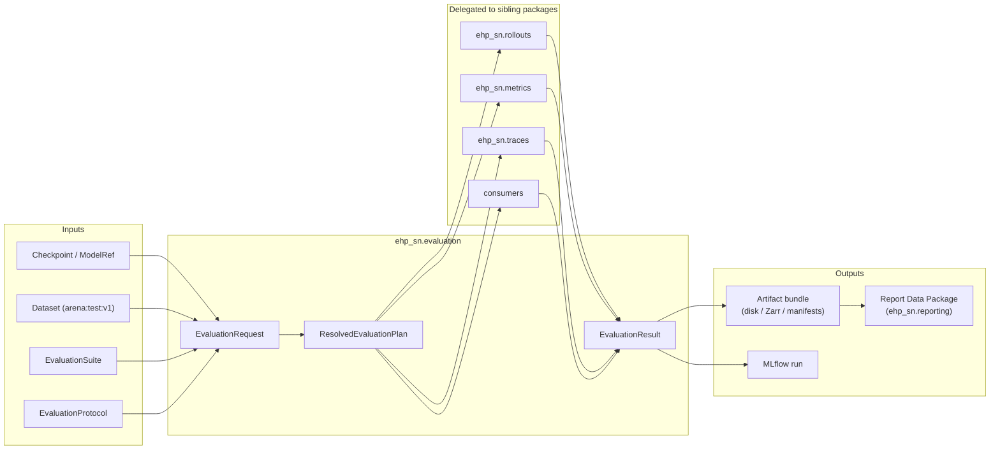

# Evaluation Design Contract (`ehp_sn.evaluation`)

> A small domain kernel that owns the **meaning and orchestration** of
> evaluation: specification, compatibility resolution, execution
> orchestration, metric aggregation, result validation, and result
> persistence.

The evaluation subsystem answers these questions:

1. What model and dataset are being evaluated?
2. Under which exact **protocol**?
3. Which **metrics** and **evidence** must be produced?
4. Which **execution implementation** can evaluate this model/task combination?
5. Did the evaluation **execute successfully**?
6. Did the resulting metrics **satisfy the declared criteria**?
7. Where are the resulting **artifacts**?
8. Can the complete result be **reproduced and audited**?

---

## 1. Ownership boundary

### Owns

- Evaluation **specifications** (what is measured, under which protocol)
- Evaluation **execution orchestration** (plan → run → aggregate)
- Metric **computation and aggregation** (via delegated metrics)
- **Validation or acceptance rules** (criteria: pass/fail thresholds)
- **Evaluation results** and artifact references (the typed `EvaluationResult`)
- **Provenance** recording (protocol, model, dataset, environment)

### Does not own

| Concern                                                                       | Owner                           |
| ----------------------------------------------------------------------------- | ------------------------------- |
| Dataset construction, splits, batching                                        | `ehp_sn.data`                   |
| Task semantics, targets, task-specific scoring                                | `ehp_sn.tasks`                  |
| Model construction, architecture, inference contracts                         | `ehp_sn.models`, `experiments/` |
| Recurrent execution mechanics, carry, environment stepping                    | `ehp_sn.rollouts`               |
| Reusable metric algorithms (stateful `update`/`compute`/`reset`)              | `ehp_sn.metrics`                |
| Trace collection infrastructure (observers, sinks, trace trees)               | `ehp_sn.traces`                 |
| Post-hoc scientific computation (grid scores, place fields, pathway analysis) | `ehp_sn.analysis`               |
| Visual rendering                                                              | `ehp_sn.figures`                |
| Report composition (Data Packages, notebooks)                                 | `ehp_sn.reporting`              |
| Experiment tracking implementation                                            | `adapters/` (e.g. `mlflow.py`)  |
| Model-health diagnostics (NaN detection, activation norms)                    | `ehp_sn.diagnostics`            |

### Formal responsibility

```
evaluation =
    specification +
    compatibility resolution +
    execution orchestration +
    metric aggregation +
    result validation +
    result persistence
```

---

## 2. Architectural position



---

## 3. Core lifecycle

```
EvaluationRequest
    ↓ resolve + validate
ResolvedEvaluationPlan
    ↓ execute
EvaluationResult
    ↓ persist / track / report
    ↓
artifacts, MLflow, reports
```

### Internal phases of `evaluate(request)`

```
1. Resolve
   └── model reference → concrete checkpoint + model factory
   └── dataset reference → versioned split
   └── suite alias → immutable EvaluationSuite
   └── recipe/binding → execution factory
   └── protocol defaults + overrides

2. Validate (before inference)
   └── model capabilities satisfy suite requirements
   └── dataset provides required channels
   └── suite metrics have available inputs
   └── checkpoint is compatible
   └── protocol is internally consistent
   └── requested traces are supported

3. Execute
   └── open resources
   └── torch.inference_mode()
   └── delegate recurrent stepping to ehp_sn.rollouts
   └── update metrics and consumers per step

4. Aggregate
   └── merge metric state across batches/episodes/environments
   └── finalize sufficient statistics

5. Validate results
   └── evaluate criteria independently from metric calculation

6. Persist
   └── resolved configuration
   └── metrics, criteria, provenance
   └── produced artifacts (traces, aggregates, analyses)
   └── failures and warnings
```

---

## 4. Domain model

### 4.1 EvaluationRequest — user-facing evaluation intent

```python
@dataclass(frozen=True)
class EvaluationRequest:
    model: ModelReference
    dataset: DatasetReference
    suite: EvaluationSuiteReference
    protocol: EvaluationProtocol
    output: EvaluationOutputSpec = EvaluationOutputSpec()
```

This object is **unresolved and serializable**. It may contain aliases,
paths, run IDs, or configuration references — no loaded models, no
open dataloaders, no MLflow clients.

```python
request = EvaluationRequest(
    model=CheckpointReference("checkpoints/tem-v2.ckpt"),
    dataset=DatasetReference("arena:test:v1"),
    suite="arena-structural-v1",
    protocol=EvaluationProtocol(seed=42),
)
```

### 4.2 ModelReference — explicit value object, not an ambiguous string

```python
ModelReference =
    CheckpointReference
    | MLflowModelReference
    | RegisteredModelReference
```

```python
@dataclass(frozen=True)
class CheckpointReference:
    path: str
    digest: str | None = None


@dataclass(frozen=True)
class MLflowModelReference:
    run_id: str
    artifact_path: str = "model"


@dataclass(frozen=True)
class RegisteredModelReference:
    name: str
    version: str | None = None
```

All `ModelReference` variants are **serializable and reproducible** —
they resolve to stable identities suitable for provenance recording.

An in-memory `nn.Module` is not a `ModelReference`. For interactive or
debugging use, a separate entry point accepts a pre-loaded model:

```python
def evaluate_model(
    model: nn.Module,
    request: EvaluationRequest,  # model field is optional here
) -> EvaluationResult: ...
```

Canonical evaluation and provenance always use stable `ModelReference`
variants. `evaluate_model()` is a convenience that skips model resolution
but produces no model provenance digest.

### 4.3 DatasetReference — versioned data identity

```python
@dataclass(frozen=True)
class DatasetReference:
    task: str
    split: str
    version: str
    uri: str | None = None
```

### 4.4 EvaluationProtocol — the scientific and runtime conditions

```python
@dataclass(frozen=True)
class EvaluationProtocol:
    seed: int
    deterministic: bool
    precision: Precision
    state_reset: StateResetProtocol
    rollout: RolloutProtocol
    aggregation: AggregationProtocol
    repetitions: RepetitionProtocol
```

Protocol semantics in EHP — these materially affect what a reported number
means:

- **State reset**: carry across TBPTT chunks, reset between episodes,
  TEM memory persistence, reset between evaluation cases
- **Rollout**: maximum steps, greedy vs. sampled actions, teacher forcing
  permitted, carry policy per episode, memory policy per episode
- **Aggregation**: step micro-average vs. episode macro-average,
  environment macro-average, grouping keys, confidence interval method,
  bootstrap unit
- **Repetitions**: number of independent execution repeats, seed per repeat

Subordinate protocol types:

```python
@dataclass(frozen=True)
class RolloutProtocol:
    max_steps: int | None
    action_selection: ActionSelection
    teacher_forcing: bool
    carry_policy: CarryPolicy
    memory_policy: MemoryPolicy


@dataclass(frozen=True)
class AggregationProtocol:
    observation_unit: ObservationUnit       # step | episode | environment
    reduction: Reduction                    # micro | macro
    group_by: tuple[str, ...] = ()
    confidence_interval: ConfidenceIntervalSpec | None = None


@dataclass(frozen=True)
class StateResetProtocol:
    between_cases: bool
    between_episodes: bool
    between_chunks: bool
```

These conditions must not remain embedded in experiment builders and recipe
implementations. They are first-class protocol fields.

### 4.5 EvaluationSuite — what is measured (task-facing, model-family-agnostic)

```python
@dataclass(frozen=True)
class EvaluationSuite:
    name: str
    version: int
    task: str
    metrics: tuple[MetricSelection, ...]
    criteria: tuple[Criterion, ...] = ()
    primary_metric: str | None = None
    required_capabilities: frozenset[str] = frozenset()
    required_evidence: tuple[EvidenceRequirement, ...] = ()
```

A suite **selects metrics from the task scoring catalog** rather than
owning metric construction itself:

```python
@dataclass(frozen=True)
class MetricSelection:
    metric: str                         # key in the task scoring catalog
    parameters: Mapping[str, object] = field(default_factory=dict)
```

This avoids the evaluation package becoming the owner of task metric
implementations. The task scoring catalog (in `ehp_sn.tasks`) defines
supported metrics and their implementations. The suite selects and
configures from that catalog. The same metric may be primary in one
suite and secondary in another — primacy belongs to the suite, not
the metric specification.

```python
ARENA_STRUCTURAL_V1 = EvaluationSuite(
    name="arena-structural",
    version=1,
    task="arena",
    metrics=(
        MetricSelection("accuracy_inference_all"),
        MetricSelection("accuracy_inference_revisit"),
        MetricSelection("accuracy_retrieved_revisit"),
        MetricSelection("accuracy_ancestral_revisit"),
    ),
    primary_metric="accuracy_ancestral_revisit",
    criteria=(
        MinimumMetric("accuracy_ancestral_revisit", threshold=0.70),
    ),
    required_capabilities=frozenset({
        "recurrent_rollout",
        "sensory_prediction",
    }),
)
```

A suite is **task-facing and model-family-agnostic**. The same suite can
be evaluated against TEM v1, TEM v2, or any future model family that
provides the required capabilities:

```
suite:            arena-structural-v1

execution binding:   arena + tem-v1
                     arena + tem-v2
                     arena + ehp-v1
```

The suite states **what constitutes the benchmark**. The recipe/binding
states **how a particular model family is executed**.

### 4.6 Criteria — interpretation of metric values

```python
class CriterionOperator(Enum):
    GE = ">="
    GT = ">"
    LE = "<="
    LT = "<"
    EQ = "=="


@dataclass(frozen=True)
class Criterion:
    metric_name: str
    operator: CriterionOperator
    threshold: float
    label: str | None = None


class MinimumMetric(Criterion):
    def __init__(self, metric: str, threshold: float):
        super().__init__(
            metric_name=metric,
            operator=CriterionOperator.GE,
            threshold=threshold,
            label=f"{metric} >= {threshold}",
        )


class MaximumMetric(Criterion):
    def __init__(self, metric: str, threshold: float):
        super().__init__(
            metric_name=metric,
            operator=CriterionOperator.LE,
            threshold=threshold,
            label=f"{metric} <= {threshold}",
        )


@dataclass(frozen=True)
class CriterionResult:
    criterion: Criterion
    metric_value: float
    passed: bool

    @property
    def margin(self) -> float:
        """Signed margin: positive = passed, negative = failed."""
        ...
```

Criteria are **separate from metric implementations**. A metric computes
a value. A criterion interprets that value against a threshold.

### 4.7 EvaluationResult — the unified, typed result

```python
@dataclass(frozen=True)
class EvaluationResult:
    evaluation_id: str
    suite_name: str
    model: ResolvedModelReference
    dataset: ResolvedDatasetReference
    protocol: ResolvedEvaluationProtocol
    summary: EvaluationSummary
    cases: CaseResultCollection
    artifacts: tuple[ProducedArtifact, ...]
    provenance: EvaluationProvenance
    issues: tuple[EvaluationIssue, ...] = ()
    execution_status: EvaluationExecutionStatus = EvaluationExecutionStatus.COMPLETED
    decision: EvaluationDecision | None = None
    output_directory: Path | None = None

    @property
    def primary_metric(self) -> MetricResult: ...

    @property
    def passed(self) -> bool:
        """True when execution completed and all criteria passed."""
        ...

    def require_passed(self) -> None:
        """Raise EvaluationCriterionFailed if decision is not PASSED."""
        ...

    def metric(self, name: str) -> MetricResult: ...
```

**Execution status and benchmark decision are separate concerns:**

```python
class EvaluationExecutionStatus(Enum):
    """Whether the evaluation computation succeeded."""
    COMPLETED = "completed"
    COMPLETED_WITH_WARNINGS = "completed_with_warnings"
    FAILED = "failed"


class EvaluationDecision(Enum):
    """Whether the model met the benchmark criteria."""
    PASSED = "passed"
    FAILED = "failed"
    NOT_EVALUATED = "not_evaluated"
```

`execution_status` records whether the computation completed.
`decision` records whether the model satisfied the benchmark.
When execution fails, `decision` is `NOT_EVALUATED`.
When execution succeeds but criteria are not met,
`execution_status` is `COMPLETED` and `decision` is `FAILED`.
This cleanly separates:

- whether the computation succeeded;
- whether the model met the benchmark.

Supporting types:

```python
@dataclass(frozen=True)
class EvaluationSummary:
    """Lightweight top-level metrics and criteria, always loaded eagerly."""
    metrics: Mapping[str, MetricResult]
    criteria: tuple[CriterionResult, ...]
    case_count: int
    primary_metric_name: str | None


CaseResultCollection =
    InlineCaseResults
    | ArtifactBackedCaseResults


@dataclass(frozen=True)
class InlineCaseResults:
    results: tuple[EvaluationCaseResult, ...]


@dataclass(frozen=True)
class ArtifactBackedCaseResults:
    """Reference to cases persisted in the artifact bundle."""
    artifact_path: str
    case_ids: tuple[str, ...]
    case_count: int


@dataclass(frozen=True)
class MetricResult:
    name: str
    value: float
    unit: str | None
    higher_is_better: bool | None
    sample_count: int | None
    aggregation: AggregationDescription
    uncertainty: MetricUncertainty | None = None


@dataclass(frozen=True)
class EvaluationCaseResult:
    case_id: str
    metrics: Mapping[str, MetricResult]
    artifacts: tuple[ProducedArtifact, ...]
    status: CaseStatus
```

The `EvaluationSummary` and `CaseResultCollection` split keeps the
top-level result cheap to load: summaries are always inlined; case
details may be artifact-backed for large evaluations with thousands
of cases.

### 4.8 EvaluationIssue — partial success and warnings

```python
@dataclass(frozen=True)
class EvaluationIssue:
    code: str
    severity: IssueSeverity
    phase: EvaluationPhase
    message: str
    case_id: str | None = None
    artifact: ArtifactKey | None = None


class IssueSeverity(Enum):
    WARNING = "warning"
    ERROR = "error"


class EvaluationPhase(Enum):
    RESOLUTION = "resolution"
    VALIDATION = "validation"
    EXECUTION = "execution"
    AGGREGATION = "aggregation"
    CRITERIA = "criteria"
    PERSISTENCE = "persistence"
```

Issues capture situations where the evaluation **partially succeeds**:

- 997 of 1,000 episodes complete (3 fail with `WARNING`)
- one trace consumer fails after metrics complete (`ERROR`)
- MLflow logging fails after local persistence (`WARNING`)
- one optional analysis artifact fails (`WARNING`)
- a criterion metric is unavailable (`ERROR`)

`EvaluationResult.issues` records all issues. `execution_status` is
derived from the worst issue severity: no errors → `COMPLETED`;
warnings only → `COMPLETED_WITH_WARNINGS`; any error → `FAILED`.
This is more precise than relying solely on a status enum.

### 4.9 EvaluationProvenance — reproducibility metadata

```python
@dataclass(frozen=True)
class EvaluationProvenance:
    created_at: datetime
    repository_commit: str | None
    repository_dirty: bool | None
    package_version: str
    model: ModelProvenance
    dataset: DatasetProvenance
    suite_digest: str
    protocol_digest: str
    resolved_request_digest: str
    environment: RuntimeEnvironment
```

For EHP, the **protocol digest** must cover:

- state reset policy
- carry semantics across chunks
- memory policy (TEM reset, HRM state clearing)
- rollout length
- action selection mode
- metric definitions and versions
- aggregation unit and reduction
- seed
- fixed case selection
- evaluation overrides

A checkpoint hash alone is not adequate provenance. The protocol digest
ensures that two evaluation runs with different carry semantics produce
different digests even if they use the same checkpoint.

### 4.10 ResolvedEvaluationPlan — the pre-execution concrete plan

```python
@dataclass(frozen=True)
class ResolvedEvaluationPlan:
    identity: EvaluationIdentity
    model: ResolvedModel
    dataset: ResolvedEvaluationSource
    suite: EvaluationSuite
    protocol: ResolvedEvaluationProtocol
    execution_binding: EvaluationExecutionBinding
    metrics: tuple[ResolvedMetric, ...]
    consumers: tuple[EvaluationConsumer, ...]
    artifact_plan: ArtifactPlan
    reuse_target: ArtifactPath | None = None
```

The planner performs:

1. Model reference resolution (local path, MLflow run, etc.)
2. Dataset version resolution
3. Suite resolution (alias → immutable suite)
4. Recipe/binding resolution (task + model_family → execution factory)
5. Capability validation (model provides what the suite requires)
6. Metric-input validation (suite metrics' requirements are satisfiable)
7. Trace requirement compilation (what trace fields to capture)
8. Artifact plan compilation (where to write outputs)
9. Reuse decision (skip execution if compatible artifacts exist)

The runtime receives **no unresolved aliases**.

---

## 5. Metric data API — the evaluator-to-metric boundary

Metrics declare their input requirements before execution:

```python
@dataclass(frozen=True)
class MetricRequirements:
    predictions: frozenset[str] = frozenset()
    targets: frozenset[str] = frozenset()
    masks: frozenset[str] = frozenset()
    groups: frozenset[str] = frozenset()
    metadata: frozenset[str] = frozenset()
```

Metrics consume a normalized observation, not raw model output:

```python
@dataclass(frozen=True)
class EvaluationObservation:
    predictions: Mapping[str, Tensor]
    targets: Mapping[str, Tensor]
    masks: Mapping[str, Tensor]
    groups: Mapping[str, Tensor]
    metadata: Mapping[str, object]
```

This generic representation is the **orchestration boundary** — the
single adapter point between model-family-specific outputs and
reusable metric implementations. To prevent it from degrading into
an untyped dictionary protocol, every metric also declares the
**concrete field schema** it expects:

```python
@dataclass(frozen=True)
class EvaluationFieldSpec:
    key: str
    dtype: torch.dtype
    axes: tuple[str, ...]               # e.g. ("batch", "time", "units")
    optional: bool = False
```

Each `EvaluationObservation` is constructed by a **task-owned typed
adapter** that knows the model output conventions for that task. The
adapter transforms model-specific outputs into the normalized
observation, validating field schemas at construction time. Task
packages may additionally expose a typed protocol for downstream
code that needs compile-time guarantees:

```python
class ArenaEvaluationObservation(Protocol):
    sensory_prediction: Tensor
    sensory_target: Tensor
    valid_step: Tensor
    revisit: Tensor
    pathway: Tensor
```

The generic `EvaluationObservation` remains the single orchestration
boundary; typed protocols are optional task-level conveniences.

Metric specification with requirements:

```python
ANCESTRAL_REVISIT_ACCURACY = MetricSpec(
    name="accuracy_ancestral_revisit",
    requirements=MetricRequirements(
        predictions=frozenset({"sensory_id"}),
        targets=frozenset({"sensory_id"}),
        masks=frozenset({"valid_step"}),
        groups=frozenset({"ancestral", "revisit"}),
    ),
)
```

This enables the planner to reject invalid evaluations before inference:

```
Metric "accuracy_ancestral_revisit" requires group "ancestral",
but task source "arena:test:v1" does not provide it.
```

The metric interface:

```python
class Metric(Protocol):
    @property
    def requirements(self) -> MetricRequirements: ...

    def update(self, observation: EvaluationObservation) -> None: ...

    def compute(self) -> MetricResult: ...

    def reset(self) -> None: ...
```

This boundary provides three advantages:

- Trace capture can be planned before execution
- Missing fields fail before expensive evaluation begins
- Metric implementations remain independent from specific model output shapes

---

## 6. Package structure

### Recommended target (practical, additive to existing code)

```
src/ehp_sn/evaluation/
├── __init__.py              ← narrow public API (7-10 symbols)
├── api.py                   ← evaluate(), validate() entry points
│
├── models.py                ← EvaluationRequest, ModelReference, DatasetReference,
│                                EvaluationResult, EvaluationSummary,
│                                CaseResultCollection, MetricResult,
│                                EvaluationCaseResult
├── protocols.py             ← EvaluationProtocol, RolloutProtocol,
│                                AggregationProtocol, StateResetProtocol
├── suites.py                ← EvaluationSuite, MetricSelection,
│                                EvaluationSuiteRegistry, get_suite()
├── criteria.py              ← Criterion, MinimumMetric, MaximumMetric,
│                                CriterionResult, EvaluationDecision
├── provenance.py            ← EvaluationProvenance, ModelProvenance,
│                                DatasetProvenance, RuntimeEnvironment
├── errors.py                ← EvaluationError hierarchy, EvaluationIssue
│
├── planning.py              ← resolve_evaluation(), validate_plan(),
│                                ResolvedEvaluationPlan
├── runtime.py               ← execute_evaluation(), run_offline_eval()
├── configuration.py         ← TOML loading, merging, Pydantic schemas,
│                                ResolvedEvaluationInvocation
├── artifacts.py             ← reader, writer, manifest models, reuse
├── consumers.py             ← EvaluationConsumer, TraceConsumer,
│                                SpatialPopulationAccumulator
├── recipes.py               ← EvaluationExecutionBinding, recipe registry,
│                                resolve_binding()
│
└── adapters/
    ├── __init__.py
    └── mlflow.py            ← MLflowEvaluationRecorder
```

Split modules only when they contain independent stable abstractions or
become difficult to navigate. `models.py` may initially hold request,
plan, result, and provenance types; split later based on actual size and
dependency direction. The structure above is a **target**, not a day-one
requirement.

---

## 7. Public API

```python
from ehp_sn.evaluation import (
    EvaluationProtocol,
    EvaluationRequest,
    EvaluationResult,
    EvaluationSuite,
    evaluate,
    get_suite,
    validate,
)
```

### `__init__.py`

```python
from .api import evaluate, validate
from .protocols import EvaluationProtocol
from .requests import EvaluationRequest
from .results import EvaluationResult, MetricResult
from .criteria import CriterionResult
from .suites import EvaluationSuite, get_suite

__all__ = [
    "CriterionResult",
    "EvaluationProtocol",
    "EvaluationRequest",
    "EvaluationResult",
    "EvaluationSuite",
    "MetricResult",
    "evaluate",
    "get_suite",
    "validate",
]
```

### Not exported from package root

These remain importable from their submodules but are **not** part of the
root public API:

| Symbol                                            | Submodule             |
| ------------------------------------------------- | --------------------- |
| `ArtifactKey`, `ArtifactKind`, `ProducedArtifact` | `artifacts/models.py` |
| `EvaluationConsumer`, `TraceConsumer`             | `consumers/`          |
| `ProviderSpec`, `EvaluationExecutor`              | internal              |
| `ResolvedEvaluationPlan`                          | `planning/`           |
| `execute_replay_evaluation_batch`                 | `runtime/executor.py` |
| `MLflowEvaluationRecorder`                        | `adapters/mlflow.py`  |
| `EvaluationRecipeConfig`, `EvaluationAlias`       | `recipes/`            |
| `_EVALUATION_RECIPE_BINDINGS`                     | `recipes/bindings.py` |

---

## 8. API workflows

### Programmatic

```python
from ehp_sn.evaluation import (
    EvaluationProtocol,
    EvaluationRequest,
    evaluate,
    get_suite,
)

request = EvaluationRequest(
    model="runs:/abc123/checkpoint",
    dataset="arena:test:v1",
    suite=get_suite("arena-structural-v1"),
    protocol=EvaluationProtocol(
        seed=42,
        deterministic=True,
        state_reset=StateResetProtocol(
            between_cases=True,
            between_episodes=True,
            between_chunks=False,
        ),
        rollout=RolloutProtocol(
            max_steps=250,
            action_selection="greedy",
            teacher_forcing=False,
        ),
        aggregation=AggregationProtocol(
            observation_unit="episode",
            reduction="macro",
        ),
    ),
)

result = evaluate(request)

print(result.primary_metric)   # MetricResult(value=0.732, ...)
print(result.passed)           # True / False
print(result.output_directory) # Path("artifacts/eval/...")

result.require_passed()        # raises EvaluationCriterionFailed if not
```

### CLI

```shell
ehp evaluation run \
    --suite arena-structural-v1 \
    --model runs:/abc123/checkpoint \
    --dataset arena:test:v1 \
    --seed 42
```

The CLI calls the exact same `evaluate()` entry point. It contains no
separate evaluation logic.

---

## 9. Configuration model

Two levels:

```
User-authored configuration        Resolved evaluation plan
─────────────────────────────      ─────────────────────────
aliases, defaults, optionals        concrete paths, versions, policies
```

### User-facing TOML

```toml
schema_version = 1

suite = "arena-structural-v1"
model = "runs:/abc123/checkpoint"
dataset = "arena:test:v1"

[protocol]
seed = 42
deterministic = true
precision = "float32"

[protocol.state_reset]
between_cases = true
between_episodes = true
between_chunks = false

[protocol.rollout]
max_steps = 250
action_selection = "greedy"
teacher_forcing = false
carry_policy = "preserve-within-episode"
memory_policy = "reset-between-episodes"

[protocol.aggregation]
observation_unit = "episode"
reduction = "macro"

[output]
store_predictions = false
store_traces = true
trace_profile = "tem-evaluation"
```

This configuration does **not** name Python builder functions. Builder
selection belongs to recipe/binding resolution, not user-facing TOML.

---

## 10. Internal `evaluate()` lifecycle

```python
def evaluate(request: EvaluationRequest) -> EvaluationResult:
    issues: list[EvaluationIssue] = []

    # 1. Resolve
    try:
        plan = resolve_evaluation(request)
    except EvaluationResolutionError as exc:
        return EvaluationResult(
            execution_status=EvaluationExecutionStatus.FAILED,
            issues=(EvaluationIssue(
                code="resolution_failed",
                severity=IssueSeverity.ERROR,
                phase=EvaluationPhase.RESOLUTION,
                message=str(exc),
            ),),
            ...
        )

    # 2. Validate (pre-execution)
    validate_plan(plan)

    # 3. Execute
    execution = execute_evaluation(plan)
    issues.extend(execution.issues)

    # 4. Aggregate metrics
    metrics = finalize_metrics(execution)
    issues.extend(execution.metric_issues)

    # 5. Evaluate criteria
    criteria = evaluate_criteria(plan.suite.criteria, metrics)

    # 6. Build provenance
    provenance = build_provenance(plan, execution)

    # 7. Derive status and decision
    execution_status = _derive_execution_status(issues)
    decision = _derive_decision(
        criteria, execution_status=execution_status
    )

    # 8. Assemble result
    result = EvaluationResult(
        evaluation_id=plan.identity.id,
        suite_name=plan.suite.name,
        model=plan.model,
        dataset=plan.dataset,
        protocol=plan.protocol,
        summary=EvaluationSummary(
            metrics=metrics,
            criteria=criteria,
            case_count=execution.case_count,
            primary_metric_name=plan.suite.primary_metric,
        ),
        cases=_inline_or_reference_cases(execution),
        artifacts=execution.artifacts,
        provenance=provenance,
        issues=tuple(issues),
        execution_status=execution_status,
        decision=decision,
    )

    # 9. Persist
    output_directory = persist_result(result, plan.artifact_plan)

    return replace(result, output_directory=output_directory)
```

---

## 11. Error model

```python
class EvaluationError(Exception):
    """Base for all evaluation domain errors."""

class EvaluationConfigurationError(EvaluationError):
    """Invalid or incomplete configuration."""

class EvaluationResolutionError(EvaluationError):
    """Failed to resolve a model, dataset, suite, or binding."""

class EvaluationCompatibilityError(EvaluationError):
    """Model capabilities do not satisfy suite requirements."""

class InvalidEvaluationProtocol(EvaluationError):
    """Protocol is internally inconsistent or unsupported."""

class MissingMetricInput(EvaluationError):
    """A required metric input is not available."""

class EvaluationExecutionError(EvaluationError):
    """Execution failed (metric error, runtime crash, resource issue)."""

class MetricComputationError(EvaluationError):
    """A metric could not be computed."""

class EvaluationArtifactError(EvaluationError):
    """Artifact read/write failure."""

class EvaluationCriterionFailed(Exception):
    """The evaluation completed but criteria were not met.

    This is NOT an EvaluationError — the evaluation itself was valid.
    The model simply did not satisfy the benchmark requirement.
    """
```

A failed criterion must not be an `EvaluationError`:

```python
result.execution_status == EvaluationExecutionStatus.COMPLETED
result.decision == EvaluationDecision.FAILED
# → The evaluation executed correctly.
# → The model did not satisfy the benchmark.
```

Reserve exceptions for situations where the evaluation result itself is
invalid or incomplete:

```python
result.execution_status == EvaluationExecutionStatus.FAILED
# → Execution error, metric crash, resource failure
```

`EvaluationIssue` (see §4.8) captures partial failures within a
successful execution — e.g. 3 of 1000 cases failed, or MLflow logging
failed after local persistence. `execution_status` is derived from the
worst issue severity.

---

## 12. Artifact bundle layout

```
artifacts/eval/<suite>-<timestamp>/
├── _SUCCESS                          # atomic commit sentinel
├── evaluation.json                   # CANONICAL: versioned EvaluationResult
│                                     #   schema_version, result (summary +
│                                     #   case refs), provenance
│
├── metrics.json                      # DERIVED: metric scalars + uncertainty
├── criteria.json                     # DERIVED: criteria results
├── protocol.json                     # DERIVED: resolved EvaluationProtocol
├── provenance.json                   # DERIVED: EvaluationProvenance
├── request.json                      # DERIVED: original EvaluationRequest
│
├── cases/
│   ├── case-0001/
│   │   ├── metrics.json
│   │   └── manifest.json
│   └── ...
│
├── aggregates/                       # consumer-produced artifacts
│   └── mec_spatial_population.zarr/
│
├── analyses/                         # analysis runner outputs
│   ├── mec_grid.zarr/
│   └── hpc_place.zarr/
│
├── traces/                           # trace capture
│   ├── behavioral.zarr/
│   └── trace_index.json
│
├── figures/                          # rendered figures (post-hoc)
│
├── probes/                           # compact derived evidence
│
└── resolved-invocation.toml          # DERIVED: full resolved config for audit
```

`evaluation.json` is the **single canonical manifest**. All other files
are denormalized projections written from the same `EvaluationResult`
object. The writer generates every projection atomically; the reader
reconstructs primarily from the canonical manifest. This prevents drift
across parallel representations.

```python
@dataclass(frozen=True)
class EvaluationArtifactManifest:
    schema_version: int
    result: EvaluationResult
```

The canonical object model exists independently of the disk layout:

```python
writer.write(result)          # result → artifact bundle
loaded = reader.read(path)    # artifact bundle → EvaluationResult
```

This prevents the filesystem schema from becoming the in-memory API.

---

## 13. Suites vs. recipes — the separation

| Concept      | Type                               | Purpose                        | Example                                                   |
| ------------ | ---------------------------------- | ------------------------------ | --------------------------------------------------------- |
| **Suite**    | `EvaluationSuite`                  | What is measured, task-facing  | `arena-structural-v1`                                     |
| **Protocol** | `EvaluationProtocol`               | Under what conditions          | seed=42, macro, greedy, carry reset                       |
| **Recipe**   | `EvaluationRecipeConfig` + binding | How this model family executes | `arena-tem-v1`                                            |
| **Request**  | `EvaluationRequest`                | Concrete model + data + suite  | model=X, dataset=arena:test:v1, suite=arena-structural-v1 |
| **Result**   | `EvaluationResult`                 | What happened                  | metrics, criteria, provenance, artifacts                  |

This separation produces a clean dependency:

```
EvaluationSuite (task-facing, model-agnostic)
    ↓ "I need these metrics under these criteria"

ExecutionBinding / Recipe (model-family-specific)
    ↓ "I know how to run model family X on task Y"

EvaluationRequest (concrete)
    ↓ model + dataset + suite + protocol

EvaluationResult (complete)
```

The registry resolves bindings by `(task, model_family)`:

```python
binding = execution_bindings.resolve(
    task=suite.task,
    model_family=model.family,
)
```

---

## 14. Implementation priority

### P0 — Establish the result model

| File            | What                                                                 |
| --------------- | -------------------------------------------------------------------- |
| `results.py`    | `EvaluationResult`, `MetricResult`, `EvaluationCaseResult`           |
| `criteria.py`   | `Criterion`, `CriterionOperator`, `MinimumMetric`, `CriterionResult` |
| `provenance.py` | `EvaluationProvenance`, `RuntimeEnvironment`                         |

Make `run_offline_eval()` return `EvaluationResult` rather than only a
`Path`.

### P1 — Make protocol semantics explicit

| File           | What                                                                                 |
| -------------- | ------------------------------------------------------------------------------------ |
| `protocols.py` | `EvaluationProtocol`, `RolloutProtocol`, `AggregationProtocol`, `StateResetProtocol` |

Extract reset, rollout, carry, memory, and aggregation semantics from
builder implementations into typed, serializable configuration.

### P1 — Narrow the public API

| File          | What                                     |
| ------------- | ---------------------------------------- |
| `api.py`      | `evaluate(request)`, `validate(request)` |
| `__init__.py` | Export only 7-10 symbols                 |

Move `inspection.py` and `render.py` out of the evaluation package.
Inspection is a post-hoc consumer of evaluation artifacts; rendering
is a figure concern.

### P2 — Separate suites from recipes

| File        | What                                                        |
| ----------- | ----------------------------------------------------------- |
| `suites.py` | `EvaluationSuite`, `EvaluationSuiteRegistry`, `get_suite()` |

Keep model-specific recipes as execution bindings. Introduce task-facing
suites when the same benchmark is evaluated across multiple model families.

### P2 — Add metric requirements

| File                       | What                                                 |
| -------------------------- | ---------------------------------------------------- |
| `planning/requirements.py` | `MetricRequirements`, pre-execution input validation |

Allow planning to validate metric inputs and trace requirements before
running inference.

### P3 — Improve aggregation semantics

| File                     | What                                                       |
| ------------------------ | ---------------------------------------------------------- |
| `runtime/aggregation.py` | Explicit micro/macro, step/episode/environment aggregation |

The current ratio-statistic accumulation (`RatioStat`, `RolloutAccumulator`)
is effectively micro-aggregation. The aggregation unit must be declared
because it materially changes the interpretation of navigation metrics.

---

## 15. Relationship to existing `ehc_sn.eval`

The design **does not replace** the existing package wholesale. It evolves
it by:

1. Adding the **missing types** (`EvaluationResult`, `Criterion`,
   `EvaluationProtocol`, `EvaluationSuite`, `EvaluationProvenance`)
2. **Narrowing the public API** to 7-10 stable symbols
3. **Extracting protocol semantics** from scattered builder code into
   typed, serializable configuration
4. **Moving inspection and rendering** to their correct ownership domains
5. **Formalizing the adapter boundary** for MLflow

The execution engine (`execute_replay_evaluation_batch`, `run_offline_eval`),
consumer lifecycle (`EvaluationConsumer`, `TraceConsumer`,
`SpatialPopulationAccumulator`), artifact persistence (Zarr,
`_SUCCESS`, manifests), trace subsystem (`traces/`), and the
analysis/reporting separation are **retained** as the strong infrastructure
they already are.

> The evaluation design is a domain model placed around infrastructure that
> is already largely correct.
