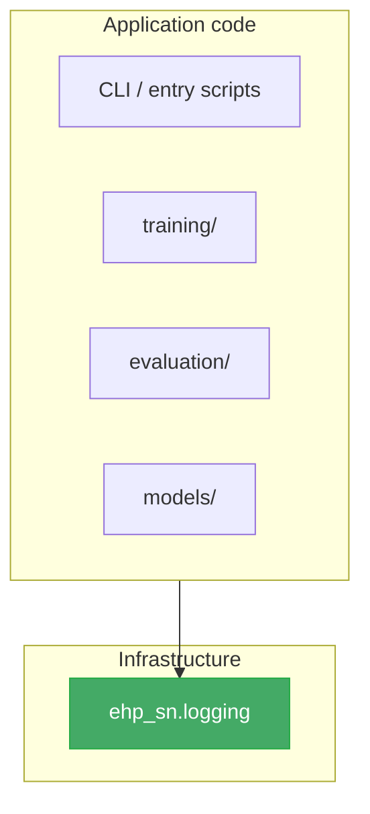

# Logging Architecture

> Canonical design for `ehp_sn.logging` — a small infrastructure package
> for **operational events produced while the program executes**.

`ehp_sn.logging` configures, enriches, filters, formats, and routes
application log records. It does **not** own domain results, durable ML
artifacts, experiment tracking, or metric infrastructure.

---

## 1. Scope and ownership

### 1.1 What logging means

A professional ML codebase treats **logging as infrastructure**, not as a
miscellaneous place for every operation that "records something."

| Concern                 | Purpose                                                             | Typical backend                   |
| ----------------------- | ------------------------------------------------------------------- | --------------------------------- |
| **Application logging** | Explain runtime behaviour, failures, warnings, lifecycle events     | Python `logging`, structlog       |
| **Experiment tracking** | Record parameters, scalar metrics, datasets, checkpoints, artifacts | MLflow, W&B, Lightning loggers    |
| **Telemetry**           | Correlate logs, traces and system metrics across processes          | OpenTelemetry                     |
| **Domain traces**       | Persist model states, activations, trajectories, replay data        | `ehp_sn.traces` / artifact system |
| **Evaluation results**  | Store benchmark outputs and aggregate metrics                       | `ehp_sn.evaluation`               |
| **Diagnostics**         | Compute structured health and correctness findings                  | `ehp_sn.diagnostics`              |

These must interoperate, but they must **not** collapse into one `logging`
package.

### 1.2 Ownership rule

> `ehp_sn.logging` records **that** an event happened. The subsystem that
> understands the event owns its schema and semantics.

Concretely: evaluation owns the meaning of `accuracy_ancestral_revisit`;
logging may emit a message that evaluation completed, but it must not define,
aggregate, or persist that metric.

### 1.3 What logging is responsible for

| #   | Question                                            | Answer                                       |
| --- | --------------------------------------------------- | -------------------------------------------- |
| 1   | How does a module acquire a logger?                 | `get_logger(__name__)`                       |
| 2   | How is logging configured at an entry point?        | `configure_logging(LoggingConfig(...))`      |
| 3   | How is execution context attached to records?       | `logging_context(...)` / `bind_context(...)` |
| 4   | Which records are emitted, filtered, and formatted? | Built-in filters and formatter processors    |

### 1.4 What logging is NOT responsible for

| Concern                                 | Owner                        |
| --------------------------------------- | ---------------------------- |
| TensorBoard metric logging              | `ehp_sn.lightning.loggers`   |
| MLflow run lifecycle                    | `ehp_sn.evaluation.tracking` |
| Domain traces and replay data           | `ehp_sn.traces`              |
| Diagnostic probes and findings          | `ehp_sn.diagnostics`         |
| Evaluation metrics and results          | `ehp_sn.evaluation`          |
| Post-hoc TensorBoard event-file reading | `ehp_sn.reporting`           |
| Report composition                      | `ehp_sn.reporting`           |
| Lightning callbacks                     | `ehp_sn.lightning.callbacks` |

---

## 2. Dependency rules

### 2.1 Position in the DAG

`ehp_sn.logging` sits at the **bottom of the dependency DAG**. Every runtime
package may use it, but it depends on **nothing** outside the Python standard
library and structlog.



### 2.2 Forbidden imports

The package **must not** import from:

- `torch`, `lightning`, `mlflow`, `zarr`, `matplotlib`
- `ehp_sn.models`, `ehp_sn.training`, `ehp_sn.evaluation`
- `ehp_sn.traces`, `ehp_sn.diagnostics`, `ehp_sn.lightning`

This ensures:

- Fast imports (no CUDA initialisation)
- No circular dependencies
- No Lightning or MLflow coupling
- Usable from CLI, workers, preprocessing, evaluation, and notebooks

### 2.3 Tensor-aware serialization

Core logging normalises only standard Python values: `Path`, `Enum`,
dataclasses passed as dictionaries, bounded strings, scalar sequences,
and scalar mappings.

It does **not** understand Torch types. Tensor summarisation belongs in
`ehp_sn.diagnostics` or a low-level ML utility. Logging callers
pre-summarise tensors explicitly:

```python
logger.debug(
    "tensor_observed",
    shape=tuple(tensor.shape),
    dtype=str(tensor.dtype),
    device=str(tensor.device),
)
```

The logging package should never call `.item()`, `.detach()`, or
`torch.isfinite()`. Those require the Torch dependency that logging must
not have.

---

## 3. Public API

### 3.1 Essential surface

```python
from ehp_sn.logging import (
    LogFormat,
    LogLevel,
    LoggingConfig,
    bind_context,
    clear_context,
    configure_logging,
    get_logger,
    logging_context,
)
```

Eight exports. This is the complete public contract.

### 3.2 `get_logger`

```python
def get_logger(name: str) -> structlog.stdlib.BoundLogger:
    """Return a structured logger associated with a Python module path.

    Usage::

        from ehp_sn.logging import get_logger

        logger = get_logger(__name__)
        logger.info("event_name", key=value)
    """
```

Uses structlog's `BoundLogger` type as the return type directly — no custom
protocol. The cost of a custom protocol (completeness, maintenance, abstraction
without substitutability) outweighs its benefit for this repository.

**Do not** expose a global logger singleton:

```python
from ehp_sn.logging import logger  # reject
```

Logger names preserve the Python package hierarchy:

```
ehp_sn.training.runner
ehp_sn.evaluation.offline
ehp_sn.models.tem_v2
```

This permits selective level control via `level_overrides`.

### 3.3 `configure_logging`

```python
def configure_logging(
    config: LoggingConfig,
    *,
    force: bool = False,
) -> None:
    """Configure process-wide operational logging.

    Idempotent on equivalent repeated calls.  Raises ``RuntimeError``
    on divergent repeated calls unless ``force=True``.
    """
```

Called by executable entry points, **never** by ordinary imported modules.

**Correct callers:**

- `ehp_sn.cli` (the top-level CLI entry point)
- Training CLI entry points (`scripts/training/*.py`)
- Evaluation CLI entry points
- Standalone scripts
- Worker bootstrap (if workers are separate processes)

**Incorrect callers:**

- `ehp_sn.logging.__init__` (import-time configuration)
- A model constructor
- A `LightningModule`
- A `DataModule`
- Package import hooks

The function owns handlers, levels, formatting, warning capture, structlog
wiring, and rank filters. It does **not** own run creation, experiment
configuration, TensorBoard, MLflow, or artifact registration.

### 3.4 `logging_context`

```python
@contextmanager
def logging_context(**fields: object) -> Iterator[None]:
    """Temporarily bind structured fields to nested log records.

    Fields are bound on entry and restored on exit, even if an exception
    occurs.
    """
```

Usage:

```python
with logging_context(
    command="evaluate",
    run_id=run_id,
    task="arena",
    model_family="tem_v2",
    checkpoint=str(checkpoint_ref),
):
    logger.info("evaluation_started")
    result = run_evaluation(...)
    logger.info("evaluation_completed", example_count=len(result.cases))
```

### 3.5 `bind_context` / `clear_context`

```python
def bind_context(**fields: object) -> None:
    """Bind fields until explicitly removed or cleared."""

def clear_context() -> None:
    """Remove all fields bound in the current execution context."""
```

`bind_context` is for lifecycle-long values:

```python
bind_context(run_id=run_id, command="train")
```

`clear_context` is required at every top-level execution boundary to prevent
context leakage:

```python
clear_context()
with logging_context(command="train", run_id=run_id):
    ...
```

This matters particularly in notebooks, test processes, worker pools,
repeated evaluation runs, and long-lived CLI processes.

---

## 4. Package structure

### 4.1 Initial implementation

```
src/ehp_sn/logging/
├── __init__.py           # Public API exports
├── types.py              # LoggingConfig, LogFormat, LogLevel
├── configuration.py      # configure_logging(), structlog wiring, dictConfig
├── context.py            # bind_context, logging_context, clear_context
└── logger.py             # get_logger()
```

Five files. Filters and formatter builders remain private within
`configuration.py` until complexity justifies splitting them out.

### 4.2 Later additions (when needed)

```
src/ehp_sn/logging/
├── filters.py            # Only when RankFilter/ContextFilter logic grows
├── formatters.py         # Only when custom processor chains need their own module
├── redaction.py          # Only when external credentials or remote tracking are used
├── handlers.py           # Only when multi-process QueueHandler is needed
└── testing.py            # Only when caplog is insufficient
```

Do not add modules until each has a real responsibility.

### 4.3 Final ownership map

```
ehp_sn.logging
    operational application logs

ehp_sn.lightning
    Lightning Logger implementations, metric routing, TensorBoard, callbacks

ehp_sn.evaluation
    evaluation contracts, metrics, results, MLflow evaluation recording

ehp_sn.traces
    model states, activations, trajectories, high-volume temporal data

ehp_sn.diagnostics
    health probes, diagnostic findings, diagnostic persistence

ehp_sn.reporting
    TensorBoard event-file reading, report preparation, post-hoc presentation
```

---

## 5. Configuration

### 5.1 `types.py`

```python
from __future__ import annotations

from dataclasses import dataclass
from enum import StrEnum
from pathlib import Path


class LogLevel(StrEnum):
    """Validated log level — prevents typos like ``"INOF"``."""
    DEBUG = "DEBUG"
    INFO = "INFO"
    WARNING = "WARNING"
    ERROR = "ERROR"
    CRITICAL = "CRITICAL"


class LogFormat(StrEnum):
    CONSOLE = "console"
    JSON = "json"


@dataclass(frozen=True, slots=True)
class LoggingConfig:
    """Immutable operational logging configuration.

    Applied once at application startup by ``configure_logging()``.
    All fields are validated at construction time.
    """

    level: LogLevel = LogLevel.INFO

    # Console output (always enabled).
    console_format: LogFormat = LogFormat.CONSOLE

    # Optional file output.
    output_file: Path | None = None
    file_format: LogFormat = LogFormat.JSON

    capture_warnings: bool = True
    include_timestamp: bool = True
    include_source: bool = False

    # Rank filtering.
    rank_zero_only_below_warning: bool = True

    # Per-logger level overrides (first-party and third-party).
    level_overrides: tuple[tuple[str, LogLevel], ...] = (
        ("lightning", LogLevel.WARNING),
        ("matplotlib", LogLevel.WARNING),
        ("urllib3", LogLevel.WARNING),
    )
```

**Key design decisions:**

- `LogLevel` is a `StrEnum` — prevents typos like `"INOF"`.
- `console_format` and `file_format` are independent — console can be
  human-readable while file output is JSONL.
- `level_overrides` replaces the misleading `third_party_levels` — it
  applies equally to first-party (`ehp_sn.models`) and third-party
  (`lightning`) loggers.
- `redact_secrets` is **not** present — redaction is a deferred extension.
  Configuration must correspond to implemented behaviour.

**Must not contain:** TensorBoard output directories, MLflow experiment
names, run IDs, checkpoint paths, task-specific settings.

### 5.2 `configuration.py`

```python
from __future__ import annotations

import logging
import logging.config
import sys
from threading import Lock

import structlog

from .context import get_context
from .types import LogFormat, LoggingConfig

_CONFIG_LOCK = Lock()
_CONFIGURED_WITH: LoggingConfig | None = None


def configure_logging(config: LoggingConfig, *, force: bool = False) -> None:
    """Configure process-wide operational logging.

    Idempotent on equivalent repeated calls.  Raises ``RuntimeError``
    on divergent repeated calls unless ``force=True``.
    """
    with _CONFIG_LOCK:
        global _CONFIGURED_WITH
        if _CONFIGURED_WITH is not None:
            if _CONFIGURED_WITH == config:
                return
            if not force:
                raise RuntimeError(
                    "configure_logging() called with different config. "
                    "Use force=True to override."
                )
            _close_owned_handlers()

        _apply_dict_config(config)
        logging.captureWarnings(config.capture_warnings)
        _configure_structlog(config)
        _CONFIGURED_WITH = config


def _apply_dict_config(config: LoggingConfig) -> None:
    """Build and apply a ``logging.config.dictConfig``."""
    dict_config = _build_dict_config(config)
    logging.config.dictConfig(dict_config)
    # Track handlers so _close_owned_handlers only removes ours.
    root = logging.getLogger()
    for handler_name in dict_config["handlers"]:
        for h in root.handlers:
            if getattr(h, "_ehp_owned", False):
                continue
            h._ehp_owned = True  # type: ignore[attr-defined]
            _OWNED_HANDLERS.add(h)


def _build_dict_config(config: LoggingConfig) -> dict[str, object]:
    """Construct a dictConfig-compatible dictionary."""
    handlers: dict[str, object] = {
        "console": {
            "class": "logging.StreamHandler",
            "level": config.level.value,
            "formatter": "console",
            "stream": "ext://sys.stderr",
        },
    }
    if config.output_file is not None:
        handlers["file"] = {
            "class": "logging.handlers.RotatingFileHandler",
            "level": config.level.value,
            "formatter": "file",
            "filename": str(config.output_file),
            "maxBytes": 10 * 1024 * 1024,
            "backupCount": 3,
        }

    if config.rank_zero_only_below_warning:
        for handler in handlers.values():
            handler.setdefault("filters", []).append("rank")

    return {
        "version": 1,
        "disable_existing_loggers": False,
        "formatters": {
            "console": {
                "()": "structlog.stdlib.ProcessorFormatter",
                "processor": _renderer(config.console_format),
                "foreign_pre_chain": _shared_processors(config),
            },
            "file": {
                "()": "structlog.stdlib.ProcessorFormatter",
                "processor": _renderer(config.file_format),
                "foreign_pre_chain": _shared_processors(config),
            },
        },
        "filters": {
            "rank": {
                "()": "ehp_sn.logging.configuration.RankFilter",
            },
        },
        "handlers": handlers,
        "root": {
            "level": config.level.value,
            "handlers": list(handlers),
        },
    }


def _close_owned_handlers() -> None:
    """Close only handlers installed by a prior ``configure_logging`` call."""
    for handler in list(_OWNED_HANDLERS):
        handler.close()
        logging.getLogger().removeHandler(handler)
    _OWNED_HANDLERS.clear()


_OWNED_HANDLERS: set[logging.Handler] = set()


def _configure_structlog(config: LoggingConfig) -> None:
    """Wire structlog processors for structured events."""
    structlog.configure(
        processors=[
            *_shared_processors(config),
            structlog.stdlib.ProcessorFormatter.wrap_for_formatter,
        ],
        wrapper_class=structlog.stdlib.BoundLogger,
        logger_factory=structlog.stdlib.LoggerFactory(),
        cache_logger_on_first_use=True,
    )
    _apply_level_overrides(config)


def _shared_processors(config: LoggingConfig) -> list:
    """Processors used by both structlog and foreign stdlib records."""
    import structlog

    processors: list = [
        structlog.contextvars.merge_contextvars,
        structlog.stdlib.add_logger_name,
        structlog.stdlib.add_log_level,
    ]
    if config.include_timestamp:
        processors.append(
            structlog.processors.TimeStamper(fmt="iso", utc=True)
        )
    if config.include_source:
        processors.append(structlog.processors.CallsiteParameterAdder())
    processors.extend([
        structlog.processors.StackInfoRenderer(),
        structlog.processors.format_exc_info,
    ])
    return processors


def _renderer(fmt: LogFormat):
    """Return the renderer processor for a given format."""
    import structlog

    if fmt is LogFormat.JSON:
        return structlog.processors.JSONRenderer()
    return structlog.dev.ConsoleRenderer()


def _apply_level_overrides(config: LoggingConfig) -> None:
    """Apply per-logger level overrides to third-party and first-party loggers."""
    for logger_name, level in config.level_overrides:
        logging.getLogger(logger_name).setLevel(level.value)


def is_logging_configured() -> bool:
    """Return ``True`` if ``configure_logging()`` has been called."""
    return _CONFIGURED_WITH is not None
```

**Key design decisions:**

- `_CONFIGURED_WITH` stores the applied config for equivalence comparison.
- `_OWNED_HANDLERS` tracks only package-installed handlers; `force=True`
  reconfiguration closes only those, leaving embedding-application handlers
  intact.
- Console and file handlers use **independent formatters**: `console_format`
  selects the console renderer, `file_format` selects the file renderer.
- `include_timestamp` and `include_source` conditionally add their
  processors to the shared chain.
- `level_overrides` are applied via `logging.getLogger(name).setLevel()`
  after structlog is wired.
- `rank_zero_only_below_warning` attaches `RankFilter` to handlers via
  `dictConfig` filters.
- Console output goes to **stderr** (`ext://sys.stderr`) — the professional
  default for CLI tools. This keeps stdout clean for machine-readable
  command output (JSON, paths, result IDs).
- Context merging uses structlog's `foreign_pre_chain` for third-party
  stdlib records — **no redundant `ContextFilter` for rendering is
  needed**. The `merge_contextvars` processor in the pre-chain handles
  record enrichment. RankFilter reads rank from structlog contextvars
  directly because it executes before `foreign_pre_chain`.
- `_renderer(fmt)` resolves the renderer processor per-format; renderer
  selection is a processor swap, not a separate module.

### 5.3 `context.py`

```python
from __future__ import annotations

from collections.abc import Iterator
from contextlib import contextmanager
from typing import Any

import structlog


def bind_context(**fields: object) -> None:
    """Bind fields until explicitly removed or cleared."""
    structlog.contextvars.bind_contextvars(**fields)


def unbind_context(*keys: str) -> None:
    """Remove specific fields from the current context."""
    structlog.contextvars.unbind_contextvars(*keys)


def clear_context() -> None:
    """Remove all fields bound in the current execution context."""
    structlog.contextvars.clear_contextvars()


def get_context() -> dict[str, Any]:
    """Return a snapshot of the current context."""
    return dict(structlog.contextvars.get_contextvars())


@contextmanager
def logging_context(**fields: object) -> Iterator[None]:
    """Temporarily bind structured fields.

    Fields are bound on entry and restored on exit, even if an exception
    occurs.  Intended for operation-scoped context.
    """
    with structlog.contextvars.bound_contextvars(**fields):
        yield
```

The module is domain-neutral. It accepts arbitrary JSON-compatible fields
but does not define TEM-, HRM-, Arena-, or MazeHard-specific context.

### 5.4 `__init__.py`

```python
from .configuration import configure_logging
from .context import bind_context, clear_context, logging_context
from .logger import get_logger
from .types import LogFormat, LogLevel, LoggingConfig

__all__ = [
    "LogFormat",
    "LogLevel",
    "LoggingConfig",
    "bind_context",
    "clear_context",
    "configure_logging",
    "get_logger",
    "logging_context",
]
```

Eight public exports. `is_logging_configured`, `get_context`, and
`unbind_context` remain internal — they are available for tests and
advanced use but are not part of the canonical public contract.

`get_logger` lives in `logger.py` (a small single-function module) so
acquisition logic has a clear home.

---

## 6. Context and distributed policy

### 6.1 Context field taxonomy

**Stable execution context** (suitable for `bind_context` / `logging_context`):

```
command          application-level operation (train, evaluate, ...)
run_id           unique execution identifier
experiment       experiment name
phase            train / validate / test / evaluate
task             task family (arena, mazehard, ...)
dataset          dataset name
model_family     tem_v1, tem_v2, hrm_v1, ...
model_variant    specific model variant
checkpoint_id    stable checkpoint identifier (not raw path)
rank             global rank in distributed training
local_rank       local rank on node
world_size       total process count
```

**Event-local dynamic values** (suitable as per-event keyword arguments):

```
epoch            current epoch (changes every epoch)
global_step      current step (changes every step)
worker_id        may change per-operation
example_count    varies per evaluation run
duration_seconds varies per operation
```

Fields that change every step or every record should be passed as event
arguments, not bound into context.

**Do not bind:** loss, accuracy, batch contents, tensor values, full
configurations, optimizer state, or activation matrices. Metrics are
observations, not ambient execution context.

**Checkpoint paths:** raw filesystem paths may expose local usernames, mount
paths, or signed URLs. Prefer `checkpoint_id` or `checkpoint_name` with
explicit redaction policy rather than assuming arbitrary paths are safe
context values.

### 6.2 Rank filtering

Rank is bound through `contextvars` during distributed training setup.
Stdlib logging filters run **before** `foreign_pre_chain`, so `RankFilter`
must read rank directly from structlog's contextvars rather than from
`record.rank` (which has not been populated yet).

```python
import logging

import structlog


class RankFilter(logging.Filter):
    """Suppress DEBUG and INFO from nonzero ranks.

    WARNING, ERROR, and CRITICAL are always emitted so that failures
    on any rank are visible.  Rank is read from structlog contextvars
    because the filter runs before ``foreign_pre_chain`` merges context
    into the LogRecord.
    """

    def __init__(self, *, rank_zero_only_below_warning: bool = True) -> None:
        super().__init__()
        self._enabled = rank_zero_only_below_warning

    def filter(self, record: logging.LogRecord) -> bool:
        if not self._enabled:
            return True
        if record.levelno >= logging.WARNING:
            return True
        ctx = structlog.contextvars.get_contextvars()
        rank = ctx.get("rank", 0)
        return rank in (None, 0)
```

| Level      | Default policy |
| ---------- | -------------- |
| `DEBUG`    | Rank zero only |
| `INFO`     | Rank zero only |
| `WARNING`  | All ranks      |
| `ERROR`    | All ranks      |
| `CRITICAL` | All ranks      |

**Caveat:** repeated warnings from hundreds of ranks can still flood output.
If this becomes a problem in practice, a future revision can add per-rank
deduplication or once-per-rank throttling. The initial policy prioritises
error visibility. Every record always includes `rank` so filtering can be
refined later.

### 6.3 Context and foreign records

structlog's `foreign_pre_chain` passes stdlib records through
`merge_contextvars` before rendering. This ensures that third-party
libraries (PyTorch, Lightning, urllib3) automatically include bound context
fields in their log output. Records are never double-injected because the
chain runs once per handler.

**Rank filtering exception:** `RankFilter` is a stdlib filter that runs
_before_ the formatter chain, so it cannot rely on `merge_contextvars` for
rank admission. It reads rank directly from structlog's contextvars via
`structlog.contextvars.get_contextvars()`. This is the only context-aware
filter; all other filtering and enrichment is handled by the processor
chain.

---

## 7. Event semantics

### 7.1 Event identifiers

Use stable, lowercase, snake_case event identifiers as the first positional
argument:

```python
logger.info(
    "checkpoint_loaded",
    checkpoint=str(checkpoint),
    loaded_parameter_count=len(loaded_keys),
)
```

Not:

```python
logger.info(f"Loaded {len(loaded_keys)} parameter keys from {checkpoint}")
```

The first form supports filtering, aggregation, machine parsing, stable
tests, JSON rendering, and telemetry export.

**Lifecycle event examples:**

```
application_started
configuration_loaded
training_started
training_completed
evaluation_started
evaluation_completed
checkpoint_loaded
checkpoint_saved
artifact_published
dataset_opened
worker_started
worker_failed
run_failed
```

### 7.2 Who owns event names

`ehp_sn.logging` does **not** maintain a global registry of event names.
Each domain subsystem may define its own event constants if reuse or typo
prevention justifies them:

```python
# ehp_sn/training/events.py (if needed)
TRAINING_STARTED = "training_started"
TRAINING_COMPLETED = "training_completed"
CHECKPOINT_LOADED = "checkpoint_loaded"
```

Cross-cutting lifecycle events (application, run, worker) are natural in
logging examples but do not require a shared enum. Only introduce constants
when multiple modules actually emit or consume the same event.

Do **not** create `ehp_sn.logging.events` as a repository-wide catalogue.

### 7.3 Log levels

| Level      | Meaning                                  | Example                                                   |
| ---------- | ---------------------------------------- | --------------------------------------------------------- |
| `DEBUG`    | Internal details useful during diagnosis | `batch_prepared`, `tensor_shape_observed`                 |
| `INFO`     | Expected lifecycle transition            | `training_started`, `artifact_published`                  |
| `WARNING`  | Recoverable abnormal condition           | `checkpoint_keys_mismatched`, `optional_artifact_missing` |
| `ERROR`    | Requested operation failed               | `evaluation_failed`, `artifact_publish_failed`            |
| `CRITICAL` | Process cannot continue safely           | (use sparingly)                                           |

Guard expensive debug computation:

```python
if logger.is_enabled_for(logging.DEBUG):
    logger.debug(
        "gradient_summary",
        maximum_norm=float(compute_max_gradient_norm(model)),
    )
```

### 7.4 Exceptions

Log exceptions **once** at the boundary that declares the operation failed.

Lower layers raise typed exceptions without logging:

```python
def load_checkpoint(path: Path) -> StateDict:
    if not path.exists():
        raise CheckpointNotFoundError(path)
```

Boundary:

```python
def run_training(request: TrainingRequest) -> TrainingResult:
    try:
        return _execute_training(request)
    except Exception:
        logger.exception("training_failed", experiment=request.experiment)
        raise
```

Rule: **Raise** where the error is detected; **log** where the operation is
declared failed. Avoid logging the same exception at every layer.

### 7.5 Warnings vs logs

Use `warnings.warn()` when: an API is deprecated, caller behaviour is
questionable, a library consumer should see a Python warning, or warning
filters and pytest assertions are useful.

Use `logger.warning()` when: a runtime operation is degraded, a resource is
unavailable, a recoverable execution anomaly occurred, or the event should
appear in operational logs.

---

## 8. Adjacent subsystem boundaries

### 8.1 Lightning

Lightning metric logging remains entirely separate.

Correct (Lightning metric):

```python
self.log("train/loss", loss, on_step=True, on_epoch=True, sync_dist=True)
```

Correct (operational event):

```python
logger.info(
    "training_stage_started",
    stage="fit",
    world_size=self.trainer.world_size,
)
```

Do **not** duplicate metrics:

```python
self.log("train/loss", loss)
logger.info("train_loss", value=float(loss))  # reject
```

The current `Logger` (TensorBoard adapter) and `LoggerSettings` belong in
`ehp_sn.lightning.loggers`, not in `ehp_sn.logging`.

### 8.2 MLflow

`ehp_sn.logging` may include an MLflow run ID as contextual metadata:

```python
bind_context(mlflow_run_id=run.info.run_id)
```

It must **not** call `mlflow.start_run()`, `mlflow.log_metric()`,
`mlflow.log_artifact()`, or `mlflow.set_tag()`. Those belong to
`ehp_sn.evaluation.tracking`.

### 8.3 Traces and diagnostics

Operational log:

```python
logger.info(
    "trace_written",
    trace_id=trace_id,
    step_count=step_count,
    destination=str(destination),
)
```

Trace subsystem (separate):

```python
trace_sink.append(step=step, hpc_state=hpc_state, mec_state=mec_state)
```

Diagnostics computes findings; logging announces results:

```python
logger.warning(
    "tem_memory_health_degraded",
    severity=finding.severity,
    issue_count=len(finding.issues),
)
```

The structured finding remains owned by `ehp_sn.diagnostics`.

---

## 9. Security and performance

### 9.1 Never log directly

- Complete tensors
- Batches
- Optimizer state dictionaries
- Model state dictionaries
- Whole resolved configurations
- Raw dataset examples
- Credentials or tokens
- Signed storage URLs
- Complete environment-variable maps
- Full activation traces

### 9.2 Log summaries instead

```python
logger.debug(
    "tensor_shape_observed",
    name="hpc_state",
    shape=tuple(state.shape),
    dtype=str(state.dtype),
    device=str(state.device),
)
```

For diagnostics:

```python
logger.warning(
    "non_finite_tensor",
    name="hpc_state",
    finite_fraction=float(torch.isfinite(state).float().mean()),
)
```

The actual tensor belongs in a trace or diagnostic artifact, not in a log
message. Tensor summarisation functions live in `ehp_sn.diagnostics` or a
low-level ML utility — never in the logging package itself.

### 9.3 Per-step and per-token volume

Do not emit application log records per token, per observation, or per
training step. Use the logging cadence `log_every_n_steps` for training
metrics (via Lightning `self.log()`, not application logging) and emit
operational events only for lifecycle transitions and anomalies.

---

## 10. Testing

### 10.1 Essential tests

| Test                                                   | What it guards                             |
| ------------------------------------------------------ | ------------------------------------------ |
| `test_import_does_not_configure_root_logger`           | Library/application boundary               |
| `test_configure_logging_sets_requested_level`          | Configuration correctness                  |
| `test_configure_logging_is_idempotent`                 | Safety under repeated calls                |
| `test_configure_logging_raises_on_divergent_config`    | Error on accidental reconfiguration        |
| `test_module_logger_preserves_logger_name`             | `get_logger(__name__)` contract            |
| `test_logging_context_adds_fields`                     | Context binding works                      |
| `test_nested_logging_context_restores_previous_values` | Context isolation                          |
| `test_clear_context_prevents_context_leakage`          | Boundary clearing                          |
| `test_rank_filter_suppresses_nonzero_info`             | Rank filtering by level                    |
| `test_rank_filter_preserves_nonzero_errors`            | Error visibility                           |
| `test_rank_filter_reads_rank_from_contextvars`         | Rank filter before formatter chain         |
| `test_exception_record_contains_traceback`             | `logger.exception()` contract              |
| `test_json_output_is_valid_json`                       | JSON formatter correctness                 |
| `test_console_output_to_stderr`                        | stdout clean for machine output            |
| `test_console_and_file_use_separate_formats`           | Independent `console_format`/`file_format` |
| `test_level_overrides_applied`                         | `level_overrides` wired correctly          |
| `test_owned_handlers_do_not_close_external_handlers`   | Embedding applications safe                |
| `test_timestamp_processor_conditional`                 | `include_timestamp` toggles correctly      |
| `test_source_processor_conditional`                    | `include_source` toggles correctly         |

### 10.2 Import-time contract test

```python
import logging

def test_import_does_not_configure_root_logger() -> None:
    root = logging.getLogger()
    before = tuple(root.handlers)

    import ehp_sn.logging  # noqa: F401

    assert tuple(root.handlers) == before
```

This directly protects the most important library/application boundary.

---

## 11. Migration

### 11.1 Current state

```
src/ehp_sn/logging/
├── __init__.py          (empty)
└── tensorboard.py       LoggerSettings, Logger (Lightning adapter)
                         discover_runs(), export_scalars() (reporting utility)
```

### 11.2 Target state

```
src/ehp_sn/
├── logging/
│   ├── __init__.py           # Public API
│   ├── types.py              # LoggingConfig, LogFormat, LogLevel
│   ├── configuration.py      # configure_logging(), structlog wiring
│   └── context.py            # bind_context(), logging_context()
│
├── lightning/
│   └── loggers/
│       └── tensorboard.py    # TensorBoardLoggerConfig, build_tensorboard_logger()
│
└── reporting/
    └── tensorboard.py         # discover_tensorboard_runs(), export_tensorboard_scalars()
```

### 11.3 Migration steps (ordered, reversible)

| #   | Step                                                                                                 | Files affected                 |
| --- | ---------------------------------------------------------------------------------------------------- | ------------------------------ |
| 1   | Create `lightning/loggers/tensorboard.py` with `TensorBoardLoggerConfig` + builder                   | New                            |
| 2   | Create `reporting/tensorboard.py` with `discover_tensorboard_runs()`, `export_tensorboard_scalars()` | New                            |
| 3   | Update 7 experiment config imports → `ehp_sn.lightning.loggers`                                      | 7 config files                 |
| 4   | Update `runner.py` import → `ehp_sn.lightning.loggers`                                               | `training/runner.py`           |
| 5   | Rename TOML `[logging]` → `[lightning.tensorboard]`                                                  | 8 training TOMLs               |
| 6   | Create `logging/` infrastructure: `types.py`, `configuration.py`, `context.py`                       | New                            |
| 7   | Add `configure_logging()` to entry-point scripts and CLI                                             | `scripts/training/*`, `cli.py` |
| 8   | Migrate ~19 `print()` calls → `get_logger(__name__).info()`                                          | Various `src/` modules         |
| 9   | Remove empty `ehp_sn/logging/tensorboard.py`                                                         | Deleted                        |

---

## 12. Deferred extensions

The following are deliberately postponed. They should only be introduced
when a concrete need is demonstrated.

| Extension                       | Trigger                                                        |
| ------------------------------- | -------------------------------------------------------------- |
| `filters.py`                    | When `RankFilter` or context logic outgrows `configuration.py` |
| `formatters.py`                 | When custom processor chains need their own module             |
| `redaction.py`                  | When external credentials or remote tracking URIs are logged   |
| `handlers.py`                   | When multi-process `QueueHandler`/`QueueListener` is needed    |
| `testing.py`                    | When pytest `caplog` is insufficient for structured assertions |
| Custom `Logger` protocol        | Only if a second backend is actually supported                 |
| Global event constants registry | Rejected — domains own their event names                       |
| OpenTelemetry integration       | Only if EHP becomes a distributed service                      |
| `redact_secrets` config field   | Only when redaction is implemented                             |

---

## 13. Anti-patterns

| Anti-pattern                            | Why                                                       |
| --------------------------------------- | --------------------------------------------------------- |
| `from ehp_sn.logging import logger`     | Loses module hierarchy; prevents selective configuration  |
| Import-time `logging.basicConfig(...)`  | Breaks library/application boundary                       |
| `log_metric()` in `logging/`            | Blurs boundary with Lightning and MLflow                  |
| `TEMLogger`, `HRMLogger` subclasses     | Domains need stable event schemas, not separate engines   |
| Duplicating metrics via `logger.info()` | Creates two inconsistent metric histories                 |
| Serializing full configs or tensors     | Credential leakage, poor performance, unreadable logs     |
| Logging exceptions at every layer       | Creates duplicate tracebacks                              |
| `ehp_sn.logging.events` registry        | Creates coupling; event names belong to domain subsystems |

---

## 14. Final contract

`ehp_sn.logging` is a low-level, domain-independent infrastructure package
with four principal responsibilities:

**Logger acquisition** — `get_logger(__name__)` returns a structured logger
compatible with stdlib logging. No global singleton.

**Process configuration** — `configure_logging(LoggingConfig(...))` sets
handlers, levels, formatting, warning capture, and structlog wiring. Called
once at entry points. Importing `ehp_sn` must never configure the root
logger.

**Execution context** — `logging_context(...)` and `bind_context(...)`
attach structured fields to records via `contextvars`. Context is isolated,
nestable, and explicitly cleared at boundaries.

**Record policy** — `LogLevel`-typed levels prevent typos. Console goes to
stderr. File output is independently formatted. Rank filtering suppresses
DEBUG/INFO from nonzero ranks while preserving errors. Warnings are
captured. No custom `ContextFilter` needed — structlog's `foreign_pre_chain`
handles third-party records.

Its dependency direction remains strictly downward. Every runtime package
may use it. It knows nothing about models, tasks, Lightning, MLflow, traces,
evaluation, or diagnostics.

That narrow contract is what prevents `logging` from becoming another
generic infrastructure dumping ground.
