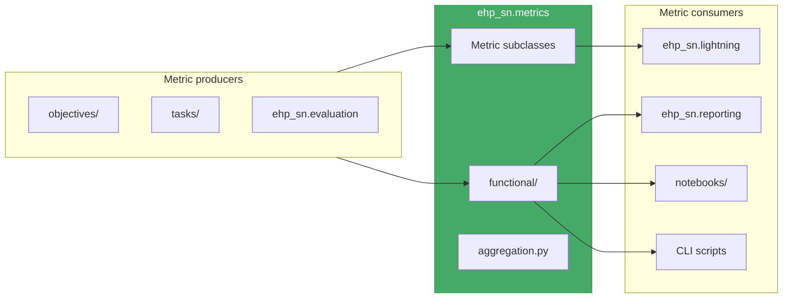

# Metrics Design Contract (`ehp_sn.metrics`)

> **Canonical architecture name:** `ehp_sn`. **Current Python namespace
> during migration:** `ehc_sn`. This document uses the canonical name
> throughout. All import examples should be read as `from ehp_sn`; the
> implementation package is `ehc_sn` until the rename is complete.
>
> The metrics module owns the **mathematical definition and accumulation
> semantics** of every measurement in the EHP project. It answers exactly
> one question: given predictions, targets, masks, and task-specific
> observations, what quantitative value should be computed and returned?

It does **not** own evaluation workflows, experiment recipes, report
generation, plotting, checkpoint selection, or MLflow logging. Those
belong in sibling packages:

```
ehp_sn.metrics       metric mathematics and accumulation
ehp_sn.evaluation    metric selection and evaluation orchestration
ehp_sn.logging       publishing scalar results
ehp_sn.figures       visual representations
ehp_sn.analysis      post-hoc derived analyses
ehp_sn.lightning     training-loop integration
```

---

## 1. Architectural position



### 1.1 Ownership

| Owns                                               | Does not own                                    |
| -------------------------------------------------- | ----------------------------------------------- |
| Metric formulas                                    | Which metrics belong to an evaluation recipe    |
| Input validation and normalization                 | Which metric is primary for a benchmark         |
| Masking and denominator semantics                  | Dataloader iteration                            |
| Stateful sufficient statistics                     | Model invocation                                |
| Distributed reduction semantics                    | Device placement policy for the whole evaluator |
| Empty-input behaviour                              | MLflow/W&B/TensorBoard logging                  |
| Result schema (shape and meaning of return values) | Figures and diagnostic artifacts                |
| Functional and streaming implementations           | Report layouts                                  |
| Tests against manually calculated examples         | Early-stopping or checkpoint-monitor policy     |

### 1.2 Dependency rule

```
ehp_sn.metrics may import:
    torch
    torchmetrics
    numpy (for genuinely NumPy-facing functional metrics;
        prefer pure Torch validation in the tensor execution path)
    ehp_sn.types (shared foundation types)

ehp_sn.metrics must not import:
    ehp_sn.lightning
    ehp_sn.evaluation
    ehp_sn.objectives
    ehp_sn.tasks
    ehp_sn.models
    ehp_sn.rollouts
    ehp_sn.traces
    ehp_sn.figures
    ehp_sn.analysis
    ehp_sn.logging
    mlflow
    matplotlib
    wandb
    lightning
```

---

## 2. The two metric APIs

Every custom mathematical formula in `ehp_sn.metrics` should expose a
**functional** (stateless) form. A **stateful** `torchmetrics.Metric`
subclass is added when streaming, Lightning integration, or distributed
accumulation is required. Not every metric needs both forms.

### 2.1 Functional API — stateless, complete-input computation

```python
from ehp_sn.metrics.functional import exact_sequence_match

value = exact_sequence_match(
    predictions=predicted_tokens,
    targets=target_tokens,
    mask=valid_steps,
)
# value → tensor(0.73)
```

**Purpose:** Unit tests, notebooks, offline datasets, per-batch
diagnostics, formula reuse inside other metrics, NumPy/DataFrame
evaluation.

**Contract:** Accepts complete `(B, T)` tensors, returns a scalar
`Tensor` or `dict[str, Tensor]`. No state, no side effects, no
`reset()`.

### 2.2 Stateful API — streaming, sufficient-statistics accumulation

```python
from ehp_sn.metrics import ExactSequenceMatch

metric = ExactSequenceMatch()

for batch in dataloader:
    metric.update(
        predictions=batch.predictions,
        targets=batch.targets,
        mask=batch.valid_steps,
    )

result = metric.compute()  # → tensor(0.73)
metric.reset()
```

**Purpose:** Training loop streaming, distributed evaluation,
GPU-resident accumulation, Lightning integration.

**Contract:** `torchmetrics.Metric` subclass with `update()`,
`compute()`, and `reset()` — the standard TorchMetrics lifecycle.

### 2.3 The authoritative primitive is the sufficient-statistics function

The public functional metric and the stateful `Metric` subclass **share
a single private sufficient-statistics helper**. The public function
returns the final ratio; the helper returns the raw counts so that the
stateful class can accumulate them.

```python
# Private shared primitive — returns raw counts, not a ratio
def _exact_sequence_match_stats(
    predictions: Tensor,
    targets: Tensor,
    *,
    mask: Tensor | None = None,
) -> tuple[Tensor, Tensor]:
    """Return (exact_count, eligible_count)."""
    ...

# Public functional metric — calls the helper and takes the ratio
def exact_sequence_match(predictions, targets, *, mask=None) -> Tensor:
    correct, total = _exact_sequence_match_stats(predictions, targets, mask=mask)
    return _safe_ratio(correct, total)

# Stateful class — calls the helper and accumulates
class ExactSequenceMatch(Metric):
    def update(self, predictions, targets, *, mask=None):
        correct, total = _exact_sequence_match_stats(
            predictions, targets, mask=mask
        )
        self.correct += correct
        self.total += total
```

This ensures one formula, one test suite, and no drift between
functional and streaming implementations. The private
sufficient-statistics helper is the **single source of truth** for the
mathematical definition. Neither the public function nor the stateful
class reimplements it independently.

---

## 3. Core metric contract (stateful)

```python
from torch import Tensor
from torchmetrics import Metric


def _safe_ratio(numerator: Tensor, denominator: Tensor) -> Tensor:
    """Return numerator / denominator, or NaN when denominator is zero."""
    value = numerator.float() / denominator.float()
    return torch.where(
        denominator > 0,
        value,
        torch.full_like(value, float("nan")),
    )


class ExactSequenceMatch(Metric):
    """Fraction of sequences where all valid positions match exactly.

    Empty support (zero eligible sequences) produces NaN at
    ``compute()`` time — zero and NaN are not interchangeable in
    scientific evaluation.
    """

    is_differentiable = False
    higher_is_better = True
    full_state_update = False

    def __init__(self) -> None:
        super().__init__()
        self.add_state(
            "correct",
            default=torch.tensor(0, dtype=torch.long),
            dist_reduce_fx="sum",
        )
        self.add_state(
            "total",
            default=torch.tensor(0, dtype=torch.long),
            dist_reduce_fx="sum",
        )

    def update(
        self,
        predictions: Tensor,
        targets: Tensor,
        *,
        mask: Tensor | None = None,
    ) -> None:
        """Accumulate sufficient statistics.

        Args:
            predictions: Integer tensor ``(B, T)``.
            targets: Integer tensor ``(B, T)``.
            mask: Optional boolean tensor ``(B, T)``.
                ``True`` = valid position participating in the comparison.
        """
        # A sequence is *eligible* iff it has at least one valid position.
        eligible = (
            torch.ones(
                predictions.shape[0], dtype=torch.bool, device=predictions.device
            )
            if mask is None
            else mask.any(dim=-1)
        )

        # Per-position correctness: True if match or masked-out.
        position_correct = predictions.eq(targets)
        if mask is not None:
            position_correct = position_correct | ~mask

        # A sequence is *exact* iff every position is correct AND it is eligible.
        # Without the eligibility guard, a fully-masked sequence would be
        # counted as exact (all positions are True from | ~mask) while being
        # excluded from total, producing a value > 1.0.
        exact = position_correct.all(dim=-1) & eligible

        self.correct += exact.sum()
        self.total += eligible.sum()

    def compute(self) -> Tensor:
        return _safe_ratio(self.correct, self.total)
```

### 3.1 Implicit contract rules

Every `Metric` subclass in this project must satisfy:

| Rule                                                                | Rationale                                                                                         |
| ------------------------------------------------------------------- | ------------------------------------------------------------------------------------------------- |
| `update()` changes state but does **not** return the dataset metric | Avoids confusion between step-level and dataset-level values                                      |
| `compute()` derives the result from accumulated state               | Pure read, no mutation                                                                            |
| `reset()` restores initial state                                    | Required for reuse by TorchMetrics collections                                                    |
| States have explicit `dist_reduce_fx`                               | DDP correctness                                                                                   |
| Metric state should be bounded                                      | Unless the metric mathematically requires dataset-level state; exceptions must declare complexity |
| Stateful evaluation metrics detach accumulated state                | Functional metric functions may remain differentiable unless explicitly documented otherwise      |
| Repeated `compute()` returns the same result                        | Unless another `update()` occurred                                                                |
| `compute()` does not destructively mutate state                     | Repeated calls are safe                                                                           |

---

## 4. Sufficient statistics — never batch averages

**This is the most important implementation rule in this module.**

A bad metric computes per-batch accuracy and averages the batch accuracies:

```python
# WRONG — batch-size-dependent result
self.batch_accuracies.append(batch_accuracy)
```

A correct metric accumulates sufficient statistics:

```python
# CORRECT — invariant to batch partitioning
self.correct += number_correct
self.total += number_valid
```

### 4.1 Sufficient-statistics table

| Metric                  | Accumulated state                            |
| ----------------------- | -------------------------------------------- |
| Accuracy                | `correct` count, `valid` count               |
| Mean error              | `error_sum`, `valid` count                   |
| MSE                     | `squared_error_sum`, `valid` count           |
| Exact sequence accuracy | `exact` count, `total` sequences             |
| Precision / Recall      | TP, FP, FN                                   |
| Mean episode return     | `return_sum`, `episode_count`                |
| Mean ACT steps          | `step_sum`, `valid_slot_count`               |
| Halt rate               | `halted_count`, `eligible_count`             |
| Field MAE               | `absolute_error_sum`, `valid_location_count` |

### 4.2 Why this matters

Sufficient-statistics accumulation produces correct results under:

- Uneven final batches
- Variable-length sequences
- Distributed evaluation (DDP)
- Dynamic masks
- Different numbers of episodes per process
- Cross-validation folds with unequal splits

---

## 5. Metric state must be mergeable

Every custom metric must be reducible through associative sufficient
statistics. This is required for correct DDP execution.

### 5.1 Mergeability checklist

For every custom metric, document:

1. **What state is accumulated?** (e.g., `correct: Tensor`, `total: Tensor`)
2. **How is each state reduced across ranks?** (`dist_reduce_fx="sum"`)
3. **Is the state bounded in memory?** (Yes: O(1) scalar or O(n_bins) histogram)
4. **Is the result exactly mergeable?** (`correct_A + correct_B`, `total_A + total_B`)
5. **Does distributed execution produce the same result as single-process?** (Yes, if sufficient statistics are used)

### 5.2 When mergeability is not possible

Some metrics inherently need complete predictions or ranked scores — for
example, exact AUROC requires sorting all scores. These cases must be:

- Explicitly documented
- Aware of memory and communication costs
- The exception, not the rule

```python
# Acceptable exception — documented non-mergeable metric
class AUROC(Metric):
    """Area Under the Receiver Operating Characteristic curve.

    NOTE: This metric collects all predictions and targets and sorts
    them at compute() time. State is O(N) in the number of samples.
    Not suitable for very large datasets or GPU-resident training
    loops without explicit memory planning.
    """
```

---

## 6. Masks and denominators

Many EHP metrics operate on structured subsets of the data:

- Padded sequences with valid-timestep masks
- Revisit-only subsets of observations
- Active ACT slots (non-halted)
- Episode boundaries
- Ancestral vs. retrieved vs. inference pathways
- Task-specific structural subsets

### 6.1 Denominator semantics

A metric is **incomplete** unless its denominator is precisely defined.
For example, `masked_categorical_accuracy` must state whether its
denominator is:

```
sum(valid_mask & revisit_mask)
```

and what happens when that sum is zero.

### 6.2 Empty-support policy — project-wide default is NaN

The **project-wide default** for an empty-denominator metric is **NaN**.
For scientific evaluation, "no qualifying observations" is semantically
different from "zero performance", and silently returning 0.0 is
misleading. Use the `_safe_ratio()` helper from §3.

A metric may override this default to return 0.0 only when the metric's
semantics explicitly define zero as the correct empty value (e.g., halt
rate when no eligible slots exist). The override must be documented in
the metric's class docstring.

Companion support keys may be used for aggregation consumers:

```python
results = {
    "accuracy_ancestral_revisit": tensor(0.73),
    "accuracy_ancestral_revisit/support": tensor(512),
}
```

### 6.3 Masked update pattern

The standard pattern for masked metrics is:

```python
def update(self, predictions, targets, *, mask=None):
    if mask is None:
        mask = torch.ones_like(targets, dtype=torch.bool)
    correct = (predictions == targets) & mask
    self.correct += correct.sum()
    self.total += mask.sum()
```

---

## 7. Semantic inputs — not evaluator-specific

Metric `update()` methods accept **semantic tensors**, not evaluator- or
runtime-specific context objects.

### 7.1 Good — explicit semantic arguments

```python
metric.update(
    predictions=output.ancestral_predictions,
    targets=batch.observations,
    mask=batch.valid_step & traces.revisit,
)
```

### 7.2 Acceptable — typed input object for related families

```python
@dataclass(frozen=True)
class PathwayInput:
    predictions: Tensor       # logits or class ids for one pathway
    targets: Tensor           # ground-truth observation ids
    valid: Tensor             # valid-step mask
    revisit: Tensor           # revisit-only mask

metric.update(PathwayInput(...))
```

### 7.3 Forbidden — universal service locator

```python
# NEVER — untyped, every field optional, hides requirements
class MetricContext:
    logits: Tensor | None = None
    labels: Tensor | None = None
    traces: Mapping[str, Tensor] | None = None
    environment: Any | None = None
```

---

## 8. Output contract

### 8.1 Direct output

The native output of `compute()` is:

```python
Tensor              # Single scalar
dict[str, Tensor]   # Multiple named scalars
```

### 8.2 Evaluation boundary wrapping

After `compute()`, the evaluation boundary may wrap the raw Tensor into a
richer result type for provenance and metadata:

```python
@dataclass(frozen=True)
class ScalarMetricResult:
    value: float
    support: int | None = None
    direction: Literal["maximize", "minimize", "none"] = "none"
```

But this wrapping happens **after** the metric computes — the Metric class
itself returns a plain `Tensor` or `dict[str, Tensor]`.

---

## 9. Metric identity vs. metric implementation

These are two different concepts that must not be collapsed.

### 9.1 Runtime metric — executable object

```python
from ehp_sn.metrics import ExactSequenceMatch
metric = ExactSequenceMatch()
```

### 9.2 Metric specification — declarative metadata

```python
@dataclass(frozen=True)
class MetricSpec:
    name: str
    factory: Callable[[], Metric]
    direction: Literal["maximize", "minimize", "none"]
```

Metric specifications reside in **`ehp_sn.evaluation`**, not in
`ehp_sn.metrics`. They are evaluation/benchmark policy:

```python
# In ehp_sn.evaluation — NOT in ehp_sn.metrics
from ehp_sn.metrics import ExactSequenceMatch

MetricSpec(
    name="sequences_exact",
    factory=ExactSequenceMatch,
    direction="maximize",
)
```

### 9.3 Registry rule

If a metric registry is needed for declarative configuration, it must
store **factories or specs**, never mutable singleton instances:

```python
# CORRECT — factory, not instance
REGISTRY["sequences_exact"] = ExactSequenceMatch

# WRONG — shared state leaks between runs
REGISTRY["sequences_exact"] = ExactSequenceMatch()
```

---

## 10. Package structure

```
src/ehp_sn/metrics/
├── __init__.py                     # Narrow public API — stable stateful classes
│
├── functional/
│   ├── __init__.py                 # Re-exports all functional metrics
│   ├── classification.py          # masked_categorical_accuracy, token_accuracy
│   ├── sequences.py               # exact_sequence_match, prefix_accuracy
│   ├── fields.py                  # masked_mae, masked_mse
│   └── deliberation.py            # halt_rate, mean_deliberation_steps
│
├── classification.py              # MaskedCategoricalAccuracy
├── sequences.py                   # ExactSequenceMatch
├── fields.py                      # MaskedMeanAbsoluteError, MaskedMeanSquaredError
├── deliberation.py                # HaltRate, MeanDeliberationSteps
├── aggregation.py                 # SupportAwareMean, support_counter
└── _validation.py                 # Internal input-validation helpers (not exported)
```

Do not add `pathways.py` in the initial package. If pathway metrics are
categorical accuracy with pathway-specific tensor selection and masks,
`MaskedCategoricalAccuracy` with external mask selection is sufficient:

```python
metric.update(
    predictions=outputs.ancestral,
    targets=targets,
    mask=valid & revisit,
)
```

Add a `PathwayAccuracy` class only when it performs real domain logic
such as alignment, pathway-specific decoding, or trace interpretation.

### 10.1 Organise by semantics, not by task or model

| Do this                     | Not this              |
| --------------------------- | --------------------- |
| `metrics/sequences.py`      | `metrics/hrm_v1.py`   |
| `metrics/deliberation.py`   | `metrics/arena.py`    |
| `metrics/fields.py`         | `metrics/mazehard.py` |
| `metrics/classification.py` | `metrics/tem_v1.py`   |

### 10.2 What not to export from `__init__.py`

```python
# In __init__.py — export only stable, commonly used stateful metrics
from .deliberation import HaltRate, MeanDeliberationSteps
from .fields import MaskedMeanAbsoluteError, MaskedMeanSquaredError
from .sequences import ExactSequenceMatch, MaskedCategoricalAccuracy

__all__ = [
    "ExactSequenceMatch",
    "HaltRate",
    "MaskedCategoricalAccuracy",
    "MaskedMeanAbsoluteError",
    "MaskedMeanSquaredError",
    "MeanDeliberationSteps",
]
```

Do not export:

- Internal reduction helpers
- Validation utilities
- Every TorchMetrics class
- Recipe registries
- Logging adapters
- Task-specific configuration types
- Experimental metrics without a stability commitment

Functional variants are explicitly namespaced:

```python
from ehp_sn.metrics.functional import (
    exact_sequence_match,
    masked_categorical_accuracy,
    masked_mean_absolute_error,
    masked_mean_squared_error,
    halt_rate,
    mean_deliberation_steps,
)
```

---

## 11. Metric naming

### 11.1 Canonical metric identifiers

Metric identifiers use **flat, underscore-delimited names** that are
stable across all experiments, commits, and evaluations. These are
the permanent names that appear in checkpoint monitor keys, MLflow
fields, and report schema columns:

```
accuracy_inference_all
accuracy_inference_revisit
accuracy_retrieved_all
accuracy_retrieved_revisit
accuracy_ancestral_all
accuracy_ancestral_revisit

sequences_exact
sequences_token_accuracy

deliberation_steps_mean
deliberation_halt_rate
deliberation_budget_exhaustion_rate

field_mae
field_mse
```

Logging namespaces (e.g., `val/sequences_exact`, `eval/`) are added
externally by the logging or Lightning layer — they are not part of
the canonical metric identity. This separates metric identity from
logging scope.

### 11.2 Display labels

Display labels are separate metadata, not derived from canonical
identifiers:

```
canonical id:   accuracy_ancestral_revisit
display label:  Ancestral revisit accuracy
```

Display labels are set by the evaluation suite or report, not by the
metric implementation.

### 11.3 Metric class names

Metric class names are `PascalCase` versions of the metric concept:

```
ExactSequenceMatch        → not SequenceExactMatchFraction
HaltRate                  → not HaltRateMetric
MaskedCategoricalAccuracy → not TokenAccuracyMetric
MaskedMeanAbsoluteError   → not MaskedFieldMAE
```

---

## 12. Parameterisation, not proliferation

### 12.1 Forbidden — one class per slice

```python
# DON'T — combinatorial explosion
class AncestralAllAccuracy(Metric): ...
class AncestralRevisitAccuracy(Metric): ...
class RetrievedAllAccuracy(Metric): ...
class RetrievedRevisitAccuracy(Metric): ...
```

### 12.2 Acceptable — parameterised metric (when domain logic justifies it)

```python
# Only if pathway interpretation requires nontrivial logic.
# Otherwise, use MaskedCategoricalAccuracy with external mask selection.
PathwayAccuracy(pathway="ancestral", subset="revisit")
```

### 12.3 Preferred — generic metric with mask selection

```python
# Selection happens before the metric:
metric.update(
    predictions=ancestral_predictions,
    targets=targets,
    mask=valid & revisit,
)
```

Use a generic `MaskedCategoricalAccuracy` whenever the mask is a
simple boolean selection — which covers the vast majority of pathway
metrics. Use a domain-specific parameterised metric only when the
logic cannot be expressed as a simple mask selection.

---

## 13. Training metrics vs. evaluation metrics

Not all metrics are equally suitable inside the training loop.

### 13.1 Streaming training metrics

These must be:

- **Cheap** — no expensive spatial analysis
- **Bounded-memory** — sufficient statistics only
- **GPU-friendly** — tensor-native
- **Distributed-reducible** — sum across ranks
- **Computable every step/epoch**

Examples:

```
token accuracy
exact sequence accuracy
mean ACT steps
halt rate
```

### 13.2 Offline evaluation metrics

These may require:

- Full trajectories
- Environment topology
- Episode reconstruction
- Sorting all predictions
- Bootstrapping
- Expensive structural analysis
- Large artifacts

Examples:

```
trajectory-level path optimality
spatial field topology metrics
grid-cell spectral analysis
place-field stability
confidence intervals
```

### 13.3 Rule

> `metrics` may contain expensive metric mathematics, but it must not
> decide when or over which artifact collection that mathematics runs.

---

## 14. Metrics vs. losses

Losses and metrics may share formulas but have different contracts.

### 14.1 Loss contract

- Must preserve gradients
- Returns a tensor participating in optimization
- May include regularization and training-only shaping
- Can depend on curriculum or schedules
- Usually computed per batch

### 14.2 Metric contract

- Runs under `no_grad` or inference mode
- Accumulates detached state
- Must be interpretable and stable
- Should not depend on optimizer schedules
- Often computes dataset- or episode-level quantities

### 14.3 Shared mathematics — the functional bridge

```python
# ehp_sn.losses.functional — differentiable terms
def cross_entropy_loss(logits, targets, reduction="mean"):
    ...

# ehp_sn.metrics.functional — measurement formulas
def masked_categorical_accuracy(predictions, targets, mask=None):
    ...
```

Occasional shared low-level utilities (e.g., softmax, argmax) can
live in `ehp_sn.ops` or a neutral internal module, but the public
contracts of losses and metrics must remain distinct.

---

## 15. Metrics vs. logging

A metric computes a value:

```python
{"sequences_exact": tensor(0.73)}
```

A logger publishes it:

```python
mlflow.log_metric("eval/sequences_exact", 0.73)
```

**A metric must never call a logger or tracking API.** This rule is a
package-boundary invariant: `ehp_sn.metrics` must not import logging or
tracking libraries. Lightning modules or evaluation runners that
_consume_ metric results may log the values — but the metric class
does not know about loggers. This keeps metrics independently usable
in:

- Lightning (via `self.log` in the LightningModule, outside the metric)
- Standalone evaluation
- Unit tests
- Notebooks
- CLI scripts
- Distributed inference
- Alternative tracking systems

---

## 16. Metrics vs. analysis

### 16.1 What is a metric?

A metric normally has a **stable scalar or small-vector interpretation**:

```
accuracy
MSE
exact-match rate
mean deliberation steps
grid score
field correlation
```

### 16.2 What is analysis?

Analysis may produce:

- DataFrames
- Per-unit distributions
- Spatial maps
- Cluster assignments
- Regression models
- Multiple intermediate values
- Rich diagnostics

For example, computing each MEC unit's autocorrelogram, identifying
candidate grid cells, estimating orientation and spacing, and producing
a table of individual cell properties — that is **analysis**.

A final aggregate such as `mean grid score` or `fraction of units above
threshold` can be a metric derived from that analysis, but the
multi-stage pipeline itself is not a metric.

### 16.3 Rule

Do not force complex analysis pipelines into `Metric.update()`.

---

## 17. Validation requirements

Every custom metric must validate:

| Check                  | Example                                   |
| ---------------------- | ----------------------------------------- |
| Tensor ranks           | `predictions.dim() == targets.dim()`      |
| Compatible shapes      | `predictions.shape == targets.shape`      |
| Dtypes                 | Long for classes, float for probabilities |
| Device compatibility   | Same device for all inputs                |
| Boolean mask shape     | `mask.shape == predictions.shape`         |
| Class-axis assumptions | `logits.shape[-1] == n_classes`           |
| Value ranges           | Probabilities in [0, 1]                   |
| Empty inputs           | `batch_size == 0`                         |
| All-masked inputs      | `mask.sum() == 0`                         |
| NaN / inf policy       | Raise or clamp                            |

```python
def exact_sequence_match(
    predictions: Tensor,
    targets: Tensor,
    *,
    mask: Tensor | None = None,
) -> Tensor:
    """Compute the fraction of fully correct valid sequences.

    Args:
        predictions: Integer tensor ``(batch, time)``.
        targets: Integer tensor ``(batch, time)``.
        mask: Optional boolean tensor ``(batch, time)``.
            ``True`` = position participates in the comparison.

    Returns:
        Scalar float tensor in [0, 1].

    Raises:
        ValueError: If shapes are incompatible or a sequence has
            zero valid positions.
    """
```

---

## 18. Test matrix

Every custom metric requires:

### 18.1 Formula tests — manually calculated small cases

```
predictions = [[1, 2, 3], [1, 4, 3]]
targets     = [[1, 2, 3], [1, 2, 3]]

token accuracy = 5 / 6
sequence exact = 1 / 2
```

### 18.2 Mask tests

Verify that padded and invalid positions do not alter results.

### 18.3 Batch-partition invariance

The result must be identical whether inputs are:

```
one batch of 100
ten batches of 10
uneven batches of 17, 31, 52
```

### 18.4 State lifecycle

```
initial state  → compute() returns 0.0 or NaN
update()       → state changes
compute()      → expected value
compute()      → same value (idempotent)
reset()        → back to initial state
update()       → accumulates correctly after reset
```

### 18.5 Distributed reduction (mathematical)

```
state(full dataset) == merge(state(partition A), state(partition B))
```

### 18.6 Device tests

CPU and CUDA where supported.

### 18.7 Reference implementation tests

Compare against:

- A simple slow implementation
- TorchMetrics built-in equivalents
- Manually enumerated values

### 18.8 Degenerate cases

```
empty batch
all masked
single observation
all correct
all incorrect
zero support (when denominator = 0)
```

---

## 19. Recommended EHP-specific metrics

### 19.1 Sequence metrics

```python
class ExactSequenceMatch(Metric):
    """Fraction of fully correct sequences over supervised tokens."""
    ...

class MaskedCategoricalAccuracy(Metric):
    """Token-level accuracy with optional mask."""
    ...

class ValidTokenAccuracy(Metric):
    """Accuracy restricted to non-padding tokens."""
    ...
```

For MazeHard:

- `sequences_exact` accumulates `number of fully correct valid sequences`
  and `number of eligible sequences` — **not** the mean of batch exact-match rates.

### 19.2 Pathway prediction metrics

A generic `MaskedCategoricalAccuracy` with external mask selection
is sufficient for pathway-specific evaluation:

```python
# Inference pathway, revisit-only:
metric.update(
    predictions=outputs.inference_predictions,
    targets=targets,
    mask=valid & revisit,
)
```

A domain-specific `PathwayAccuracy` may be added later if pathway
interpretation or alignment requires nontrivial logic. It is not
part of the initial stable API.

### 19.3 Deliberation metrics

```python
class MeanDeliberationSteps(Metric):
    """Mean deliberation steps per eligible slot."""
    ...

class HaltRate(Metric):
    """Fraction of eligible slots that halted."""
    ...

class BudgetExhaustionRate(Metric):
    """Fraction of slots that reached the maximum step budget."""
    ...
```

Denominators use sample counts or valid-slot counts, never raw batch counts.

### 19.4 Continuous field metrics

```python
class MaskedMeanAbsoluteError(Metric):
    """Mean absolute error over valid field locations."""
    ...

class MaskedMeanSquaredError(Metric):
    """Mean squared error over valid field locations."""
    ...
```

### 19.5 RL metrics

```python
class MeanEpisodeReturn(Metric):
    """Mean episode return over completed episodes."""
    ...

class EpisodeSuccessRate(Metric):
    """Fraction of completed episodes satisfying the success criterion."""
    ...
```

**Important:** These are updated on completed episodes, not on arbitrary
rollout chunks. A TBPTT or rollout boundary is not necessarily an episode
boundary.

---

## 20. Interaction with the existing route-table pipeline

The project currently has a working route-table pipeline
(`adapter.py` + `routes/` + `StepMetrics`) that routes pre-computed
numerators and denominators from objectives to generic `RatioMetric`
accumulators. This document introduces a **complementary** layer — it
does not require removing the existing pipeline.

### 20.1 Coexistence strategy

```
Objective computes correctness        Metric subclass computes correctness
     │                                         │
     ▼                                         ▼
  RatioStat (num, den)                  Metric.update(predictions, targets, mask)
     │                                         │
     ▼                                         ▼
  RatioMetric.update(num, den)           Metric internal state
     │                                         │
     ▼                                         ▼
  RatioMetric.compute()                  Metric.compute()
```

The new `Metric` subclasses provide:

1. **Formula locality** — the mathematical definition lives in a
   single class, testable without running objectives
2. **Functional API** — offline computation in notebooks and CLI scripts
3. **Self-contained tests** — no Lightning, no objective imports
4. **Future migration path** — objectives can eventually call
   `metric.update()` directly instead of populating `StepMetrics`

The generic `RatioMetric` continues to serve the route-table pipeline
for the full set of 15+ metrics. The named subclasses provide the 5–8
primary metrics with a testable, self-contained surface.

### 20.2 Migration model — phased, not indefinite

The coexistence of two execution paths is a migration tool, not a
permanent design. The formula must not be independently reimplemented
in both paths — it must live in one shared location and be called
from each adapter.

| Phase | Authority                                  | Compatibility path                                       |
| ----- | ------------------------------------------ | -------------------------------------------------------- |
| 1     | Existing route-table implementation        | Functional metric acts as reference oracle               |
| 2     | Functional sufficient-statistics primitive | Route table and TorchMetric delegate to it               |
| 3     | Functional primitive + TorchMetric wrapper | Route path retained only where architecturally necessary |
| 4     | One execution path per metric              | Legacy duplicate removed                                 |

At **Phase 2**, the `_*_stats()` private helper is the single source of
truth. At **Phase 4**, each metric has exactly one execution path —
either the TorchMetric subclass or the route-table pipeline, not both.

---

## 21. Recommended public API

### 21.1 Initial stable surface

The initial stable public API exposes six stateful metrics:

```python
# Stateful — training-loop ready
from ehp_sn.metrics import (
    ExactSequenceMatch,
    HaltRate,
    MaskedCategoricalAccuracy,
    MaskedMeanAbsoluteError,
    MaskedMeanSquaredError,
    MeanDeliberationSteps,
)

# Functional — offline and notebook ready
from ehp_sn.metrics.functional import (
    exact_sequence_match,
    halt_rate,
    masked_categorical_accuracy,
    masked_mean_absolute_error,
    masked_mean_squared_error,
    mean_deliberation_steps,
)
```

The following metrics are **experimental** and should not be exported
from `__init__.py` until concrete task contracts stabilise:

```
BudgetExhaustionRate
MeanEpisodeReturn
SuccessorRecallAtK
```

`MeanEpisodeReturn` may use standard TorchMetrics unless EHP has
special episode-completion semantics.

### 21.2 Typical evaluator usage

```python
from torchmetrics import MetricCollection
from ehp_sn.metrics import (
    ExactSequenceMatch,
    MaskedCategoricalAccuracy,
    MeanDeliberationSteps,
)

metrics = MetricCollection({
    "sequences_exact": ExactSequenceMatch(),
    "sequences_token_accuracy": MaskedCategoricalAccuracy(),
    "deliberation_steps_mean": MeanDeliberationSteps(),
})

for output in evaluation_stream:
    metrics["sequences_exact"].update(
        output.predicted_tokens,
        output.target_tokens,
        mask=output.valid_tokens,
    )
    metrics["sequences_token_accuracy"].update(
        output.predicted_tokens,
        output.target_tokens,
        mask=output.valid_tokens,
    )
    metrics["deliberation_steps_mean"].update(
        output.deliberation_steps,
        mask=output.valid_examples,
    )

results = metrics.compute()
```

Selection of that collection happens in evaluation or Lightning code —
not inside `ehp_sn.metrics`.

---

## 22. What not to build

### 22.1 No custom metric framework

```python
# NEVER — custom framework when TorchMetrics exists
class Metric:
    def calculate(self, runtime, model, batch, traces, artifacts, config):
        ...
```

### 22.2 No metric registry as primary runtime

```python
# NEVER — ordinary imports are sufficient
METRIC_REGISTRY = {"accuracy": lambda ctx: ...}
```

Registries are justified only when metrics must be selected
declaratively from external configuration. In that case, the registry
stores **factories**, not instances:

```python
# Acceptable — declarative selection needs a registry of factories
METRIC_FACTORIES: dict[str, type[Metric]] = {
    "sequences_exact": ExactSequenceMatch,
}
```

### 22.3 No evaluation metadata in metrics

- `MetricSpec` belongs in `ehp_sn.evaluation`
- Primary/secondary metric selection belongs in evaluation suites
- Direction metadata (`higher_is_better`) may live in evaluation specs
  or be derived from metric class attributes

---

## 23. Summary: professional separation boundary

```
ehp_sn.metrics
    “How is this quantity mathematically measured?”

    Owns: formulas, sufficient statistics, masks, denominators,
          functional API, stateful API, tests, TorchMetrics subclasses

ehp_sn.evaluation
    “Which quantities are computed for this benchmark, from which outputs?”

    Owns: MetricSpec, EvaluationSuite, MetricSelection, Criterion,
          primary metric selection, result aggregation

ehp_sn.lightning
    “When are streaming metrics updated and reset during training?”

    Owns: MetricCollection construction, train/val metric lifecycle,
          prefix/postfix management, Lightning hook integration

ehp_sn.logging
    “Where are the resulting values published?”

    Owns: TensorBoard, MLflow, console output of scalar values

ehp_sn.figures
    “How are results visualized?”

    Owns: matplotlib/seaborn rendering of metric distributions,
          diagnostic histograms, trajectory overlays

ehp_sn.analysis
    “What richer interpretation is derived from stored outputs?”

    Owns: grid scores, place fields, RSA, pathway decomposition,
          bootstrap confidence intervals
```

This boundary ensures that:

- **You can test a metric without a model.** `functional.exact_sequence_match(preds, targets, mask=m)` works with plain tensors.
- **You can evaluate a metric with any framework.** The same `ExactSequenceMatch` class works in Lightning, standalone scripts, and notebooks.
- **You can change the benchmark without changing the metric.** "Make `accuracy_ancestral_revisit` the primary metric for arena" is a one-line change in an evaluation suite config.
- **You can change the logging backend without touching metrics.** The metric returns `tensor(0.73)`; MLflow, W&B, and TensorBoard adapters all consume the same value.
