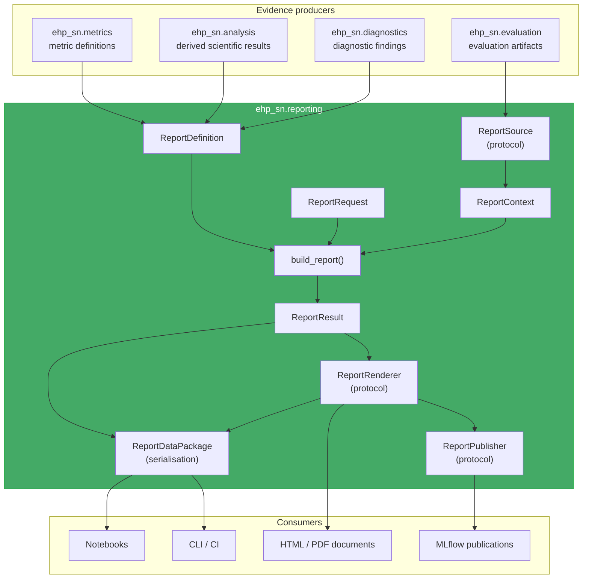

# Reporting Design Contract (`ehp_sn.reporting`)

> A deterministic application service that selects existing evaluation
> evidence, normalises it, composes it according to a report definition,
> and exposes the result for notebooks, serialisation, rendering, or
> publication.

The canonical flow:

```
evaluation evidence
    → normalised report context
    → semantic report result
    → serialised bundle or rendered document
```

The central abstraction is `ReportResult` — the missing boundary between
artifact extraction and notebook/document presentation.

---

## 1. Ownership boundary

### Owns

- **Report definitions** — declarative description of sections, metrics,
  figures, and ordering (what a report _is_)
- **Report requests** — concrete invocation binding a definition to an
  evaluation source (which evidence to use)
- **Source resolution** — abstracting evaluation storage (local, MLflow,
  in-memory) behind a protocol
- **Evidence normalisation** — anti-corruption layer between evaluation
  artifact formats and report composition
- **Report composition** — validating compatibility, selecting evidence,
  resolving sections, building provenance
- **Report serialisation** — portable Frictionless Data Package format
- **Report rendering** — converting a semantic `ReportResult` into HTML,
  Markdown, JSON, or other output formats
- **Report publication** — storing or exposing rendered output to a target
  (local directory, MLflow, S3)
- **Report registry** — deterministic registration and validation of
  built-in report definitions

### Does not own

| Concern                                                     | Owner                           |
| ----------------------------------------------------------- | ------------------------------- |
| Model execution, checkpoint loading                         | `ehp_sn.models`, `experiments/` |
| Metric computation and accumulation                         | `ehp_sn.metrics`                |
| Primary scientific evaluation results                       | `ehp_sn.evaluation`             |
| Trace capture, trace schemas, trace persistence             | `ehp_sn.traces`                 |
| Figure rendering (Matplotlib, Plotly)                       | `ehp_sn.figures`                |
| Post-hoc scientific computation (grid scores, place fields) | `ehp_sn.analysis`               |
| Model-health diagnostics                                    | `ehp_sn.diagnostics`            |
| Runtime event logging                                       | `ehp_sn.logging`                |
| Dataset construction and versioning                         | `ehp_sn.data`                   |
| Experiment tracking implementation                          | `adapters/` (e.g. `mlflow.py`)  |

### Formal responsibility

```
reporting =
    report definition +
    source resolution +
    evidence normalisation +
    compatibility validation +
    semantic section composition +
    provenance construction +
    serialisation +
    rendering +
    publication
```

---

## 2. Architectural position



### Dependency rule

```
reporting may import:
    - stable public contracts from evaluation, artifacts, figures, metrics
    - task-specific inspection modules (lazily, via derived resource builders)
    - pandas, pyarrow (for tabular serialisation)
    - typing, dataclasses, pathlib, json

reporting must not import:
    - ehp_sn.models
    - ehp_sn.controllers
    - ehp_sn.objectives
    - ehp_sn.training
    - ehp_sn.lightning
    - ehp_sn.rollouts
    - torch
    - mlflow (imported lazily by sources/mlflow.py only)
```

No downstream package may import `reporting`:

```
models / tasks / evaluation / metrics / figures / analysis
    ↑
reporting
    ↑
notebooks / CLI / documentation
```

---

## 3. Core lifecycle

```
ReportDefinition               ← what the report is
       +
ReportRequest                  ← which evidence to use
       +
ReportSource                   ← how to retrieve evidence
       ↓
build_report()
       ↓
ReportResult                   ← renderer-neutral semantic report
       ├── serialize  → ReportDataPackage (Frictionless Data Package)
       ├── inspect    → notebooks / Python
       └── render     → HTML / Markdown / PDF / JSON
```

### Internal phases of `build_report(request, *, registry, source)`

```
1. Resolve definition
   └── lookup report name in registry
   └── validate definition version, task, model families

2. Load context
   └── source.load_context(request) → ReportContext
   └── normalise evaluation artifacts into records
   └── context carries source_provenance and source_warnings

3. Validate compatibility
   └── task matches definition
   └── model family matches definition
   └── required metrics exist in context
   └── required resources exist

4. Resolve sections
   └── for each SectionSpec in definition
   └──   dispatch via @singledispatch to produce ResolvedSection
   └──   select and transform relevant evidence from context
   └── collect report_warnings for missing optional sections

5. Build provenance
   └── report identity (name, version, request_digest)
   └── source identity (run IDs, evaluation IDs)
   └── build version, repository commit
   └── no wall-clock timestamps (deterministic)

6. Return immutable ReportResult
```

---

## 4. Core domain model

### 4.1 `ReportDefinition` — what the report _is_

```python
@dataclass(frozen=True)
class ReportDefinition:
    """Declarative description of a report — no loaded data, no files."""
    name: str
    version: str
    title: str
    task: str | None = None
    model_families: frozenset[str] = frozenset()
    sections: tuple[SectionSpec, ...] = ()
    description: str | None = None
```

The definition says what should appear. It must not contain:

- loaded DataFrames or open files;
- MLflow clients or artifact paths;
- figure objects or Matplotlib state;
- renderer-specific settings (CSS, font sizes, layout grids).

**Example:**

```python
ARENA_TEM_DIAGNOSTIC = ReportDefinition(
    name="arena-tem-diagnostic",
    version="1",
    title="Arena TEM Diagnostic Report",
    task="arena",
    model_families=frozenset({"tem-v1", "tem-v2", "ehp-v1"}),
    sections=(
        MetricSummarySpec(
            id="headline",
            title="Headline Metrics",
            metrics=(
                "accuracy_ancestral_revisit",
                "accuracy_retrieved_revisit",
            ),
        ),
        MetricTableSpec(
            id="pathway_metrics",
            title="Pathway Metrics",
            resource="pathway_metrics",
        ),
        CaseGallerySpec(
            id="cases",
            title="Selected Cases",
            resource="cases",
            required=False,
        ),
        ProvenanceSpec(id="provenance"),
    ),
)
```

### 4.2 `SectionSpec` — typed section variants

Use typed variants, not a generic dictionary:

```python
SectionSpec = (
    NarrativeSpec
    | MetricSummarySpec
    | MetricTableSpec
    | CaseTableSpec
    | FigureGallerySpec
    | ArtifactLinksSpec
    | WarningSummarySpec
    | ProvenanceSpec
)
```

**Examples:**

```python
@dataclass(frozen=True)
class MetricSummarySpec:
    id: str
    title: str
    metrics: tuple[str, ...]
    required: bool = True

@dataclass(frozen=True)
class MetricTableSpec:
    id: str
    title: str
    resource: str
    required: bool = True

@dataclass(frozen=True)
class FigureGallerySpec:
    id: str
    title: str
    figures: tuple[str, ...]
    required: bool = False
```

Each spec type declares **what** semantic content is needed. It does not
declare layout, HTML classes, or visual primitives.

### 4.3 `ReportRequest` — one concrete invocation

```python
@dataclass(frozen=True)
class ReportRequest:
    """Identifies one concrete report invocation — serialisable."""
    report: str
    source: EvaluationSourceRef
    parameters: Mapping[str, JsonValue] = field(default_factory=dict)
    section_ids: tuple[str, ...] | None = None


@dataclass(frozen=True)
class EvaluationSourceRef:
    uri: str
    regime: str = "diagnostic"
```

A request should be serialisable so it can be:

- stored in MLflow;
- reproduced from a manifest;
- passed to a CLI;
- hashed for caching;
- used in tests.

Distinct from `ReportDefinition`:

```
Definition = reusable report template
Request    = one concrete report invocation
```

**Example TOML** (extending the current `report.toml` format):

```toml
schema = "ehp_sn.report.request.v1"

[report]
name = "arena-tem-diagnostic"

[source]
uri = "artifacts/eval/tem-v2-arena"
regime = "diagnostic"

[parameters]
max_cases = 8

[selection]
strategy = "balanced"
```

### 4.4 `ReportSource` — evidence retrieval protocol

```python
class ReportSource(Protocol):
    """Abstracts where evaluation evidence comes from."""

    def load_context(
        self,
        request: ReportRequest,
    ) -> ReportContext:
        """Load and normalise evidence for a request."""
        ...
```

The protocol prevents report definitions and notebooks from depending
directly on:

- `mlflow.tracking.MlflowClient`;
- `Path("artifacts/...")`;
- `zarr.open(...)`;
- manifest file formats.

**Implementations:**

| Source                 | Backend | Purpose                              |
| ---------------------- | ------- | ------------------------------------ |
| `LocalReportSource`    | Local   | Direct evaluation artifact directory |
| `MlflowReportSource`   | MLflow  | MLflow tracking server               |
| `InMemoryReportSource` | Memory  | Deterministic test fixtures          |

The current `materialize_evaluation_source()` logic forms the foundation for
`LocalReportSource` and `MlflowReportSource`.

A previously serialised report bundle is **not** a `ReportSource` — it
already contains a built report. Use `open_report()` for that path instead:

### 4.5 `ReportContext` — normalised evidence

```python
@dataclass(frozen=True)
class ReportContext:
    """Normalised, source-independent report inputs.

    Carries *source* provenance and warnings — the origin of the evidence.
    These are distinct from the *report* provenance and warnings produced
    by composition.
    """
    evaluation: EvaluationRecord
    metrics: MetricTable
    resources: ReportResourceSet
    cases: tuple[CaseRecord, ...]
    source_provenance: SourceProvenance
    source_warnings: tuple[SourceWarning, ...] = ()
```

This is the anti-corruption layer between evaluation storage and report
composition. Evaluation artifact formats are translated here into
reporting concepts:

```
RegimeArtifactSet.metrics   → MetricTable
evaluation manifest          → EvaluationRecord
artifact paths               → typed ReportResource
LoadedArtifactCase           → CaseRecord
```

#### Typed resource set — not a generic bag

`resources` is a typed union of resource kinds, not a raw
`Mapping[str, ReportResource]`:

```python
@dataclass(frozen=True)
class ReportResourceSet:
    """Typed collection of normalised resources from one evaluation source."""
    tables: Mapping[str, TabularResource] = field(default_factory=dict)
    figures: Mapping[str, FigureResource] = field(default_factory=dict)
    artifacts: Mapping[str, ArtifactResource] = field(default_factory=dict)
    json_docs: Mapping[str, JsonResource] = field(default_factory=dict)
    arrays: Mapping[str, ArrayResource] = field(default_factory=dict)

    def get_table(self, name: str) -> TabularResource: ...
    def get_figure(self, name: str) -> FigureResource: ...
    # ... per-kind typed accessors


@dataclass(frozen=True)
class FigureResource:
    name: str
    path: str              # relative within the package / artifact root
    media_type: str        # e.g. "image/png"
    caption: str | None = None
    producer_version: str | None = None


@dataclass(frozen=True)
class ArtifactResource:
    name: str
    path: str
    media_type: str
    description: str | None = None


@dataclass(frozen=True)
class JsonResource:
    name: str
    data: dict[str, object] | list[object]
    schema_id: str | None = None


@dataclass(frozen=True)
class ArrayResource:
    name: str
    shape: tuple[int, ...]
    dtype: str
    path: str | None = None  # path to Zarr / NPZ on disk
```

**Resource identity rule:** names are stable semantic identifiers (e.g.
`"pathway_metrics"`), not physical filenames (e.g. `"pathway_metrics.csv"`).
The serialisation layer maps semantic IDs to file paths. This prevents
report definitions from coupling to storage formats.

### 4.6 `ReportResult` — the canonical semantic report

```python
@dataclass(frozen=True)
class ReportResult:
    """Renderer-neutral semantic report — the primary public result type.

    Report provenance records *composition* identity — it is distinct
    from the source provenance in ReportContext.  The result is
    deterministic: two results with the same definition, request, and
    source are semantically equal.
    """
    definition: ReportDefinition
    request: ReportRequest
    sections: tuple[ResolvedSection, ...]
    provenance: ReportProvenance
    warnings: tuple[ReportWarning, ...] = ()

    def section(self, id: str) -> ResolvedSection: ...
```

This is the central abstraction. It is the missing boundary between:

```
artifact extraction
```

and:

```
notebook or document presentation
```

**Properties:**

- Immutable and frozen.
- Contains no open files, MLflow clients, or renderer state.
- The same `ReportResult` can be rendered as HTML, Markdown, or JSON.
- Notebooks consume `ReportResult` directly — they never touch artifact paths.
- **Deterministic**: no wall-clock timestamps in the semantic result.
  Timestamp metadata lives in the serialisation or render layer.

### 4.6a `RenderedReport` — render output

```python
@dataclass(frozen=True)
class RenderedReport:
    """Output of rendering a ReportResult — carries render provenance."""
    result: ReportResult
    format: str                    # "html", "pdf", "markdown", "json"
    render_provenance: RenderProvenance
    path: Path | None = None       # output directory or file
```

Renderer identity and timing belong here, not in the semantic `ReportResult`.

```python
@dataclass(frozen=True)
class RenderProvenance:
    renderer_name: str
    renderer_version: str
    rendered_at: datetime
    renderer_digest: str | None = None
```

### 4.7 `ResolvedSection` — typed semantic section content

```python
ResolvedSection = (
    NarrativeSection
    | MetricSummarySection
    | MetricTableSection
    | CaseTableSection
    | FigureGallerySection
    | ArtifactLinksSection
    | WarningSummarySection
    | ProvenanceSection
)
```

**Example:**

```python
@dataclass(frozen=True)
class MetricTableSection:
    id: str
    title: str
    table: TabularResource
    caption: str | None = None

@dataclass(frozen=True)
class FigureGallerySection:
    id: str
    title: str
    figures: tuple[FigureRecord, ...]
    caption: str | None = None
```

A resolved section must not contain:

- HTML, CSS, or display objects;
- Matplotlib figures;
- IPython display objects;
- renderer callbacks or lambdas.

### 4.8 Normalised records

```python
@dataclass(frozen=True)
class EvaluationRecord:
    evaluation_id: str
    alias: str
    task: str
    model_family: str
    model_uri: str | None = None
    dataset_uri: str | None = None
    dataset_split: str | None = None
    code_revision: str | None = None

@dataclass(frozen=True)
class MetricRecord:
    name: str
    value: float
    split: str | None = None
    aggregation: str | None = None
    unit: str | None = None

@dataclass(frozen=True)
class CaseRecord:
    case_id: str
    has_trace: bool = False
    rollout_mode: str | None = None
    metadata: Mapping[str, object] = field(default_factory=dict)

@dataclass(frozen=True)
class FigureRecord:
    name: str
    artifact_ref: str
    media_type: str
    caption: str | None = None
    producer_version: str | None = None
```

### 4.8a Source provenance and warnings

```python
@dataclass(frozen=True)
class SourceProvenance:
    """Where the evidence came from — recorded in ReportContext."""
    source_uri: str
    run_id: str | None = None
    evaluation_id: str = ""
    regime_id: str = ""
    task: str = ""
    model_family: str = ""
    code_revision: str | None = None
    artifact_digest: str | None = None

@dataclass(frozen=True)
class SourceWarning:
    """Evidence-quality or loading issue — recorded in ReportContext."""
    message: str
    code: str = ""
```

### 4.8b Report provenance and warnings

```python
@dataclass(frozen=True)
class ReportProvenance:
    """How the report was composed — recorded in ReportResult.

    Contains only composition-level metadata.  Wall-clock timestamps
    are absent so that a ReportResult is semantically deterministic.
    Renderer identity lives in RenderProvenance, not here.
    """
    report_name: str
    report_version: str
    request_digest: str
    source_ids: tuple[str, ...]
    build_version: str                    # builder code version
    repository_commit: str | None = None
    evaluation_recipe_versions: Mapping[str, str] = field(default_factory=dict)

@dataclass(frozen=True)
class ReportWarning:
    """Composition or omitted-section issue — recorded in ReportResult."""
    section_id: str
    message: str
    code: str = ""
```

DataFrames are useful tabular payloads but should not replace explicit
identity, metadata, and provenance models. Use `MetricRecord` for individual
metrics in the domain layer; use `MetricTable` (a typed wrapper around
`pd.DataFrame`) for tabular views.

### 4.9 `TabularResource` — typed table payload

```python
@dataclass(frozen=True)
class TabularResource:
    """A typed table payload — not a raw DataFrame."""
    data: pd.DataFrame
    description: str | None = None
    row_count: int | None = None
    column_units: Mapping[str, str] = field(default_factory=dict)
```

This prevents raw `pd.DataFrame` from leaking across every boundary without
metadata.

---

## 5. Package structure

### Target architecture (ownership boundaries)

```
src/ehp_sn/reporting/
├── __init__.py
│
├── definitions.py         # ReportDefinition, SectionSpec variants,
│                          #   ResolvedSection variants
├── requests.py            # ReportRequest, EvaluationSourceRef
├── results.py             # ReportResult, ReportContext, RenderedReport,
│                          #   ReportResourceSet and resource types
├── records.py             # EvaluationRecord, MetricRecord, CaseRecord,
│                          #   MetricTable, TabularResource,
│                          #   SourceProvenance, ReportProvenance, RenderProvenance,
│                          #   SourceWarning, ReportWarning
├── validation.py          # Semantic validation (definition, request, context,
│                          #   result, renderer compatibility)
├── registry.py            # ReportRegistry — deterministic registration
│
├── builders.py            # build_report() — central composition service
│                          #   + section builders via @singledispatch
├── sources.py             # ReportSource protocol
│                          #   + LocalReportSource, InMemoryReportSource
├── serializers.py         # ReportDataPackage write/read (Frictionless Data
│                          #   Package, atomic writes, _SUCCESS sentinel)
│
├── renderers/             # (deferred)
│   ├── __init__.py
│   └── base.py            # ReportRenderer protocol (stub)
│
├── publishers/            # (deferred)
│   ├── __init__.py
│   └── base.py            # ReportPublisher protocol (stub)
│
├── service.py             # prepare_report(), open_report()
├── cli.py                 # ehp report subcommands
└── errors.py              # ReportingError hierarchy
```

Split into deeper sub-packages (`sources/`, `serializers/`) only when
individual files exceed ~300 lines and acquire distinct backends.

### Immediate implementation scope

Implement now as a smaller first stage — split further when files acquire
real complexity:

| Module           | Contents                                                                     |
| ---------------- | ---------------------------------------------------------------------------- |
| `definitions.py` | `ReportDefinition`, `SectionSpec` variants, `ResolvedSection` variants       |
| `requests.py`    | `ReportRequest`, `EvaluationSourceRef` (extend existing `ReportDataRequest`) |
| `results.py`     | `ReportResult`, `ReportContext`, `RenderedReport`, `ReportResourceSet`       |
| `records.py`     | `EvaluationRecord`, `MetricRecord`, `CaseRecord`, `MetricTable`,             |
|                  | `SourceProvenance`, `ReportProvenance`, `RenderProvenance`,                  |
|                  | `SourceWarning`, `ReportWarning`, resource types                             |
| `registry.py`    | `ReportRegistry`                                                             |
| `builders.py`    | `build_report()`, section builder dispatch via `@singledispatch`             |
| `sources.py`     | `ReportSource` protocol, `LocalReportSource`, `InMemoryReportSource`         |
| `serializers.py` | `ReportDataPackage.write()`, `.load_result()`, atomic writes,                |
|                  | `_SUCCESS` sentinel                                                          |
| `validation.py`  | Semantic validation functions                                                |
| `service.py`     | `prepare_report()`, `open_report()`                                          |

Keep (unchanged or minimally adapted):

| Existing module  | Fate                                                                |
| ---------------- | ------------------------------------------------------------------- |
| `request.py`     | Extend `ReportDataRequest` → align with `ReportRequest`             |
| `package.py`     | Preserve `ReportDataPackage`, `open_report()` → add `load_result()` |
| `preparation.py` | Deprecate `prepare_report_data()` → delegate to `service.py`        |
| `loaders.py`     | Deprecate `load_arena_tem_report()` + `ArenaTemReportData`          |
| `derived.py`     | Keep — feeds into section builders                                  |
| `sources.py`     | Keep as foundation for `sources.py` → `LocalReportSource`           |
| `cli.py`         | Keep commands, update to use new API                                |
| `errors.py`      | Add new exception types                                             |

Defer:

| Module                  | Reason                                   |
| ----------------------- | ---------------------------------------- |
| `renderers/html.py`     | No concrete requirement yet              |
| `renderers/markdown.py` | No concrete requirement yet              |
| `renderers/quarto.py`   | No concrete requirement yet              |
| `publishers/local.py`   | No concrete requirement yet              |
| `publishers/mlflow.py`  | No concrete requirement yet              |
| `sources/mlflow.py`     | Use current materialisation until needed |

### Section builder dispatch — explicit `@singledispatch`

Section builders resolve each `SectionSpec` into a `ResolvedSection`.
Choose one mechanism before implementation:

```python
from functools import singledispatch

@singledispatch
def build_section(
    spec: SectionSpec,
    context: ReportContext,
) -> ResolvedSection:
    raise UnsupportedSectionSpecError(type(spec))

@build_section.register
def _build_metric_summary(
    spec: MetricSummarySpec,
    context: ReportContext,
) -> MetricSummarySection:
    rows = context.metrics.select(names=spec.metrics)
    return MetricSummarySection(
        id=spec.id,
        title=spec.title,
        table=rows,
    )

@build_section.register
def _build_metric_table(
    spec: MetricTableSpec,
    context: ReportContext,
) -> MetricTableSection:
    table = context.resources.get_table(spec.resource)
    return MetricTableSection(
        id=spec.id,
        title=spec.title,
        table=table,
    )
```

Task-specific extensions register new `SectionSpec` types and their
builders in controlled modules (e.g. `tasks/arena/reporting.py`).

**Why `singledispatch` over a second registry:** the repository does not
have third-party plugin requirements. The set of section types is small
and owned by the repository. `singledispatch` gives static typing,
discoverability, and test isolation without a second mutable registry.

### Deferred module structure

These sub-packages are defined architecturally but not yet implemented:

### Task-specific report definitions

Task/model-specific report definitions live close to their domain, not in
generic `reporting/`:

```
ehp_sn/tasks/arena/reporting.py         ← Arena+TEM report definitions
ehp_sn/tasks/mazehard/reporting.py      ← MazeHard+HRM report definitions
ehp_sn/experiments/comparison.py        ← Cross-family comparison reports
```

Then generic registration:

```python
def register_builtin_reports(registry: ReportRegistry) -> None:
    from ehp_sn.tasks.arena.reporting import register_arena_reports
    from ehp_sn.tasks.mazehard.reporting import register_mazehard_reports

    register_arena_reports(registry)
    register_mazehard_reports(registry)
```

The rule:

> Generic reporting owns report mechanics. Task and model packages own
> scientific report content.

For example:

```
reporting knows how to build MetricTableSection
arena    knows which pathway metrics belong in that table
```

---

## 6. Public API

```python
from ehp_sn.reporting import (
    ReportDefinition,
    ReportRequest,
    ReportResult,
    ReportSource,
    ReportRegistry,
    build_report,
    open_report,
    prepare_report,
)
```

Optional later exports:

```python
from ehp_sn.reporting import (
    ReportRenderer,
    ReportPublisher,
    RenderedReport,
    PublishedReport,
)
```

Do not export:

- internal artifact loaders;
- DataFrame conversion helpers;
- MLflow client wrappers;
- temporary directory helpers;
- task-specific private builders;
- `_PATHWAY_PREFIXES` or similar task constants.

### `__init__.py` design

```python
from .definitions import ReportDefinition
from .registry import ReportRegistry
from .requests import ReportRequest
from .results import ReportResult
from .service import build_report, open_report, prepare_report
from .sources.base import ReportSource

__all__ = [
    "ReportDefinition",
    "ReportRegistry",
    "ReportRequest",
    "ReportResult",
    "ReportSource",
    "build_report",
    "open_report",
    "prepare_report",
]
```

---

## 7. Service functions

### `build_report` — primary in-memory operation

```python
def build_report(
    request: ReportRequest,
    *,
    source: ReportSource | None = None,
    registry: ReportRegistry | None = None,
) -> ReportResult:
    """Build a renderer-neutral report from existing evaluation evidence.

    This is the package's central application service.
    """
```

Algorithm:

```
1. Resolve ReportDefinition from registry
2. Load ReportContext via source.load_context(request)
3. Validate definition/context compatibility
4. Resolve each SectionSpec → ResolvedSection
5. Collect warnings
6. Build ReportProvenance
7. Return immutable ReportResult
```

This operation requires no disk output.

### `prepare_report` — build and serialise

```python
def prepare_report(
    request: ReportRequest,
    destination: Path,
    *,
    source: ReportSource | None = None,
    registry: ReportRegistry | None = None,
) -> ReportDataPackage:
    """Build a report and serialise it as a portable Data Package."""
```

Internally:

```python
def prepare_report(...):
    result = build_report(
        request,
        source=source,
        registry=registry,
    )
    return write_report_package(result, destination)
```

The current `prepare_report_data()` remains as a deprecated compatibility
alias.

### `open_report` — load a serialised package

```python
def open_report(
    path: str | Path,
) -> ReportResult:
    """Load a serialised report package into the canonical result model.

    This is the standard notebook API:

        report = open_report("build/reports/arena-tem")
        report.section("headline")
        report.provenance
        report.warnings
    """
```

### `render_report` — rendering stub

```python
def render_report(
    result: ReportResult,
    *,
    renderer: ReportRenderer,
    destination: Path,
) -> RenderedReport:
    ...
```

Add when a concrete renderer exists.

---

## 8. Notebook-facing API

The notebook API should be generic and stable.

**Bad** (current pattern — couples to one task and to artifact layout):

```python
from ehp_sn.reporting.loaders import load_arena_tem_report

data = load_arena_tem_report(
    "artifacts/eval/tem-v1-arena",
    regime="test",
    max_cases=20,
)
```

**Better:**

```python
from ehp_sn.reporting import open_report

report = open_report("build/reports/arena-tem-diagnostic")

headline = report.section("headline")
pathways = report.section("pathway_metrics")
```

**Or build directly in memory from a request:**

```python
from ehp_sn.reporting import build_report, ReportRequest

request = ReportRequest.from_toml("config/reporting/arena-tem-diagnostic.toml")
report = build_report(request)

headline = report.section("headline").table
```

The notebook should know report semantics — section IDs, metric names,
figure names — not artifact directory layout, MLflow run IDs, or
`manifest.json` structure.

---

## 9. Registry

```python
class ReportRegistry:
    """Deterministic report definition registry."""

    def register(self, definition: ReportDefinition) -> None: ...
    def get(self, name: str) -> ReportDefinition: ...
    def names(self) -> tuple[str, ...]: ...
    def validate(self) -> None: ...
```

Registration should be explicit and deterministic:

```python
def register_builtin_reports(registry: ReportRegistry) -> None:
    registry.register(ARENA_TEM_DIAGNOSTIC)
    registry.register(MAZEHARD_HRM_DIAGNOSTIC)
```

**Anti-pattern:** Decorators that register definitions as a side effect of
import order:

```python
@registry.register  # BAD — order-dependent, untestable
def my_report():
    ...
```

The registry is justified because the repository is expected to contain
reports for multiple tasks and model families. Continuing with one
`*ReportData` class per report would produce incompatible report APIs and
prevent uniform tooling.

---

## 10. Validation

Semantic validation layers:

| Layer                 | Checks                                                        |
| --------------------- | ------------------------------------------------------------- |
| Definition validation | Unique section IDs, recognised section types, valid version   |
| Request validation    | Report exists in registry, source URI is parseable            |
| Context validation    | Task matches definition, model family matches, metrics exist, |
|                       | resources exist, no duplicate metric names                    |
| Result validation     | All sections populated, required sections present,            |
|                       | finite scalar values, matching protocol versions              |
| Renderer validation   | Renderer supports required section types                      |

Optional resources should produce typed warnings, not exceptions:

```python
@dataclass(frozen=True)
class MissingOptionalResourceWarning:
    section_id: str
    resource_name: str
    message: str = ""
```

---

## 11. Error model

```python
class ReportingError(Exception):
    """Base for all report-data operations."""

class ReportDefinitionError(ReportingError):
    """Invalid report definition."""

class ReportNotFoundError(ReportingError):
    """Report name not found in registry."""

class ReportSourceError(ReportingError):
    """Source resolution or context loading failure."""

class ReportCompatibilityError(ReportingError):
    """Definition/context incompatibility (task, model family, metrics)."""

class MissingReportResourceError(ReportingError):
    """Required resource missing from context."""

class ReportSerializationError(ReportingError):
    """Data Package read/write failure."""

class ReportRenderingError(ReportingError):
    """Renderer execution failure."""

class ReportPublishingError(ReportingError):
    """Publisher execution failure."""
```

---

## 12. Relationship to existing `ReportDataPackage`

Keep the existing Data Package concept, but redefine its role:

> `ReportDataPackage` is a **serialisation adapter** for `ReportResult`,
> not the report domain model itself.

The relationship should be:

```
result = ReportResult.from_package("build/reports/arena-tem")

result.to_package("build/reports/arena-tem")
```

The current implementation already has the right properties:

- Frictionless Data Package specification (`datapackage.json`);
- atomic writes via `tmp_dir → rename`;
- `_SUCCESS` sentinel;
- resource-level read methods;
- path traversal safety.

The existing `ReportDataPackage`, `DataPackageDescriptor`, `ReportDataProvenance`,
and `ReportResource` classes are structurally sound and should be preserved as
the serialisation layer. The migration path adds:

```python
class ReportDataPackage:
    ...  # existing methods preserved

    @classmethod
    def write(cls, result: ReportResult, destination: Path) -> ReportDataPackage:
        """Serialize ReportResult to a Frictionless Data Package."""
        ...

    def load_result(self) -> ReportResult:
        """Deserialize into the canonical report model."""
        ...
```

---

## 13. Migration strategy

```
Phase 1 (now):        Add ReportResult, ReportDefinition, ReportRegistry,
                      ResolvedSection, SectionSpec, records
                      Add ReportResult.from_package()
                      DeprecationWarning on load_arena_tem_report()
                      ─────────────────────────────────────────
                      No behaviour change. All existing code works.

Phase 2 (next):       Refactor prepare_report_data() to use build_report() internally
                      Switch notebooks to open_report() / build_report()
                      Extend report.toml with [report] definition section
                      ─────────────────────────────────────────
                      Notebooks use new API. Old API still works (deprecated).

Phase 3 (later):      Remove load_arena_tem_report() and ArenaTemReportData
                      Add renderer stubs, publisher stubs
                      Port task-specific definitions to tasks/arena/reporting.py
                      ─────────────────────────────────────────
                      Clean architecture. Ready for HTML/PDF rendering.
```

### What to keep unchanged

- **`ReportDataRequest`** (TOML contract) — extend with `[report]` section.
- **`ReportDataPackage`** (Frictionless Data Package) — add `write()` /
  `load_result()`.
- **`prepare_report_data()`** — keep as deprecated alias for `prepare_report()`.
- **`materialize_evaluation_source()`** — foundation for `LocalReportSource`.
- **`derived.py`** — the registry is well-designed; feeds into section builders.
- **`cli.py`** — keep commands, update implementation.
- **`config/reporting/arena-tem-diagnostic.toml`** — extend with definition section.

### What to deprecate

| Symbol                            | Replacement                         |
| --------------------------------- | ----------------------------------- |
| `load_arena_tem_report()`         | `build_report()` or `open_report()` |
| `ArenaTemReportData`              | `ReportResult`                      |
| `ReportProvenance` (in `loaders`) | `ReportProvenance` (in `records`)   |
| `prepare_report_data()`           | `prepare_report()`                  |

### Unaffected components

- `eval/artifact_models.py` — no change (still the source of truth).
- `eval/artifacts.py` — no change.
- All model/task/training code — no change.
- All figures/diagnostics — no change.
- All notebooks consuming `load_arena_tem_report` — add deprecation warning,
  keep working.

---

## 14. Testing strategy

| Test layer               | Approach                                                                         |
| ------------------------ | -------------------------------------------------------------------------------- |
| Definition tests         | `registry.validate()` checks unique names, known section types, valid metrics    |
| Builder tests            | `InMemoryReportSource` with known data; assert section content                   |
| Serialisation round-trip | `result.to_package(tmp)` → `ReportResult.from_package(tmp)`                      |
| Compatibility tests      | Mismatched task raises `ReportCompatibilityError`                                |
| Missing-resource tests   | Missing required metric raises error; missing optional resource produces warning |
| Deprecation tests        | Old API calls produce `DeprecationWarning`                                       |
| Notebook smoke tests     | Notebooks import from new API and produce same display output                    |

---

## 15. Final contract invariant

```
evaluation  computes  evidence
reporting   composes  evidence
renderers   presents  evidence
publishers  distributes evidence
```

The most important rule:

> Changing the renderer (HTML → PDF → Markdown) must not change the
> semantic `ReportResult`. Changing the `ReportResult` must not require
> re-running evaluation.

That boundary gives `ehp_sn.reporting` a stable purpose without turning it
into a second evaluation, plotting, notebook, or artifact-management package.

---

## 16. Anti-patterns

### Report modules that recompute evaluation

```python
# BAD — this is evaluation hidden inside reporting
def generate_report(checkpoint, dataloader):
    model = load_model(checkpoint)
    predictions = model(...)
    accuracy = compute_accuracy(...)
```

```python
# GOOD — reporting receives already-computed evidence
def generate_report(result: ReportResult):
    ...
```

### Notebooks reading MLflow directly

```python
# BAD — couples document to storage topology
client = MlflowClient()
runs = client.search_runs(...)
```

```python
# GOOD — notebook consumes a stable report bundle
from ehp_sn.reporting import open_report
report = open_report("build/reports/arena-tem")
```

### Figures owned by reporting

```python
# BAD
reporting/
└── plot_mec_gridness.py
```

```python
# GOOD
figures/
└── mec_grid_metrics.py

reporting/
└── definitions.py  # references "mec_grid_metrics" by ID
```

### Raw dictionaries as the public contract

```python
# BAD
def generate_report():
    return {"metrics": ..., "plots": ..., "things": ...}
```

```python
# GOOD
ReportRequest
ReportContext
ReportResult
RenderedReport
```

### Renderer-specific report definitions

```python
# BAD
ReportDefinition(
    html="<div class='metric'>...</div>"
)
```

```python
# GOOD
MetricSummarySpec(
    metrics=("accuracy_ancestral_revisit", "accuracy_retrieved_revisit"),
)
```

### Reports as mutable global singletons

```python
# BAD — modified from arbitrary modules during import
REPORTS = {}
REPORTS["arena"] = ...
```

```python
# GOOD — explicit registration
registry = ReportRegistry()
register_builtin_reports(registry)
registry.validate()
```
