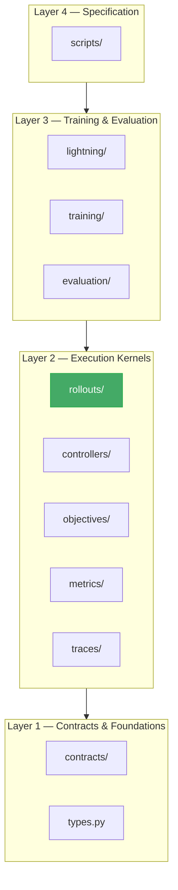

# Rollout Architecture

> Canonical design for `ehp_sn.rollouts` — the repository's **temporal
> execution kernel**.

`ehp_sn.rollouts` owns the execution of a controller against a source over
time: maintaining recurrent carry, enforcing stopping and boundary semantics,
and optionally exposing the resulting trajectory to training, evaluation,
scoring, or diagnostics. It is not a training framework, environment package,
objective package, or artifact pipeline.

---

## 1. Scope and ownership

### 1.1 Canonical responsibility

The module owns this transformation:

```
source state
    │
    ▼
step input ──► controller.step(input, carry)
                         │
                         ▼
                output + next carry
                         │
                         ▼
        boundary handling / collection / stop decision
                         │
                         ▼
                    next step
```

Formally:

\[
(x*t,\ c_t) \xrightarrow{\text{controller}} (y_t,\ c*{t+1})
\xrightarrow{\text{source/runtime}} x\_{t+1}
\]

where:

| Symbol            | Meaning                               |
| ----------------- | ------------------------------------- |
| \(x_t\)           | Sampled or generated step input       |
| \(c_t\)           | Opaque recurrent carry                |
| \(y_t\)           | Controller output                     |
| Boundary signals  | Determine whether execution continues |
| Collection policy | Determines what is retained           |

For EHP, a rollout may represent:

- one supervised step;
- a fixed recurrent sequence;
- an Arena trajectory;
- a TEM replay episode;
- an HRM ACT deliberation;
- a TBPTT chunk;
- eventually, online environment interaction.

### 1.2 What rollouts owns

| #   | Responsibility             | Concrete                                                                                      |
| --- | -------------------------- | --------------------------------------------------------------------------------------------- |
| 1   | **Temporal orchestration** | Which step runs next; which slots are active; when execution ends                             |
| 2   | **Carry lifecycle**        | Initialisation, propagation, partial reset, freezing, detachment, final return                |
| 3   | **Boundary aggregation**   | Combine `valid`, `episode_start`, `halted`, `terminated`, `truncated` into one `StepBoundary` |
| 4   | **Stop decisions**         | `StopReason` — why execution ended                                                            |
| 5   | **Execution records**      | Per-step records, final carry, operation statistics                                           |
| 6   | **Collection integration** | No collection, streaming, full capture, selected-output capture, composite sinks              |

### 1.3 What rollouts does NOT own

| Concern                                   | Owner                                              |
| ----------------------------------------- | -------------------------------------------------- |
| Model architecture                        | `ehp_sn.models`                                    |
| Control policies and deliberation         | `ehp_sn.controllers`                               |
| Task observations, rewards, transitions   | `ehp_sn.contracts.task_runtime`, task packages     |
| Loss construction                         | `ehp_sn.objectives`                                |
| Scientific metrics                        | `ehp_sn.metrics`                                   |
| Training loops, `.backward()`, optimisers | `ehp_sn.lightning`, `ehp_sn.training`              |
| MLflow, Zarr, filesystem paths            | `ehp_sn.evaluation`, `ehp_sn.traces`               |
| Trace registries, figure creation         | `ehp_sn.traces`, `ehp_sn.figures`                  |
| Gradient mode                             | Caller — wrapped as `with torch.inference_mode():` |

The critical boundary: `rollouts` invokes a controller through the
`StepController` protocol; it does not implement controller algorithms.
It consumes a source through the `Source` protocol; it does not define task
semantics. It does not own gradient context — the caller wraps execution in
`torch.inference_mode()` or enables gradients as needed.

---

### 1.4 Dependency position

`ehp_sn.rollouts` sits in Layer 2 of the repository dependency DAG — it may
import from `contracts/` and `types.py`, but must not import from
`lightning/`, `training/`, `evaluation/`, `models/`, or `objectives/`.



**Dependency rule**: `rollouts/` defines record types (`StepRecord`,
`StepBoundary`, `RolloutResult`). Consumers in Layer 3 (`training/`,
`evaluation/`) import these record types and the `Runner`/`Source`/`StepSink`
protocols from `rollouts/`. That is an intentional upward dependency:
consumers depend on stable rollout records, not the other way around.
Controllers implement `StepController`; they do not import rollout types.

The `scoring.py` module inside `rollouts/` is a **non-core integration
layer** that bridges between temporal execution and objective computation. It
is optional — the rest of `rollouts/` functions completely without it. It may
be relocated to `training/rollout_scoring.py` or `eval/rollout_scoring.py` if
its dependency on objectives grows.

---

## 2. Package structure

```
ehp_sn/rollouts/
├── __init__.py
├── contracts.py          Structural protocols (Source, StepController, StepSink, Runner)
├── configuration.py      Immutable execution policy (RolloutConfig, CollectionConfig, TBPTTConfig)
├── records.py            Immutable execution facts (StepBoundary, StepRecord, RolloutResult, SourceContext)
├── runtime.py            Runner implementations (SingleStepRunner, RecurrentRunner)
├── sources.py            Temporal input production (RepeatSource, DemandDrivenReplaySource)
├── collection.py         Record sinks and materialisation (NullSink, RecordSink, CompositeSink)
├── scoring.py            [NON-CORE] Rollout-to-score adaptation (score_rollout_record, RolloutAccumulator)
├── masking.py            Centralised batch-slot mask operations
└── errors.py             Typed exception hierarchy
```

Runners are not yet split into `recurrent.py`, `episodic.py`, and
`deliberation.py`. That becomes useful only when their runtime semantics
genuinely diverge — e.g. when online environment interaction introduces
task `reset`, autoreset, and reward feedback. For the current set of
regimes, two runners suffice.

---

## 3. Contracts

Structural protocols consumed by the execution kernel. Defined in
`contracts.py`.

### 3.1 `StepController`

```python
class StepController(Protocol[SourceItemT, CarryT, ControllerOutputT]):
    """One logical control transition.

    The runner calls ``step`` once per temporal step. The controller owns
    model invocation, decision construction, and carry update for a single
    transition.
    """

    def step(
        self,
        step_input: SourceItemT,
        carry: CarryT,
        *,
        options: Mapping[str, Any] | None = None,
    ) -> tuple[ControllerOutputT, CarryT]:
        ...
```

The name `StepController` is deliberate: the executed object combines model
computation with controller or deliberation semantics. `StepModel` would be
less accurate for this repository.

### 3.2 `Source`

Sources receive an execution-context projection — not the full controller
carry. This prevents sources from depending on arbitrary carry internals.

```python
@dataclass(frozen=True, slots=True)
class SourceContext:
    """Execution-context projection passed to sources.

    Contains the minimal signals a source needs to decide what to produce
    next, without exposing full carry structure.  Does **not** provide a
    generic ``finished`` mask — callers use the specific masks they need.
    """
    step_index: int
    active: Tensor       # (B,) bool — slots eligible to execute next step
    halted: Tensor       # (B,) bool — controller-deliberation halt only
    terminated: Tensor   # (B,) bool — task-level natural episode end
    truncated: Tensor    # (B,) bool — task-level truncation
```

```python
class Source(Protocol[SourceItemT]):
    """Temporal input producer.

    Receives a ``SourceContext`` projection on every call so it can react to
    halt, termination, or truncation when producing the next item.
    Does **not** receive the full controller carry.
    """

    def next(
        self,
        context: SourceContext,
    ) -> "SourceStep[SourceItemT]" | None:
        """Return the next step input with source-level boundary facts,
        or ``None`` to signal exhaustion."""
        ...
```

For the minority of sources that genuinely need repository-specific carry
state (e.g. `DemandDrivenReplaySource` which scatters replacement episodes
using carry-owned data), a specialised protocol exists:

```python
class CarryAwareSource(Protocol[SourceItemT, CarryViewT]):
    """Source that requires a read-only projection of controller carry.

    Prefer the plain ``Source`` protocol unless carry inspection is
    unavoidable.  The ``carry_view`` is read-only — sources must **not**
    mutate carry state.  Carry mutation is the runner's responsibility
    through ``CarryUpdater``.
    """

    def next(
        self,
        context: SourceContext,
        *,
        carry_view: CarryViewT,
    ) -> "SourceStep[SourceItemT]" | None:
        ...
```

The runner constructs the source-appropriate protocol call internally:
plain `Source` objects receive `source.next(context)`; `CarryAwareSource`
objects receive `source.next(context, carry_view=carry)`. Sources should not
receive `CarryUpdater` — they are consumers of execution state, not mutators
of it.

- controller-specific carry structure;
- objective computation;
- model invocation;
- scoring;
- trace persistence.

The source returns a `SourceStep` that carries source-level boundary facts:

```python
@dataclass(frozen=True, slots=True)
class SourceStep(Generic[InputT]):
    value: InputT
    valid: Tensor                # (B,) bool
    episode_start: Tensor        # (B,) bool
    terminated: Tensor | None = None   # (B,) bool — task-level
    truncated: Tensor | None = None    # (B,) bool — task-level
```

This is preferable to encoding boundary fields through arbitrary batch keys.

### 3.3 `StepSink`

```python
class StepSink(Protocol):
    """Observer of rollout execution.

    Receives lifecycle notifications at start, per-step, and end.
    Sinks must **not** alter core execution semantics.

    Lifecycle:

    - ``on_start`` is called before the first step.  If it raises, the
      rollout does not execute.
    - ``on_step`` is called after each executed step.  If it raises,
      execution stops, ``on_error`` is called (best-effort), and the
      exception propagates.
    - ``on_complete`` is called with the final result on normal termination.
    - ``on_error`` is called if any step raises or the source signals
      exhaustion unexpectedly.  Receives the exception.  Called on a
      best-effort basis — sinks must be safe to call in error contexts.
    """

    def on_start(self, context: "RolloutContext") -> None:
        """Called before the first step."""

    def on_step(self, step: "StepRecord[Any, Any]") -> None:
        """Called after each executed step."""

    def on_complete(self, result: "RolloutResult[Any]") -> None:
        """Called with the final result on normal termination."""

    def on_error(self, error: BaseException) -> None:
        """Called if execution fails.  Best-effort — may not be called
        if the runtime itself crashes."""
```

This replaces the ad-hoc combination of `capture_records: bool` and
`record_observer: Callable | None` with one extensible mechanism. The
split between `on_complete` and `on_error` ensures sinks can distinguish
normal termination from failure without receiving an invalid `RolloutResult`.

### 3.4 `Runner`

```python
class Runner(Protocol[CarryT, ControllerOutputT]):
    """Temporal execution driver."""

    def run(
        self,
        *,
        source: Source[Any] | CarryAwareSource[Any, CarryT],
        controller: StepController[Any, CarryT, ControllerOutputT],
        initial_carry: CarryT,
        carry_updater: CarryUpdater[CarryT],
        sink: StepSink | None = None,
        collection: "CollectionConfig | None" = None,
        options: Mapping[str, Any] | None = None,
    ) -> "RolloutResult[CarryT]":
        ...
```

The protocol is justified because `SingleStepRunner` and `RecurrentRunner`
have compatible signatures and are used polymorphically by Lightning modules.

Notes:

- `carry_updater` is used instead of a monolithic `CarryOps`. Detachment
  is the caller's responsibility (done via `CarryDetacher` or manual
  `.detach()` before passing the carry). Snapshotting is a diagnostic
  operation, not a runner concern — it belongs in diagnostic sinks.
- `collection` is an invocation-level parameter, not constructor state.
  The same runner can be used with different collection policies between
  training and evaluation calls. If `None`, no output selection is
  applied and no snapshots are taken.

### 3.5 Carry operations

Defined in `contracts/carry.py` (not in `rollouts/`), because runners,
sources, and controllers all need carry manipulation. Split into focused
capabilities rather than one broad protocol.

```python
class CarryUpdater(Protocol[CarryT]):
    """Structural carry operations needed by the runner loop."""

    def reset_where(self, carry: CarryT, mask: Tensor) -> CarryT:
        """Reset carry slots indicated by the mask to initial state."""
        ...

    def freeze_where(
        self, previous: CarryT, updated: CarryT, mask: Tensor,
    ) -> CarryT:
        """Preserve ``previous`` values for masked (inactive) slots,
        use ``updated`` values for active slots."""
        ...
```

```python
class CarryDetacher(Protocol[CarryT]):
    """Autograd detachment for carry tensors."""

    def detach(self, carry: CarryT) -> CarryT:
        """Detach all tensor values in the carry from the autograd graph."""
        ...
```

Diagnostic snapshotting is separate — it belongs in diagnostic sinks, not in
the runner's carry-operation vocabulary:

```python
# Defined alongside diagnostic infrastructure, not in contracts/carry.py
class CarrySnapshotter(Protocol[CarryT, SnapshotT]):
    def snapshot(self, carry: CarryT) -> SnapshotT:
        """Produce a lean, detached, immutable view of the carry."""
        ...
```

A minimal `halted` capability remains directly accessible on the carry:

```python
class HaltedCarry(Protocol):
    @property
    def halted(self) -> Tensor: ...
```

This is reasonable because halted state directly affects execution. Arbitrary
carry internals remain hidden behind `CarryUpdater`.

---

## 4. Configuration

Immutable execution policy dataclasses defined in `configuration.py`.

### 4.1 `RolloutConfig` — temporal execution policy

```python
@dataclass(frozen=True, slots=True)
class RolloutConfig:
    """Temporal execution policy.

    Owns only budget and stop conditions. Collection, snapshotting, and
    output selection are separate concerns (see ``CollectionConfig``).
    Gradient mode is a caller concern, not runner configuration.
    """

    # Budget
    max_steps: int | None = None
    hard_max_steps: int | None = None

    # Stop conditions
    stop_when_all_halted: bool = True
    stop_when_all_terminated: bool = True
    stop_when_all_truncated: bool = False

    def __post_init__(self) -> None:
        if self.max_steps is not None and self.max_steps < 1:
            raise ValueError("max_steps must be positive")
        if self.hard_max_steps is not None and self.hard_max_steps < 1:
            raise ValueError("hard_max_steps must be positive")
        if (
            self.max_steps is not None
            and self.hard_max_steps is not None
            and self.max_steps > self.hard_max_steps
        ):
            raise ValueError("max_steps cannot exceed hard_max_steps")
```

**Semantics of the two budget fields**:

| Field            | Purpose                                          | Exceeded behaviour                                    |
| ---------------- | ------------------------------------------------ | ----------------------------------------------------- |
| `max_steps`      | Expected rollout horizon                         | Returns normally with `StopReason.STEP_LIMIT_REACHED` |
| `hard_max_steps` | Safety guard — execution should never reach this | Raises `ExecutionLimitError`                          |

`max_steps` is the normal budget. `hard_max_steps` is a safety valve that
catches bugs (e.g. a source that never exhausts, a controller that never
halts). They must have distinct operational semantics — the runner cannot
silently stop at the hard limit and preserve the distinction.

### 4.2 `CollectionConfig` — retention policy

```python
@dataclass(frozen=True, slots=True)
class CollectionConfig:
    """What to retain from a rollout execution.

    Separate from ``RolloutConfig`` because collection policy is not
    temporal execution policy. Passed at invocation time — the same runner
    can be used with different collection strategies between training and
    evaluation.

    If output selection is always sink-specific, ``CollectionConfig`` may
    be eliminated entirely in favour of sink-level selectors:

        sink = SelectingSink(selector=select_trace_fields, downstream=RecordSink())
    """

    snapshot_carry: bool = False
    """Whether sinks may request carry snapshots. Off by default because
    snapshotting may involve recursive traversal, detaching, cloning, and
    dictionary allocation — wasted work when no sink consumes snapshots."""

    output_selector: Callable[[Any], Any] | None = None
    """Applied to controller output before passing to sinks. Prevents full
    controller outputs and autograd graphs from being retained unintentionally.
    ``None`` means pass the output unchanged."""
```

### 4.3 `TBPTTConfig`

```python
@dataclass(frozen=True, slots=True)
class TBPTTConfig:
    chunk_length: int
    detach_between_chunks: bool = True
```

TBPTT describes graph boundaries, not ordinary execution limits. It is
separate from `RolloutConfig` for that reason.

---

## 5. Records

Immutable execution fact dataclasses defined in `records.py`.

### 5.1 `StepBoundary`

```python
@dataclass(frozen=True, slots=True)
class StepBoundary:
    """Aggregated boundary signals for one execution step.

    Each field is a ``(B,)`` boolean tensor. Signals originate from different
    owners and are combined here for the runner's stopping decisions.

    Temporal ordering of these masks is critical and non-interchangeable:

    1. **pre-step** — ``valid`` and ``episode_start`` are source-level facts
       about the data for *this* timestep.
    2. **post-step** — ``halted``, ``terminated``, ``truncated`` describe the
       carry/task state *after* the controller transition.

    The runner uses pre-step masks to decide execution eligibility (which
    slots to freeze) and post-step masks to decide whether to stop.
    """
    valid: Tensor          # (B,) bool — source/data: real data this timestep
    episode_start: Tensor  # (B,) bool — source/data: new episode begins
    halted: Tensor         # (B,) bool — controller: deliberation stopped
    terminated: Tensor     # (B,) bool — task: natural episode end
    truncated: Tensor      # (B,) bool — task or budget: execution cut short

    # ── Derived masks with distinct semantics ──

    @property
    def task_done(self) -> Tensor:
        """Slots whose episode ended naturally or by truncation.

        These require reset before reuse. Distinct from ``halted``, which
        is a controller-internal decision.
        """
        return self.terminated | self.truncated

    @property
    def controller_done(self) -> Tensor:
        """Slots whose controller finished deliberating."""
        return self.halted

    @property
    def requires_reset(self) -> Tensor:
        """Slots that need a fresh episode before the next step."""
        return self.terminated | self.truncated

    @property
    def eligible_for_replacement(self) -> Tensor:
        """Slots that a demand-driven source may replace with new episodes.

        This is runner-specific: ACT deliberation may replace only halted
        slots; online RL may replace terminated slots immediately.
        """
        return self.halted | self.terminated | self.truncated
```

The single `finished` concept is intentionally **not** provided because it
conflates three distinct lifecycle states: controller completion, task
completion, and budget truncation. Callers choose the appropriate derived mask
for their context.

### 5.2 `StepRecord`

```python
@dataclass(frozen=True, slots=True)
class StepRecord(Generic[InputT, OutputT]):
    """Retained record of one executed controller step."""
    step_index: int
    sampled_input: InputT          # What the source proposed
    executed_input: InputT         # What the controller consumed
    output: OutputT                # Selected output (post-selector)
    boundary: StepBoundary         # Aggregated boundary signals
    carry_snapshot: "CarrySnapshot | None" = None  # Opt-in, diagnostic only
```

### 5.3 `CarrySnapshot`

```python
@dataclass(frozen=True)
class CarrySnapshot:
    """Lean, detached, immutable post-step carry projection.

    Constructed only when ``CollectionConfig.snapshot_carry`` is ``True``
    and a sink explicitly requests it. ``model_state`` is always ``None`` —
    semantic model observations are extracted via ``model.trace_views()``
    separately.
    """
    halted: Tensor
    steps: Tensor | None = None
    data: dict[str, Any] | None = None
    static_data: dict[str, Any] | None = None
    model_state: Any = None
    env_td: Any = None
```

### 5.4 `RolloutStats`

```python
@dataclass(frozen=True, slots=True)
class RolloutStats:
    """Operational statistics for one rollout execution."""
    executed_steps: int
    valid_steps: int
    completed_slots: int
    elapsed_seconds: float
```

### 5.5 `RolloutResult`

```python
@dataclass(frozen=True)
class RolloutResult(Generic[CarryT]):
    """Result of a rollout execution.

    Does **not** contain step records. Records are owned by the sink
    (typically ``RecordSink``) if materialisation is needed. The result
    itself is small, stable, and carries only execution-summary facts.
    """
    final_carry: CarryT
    stop_reason: "StopReason"
    stats: RolloutStats
```

### 5.6 `StopReason`

```python
class StopReason(str, Enum):
    SINGLE_STEP_COMPLETED = "single_step_completed"
    ALL_HALTED = "all_halted"
    ALL_TERMINATED = "all_terminated"
    ALL_TRUNCATED = "all_truncated"
    SOURCE_EXHAUSTED = "source_exhausted"
    STEP_LIMIT_REACHED = "step_limit_reached"
```

Not every runner must use every reason. `TERMINATED` and `TRUNCATED` are for
runners that receive task-level terminal signals from their source.

---

## 6. Runners

Runner implementations in `runtime.py`. The runner stores only immutable
execution policy. It must **not** store:

- model or controller;
- current carry;
- current source cursor;
- collection state or records from a previous run.

### 6.1 `SingleStepRunner`

**Contract**: executes exactly one source-controller step; rejects
incompatible limits; returns `SINGLE_STEP_COMPLETED`.

```python
class SingleStepRunner:
    def __init__(self, config: RolloutConfig | None = None) -> None:
        self._config = config or RolloutConfig(max_steps=1)
```

Useful for non-recurrent models and isolated task steps (ACT-supervised and
actor-critic training both use this).

### 6.2 `RecurrentRunner`

**Contract**: repeatedly consumes a source; propagates carry; supports source
exhaustion, halting, termination, truncation, and limits. Works for replay,
fixed sequences, ACT-style deliberation, and TBPTT chunks.

```python
class RecurrentRunner:
    def __init__(self, config: RolloutConfig | None = None) -> None:
        self._config = config or RolloutConfig()
```

### 6.3 Canonical execution algorithm — mask ordering

The critical temporal invariant:

> **Freeze slots that were inactive before execution, not slots that became
> inactive because of this execution.**

A slot that is active at the start of step _t_ and halts during step _t_
produced a valid final carry update. Freezing with the post-step inactive
mask would discard that update and restore the previous carry. The runner
must track **execution eligibility before the step** and freeze based on
that, not the post-step boundary.

The design uses **full-batch controller execution with post-update
freezing** — the controller receives all slots; the runner freezes
previously inactive slots after the transition:

```
pre-step:   active_before  ──► compute replacement mask for source
step:       controller.step(full batch, full carry)
post-step:  freeze ~active_before slots  ──► boundary  ──► stop / next
```

The controller internally handles inactive slots (e.g. by reading only
`resident_payload` for them). Active-slot compaction — selecting only
active rows and scattering results — is more complex and not justified
for current workloads.

A `RecurrentRunner` implementation conceptually:

```python
def run(self, *, source, controller, initial_carry,
        carry_updater, sink=None, collection=None, options=None):
    sink = sink or NullSink()
    carry = initial_carry
    step_index = 0

    # Derive initial active mask from the carry's halted state.
    active_before = ~getattr(carry, "halted",
                              torch.zeros(1, dtype=torch.bool))

    sink.on_start(RolloutContext(config=self._config))

    try:
        while True:
            # ── Budget guards ──────────────────────────────────
            if (
                self._config.max_steps is not None
                and step_index >= self._config.max_steps
            ):
                stop_reason = StopReason.STEP_LIMIT_REACHED
                break

            # hard_max_steps is a safety guard checked BEFORE execution.
            # It is inclusive: if hard_max_steps=300, step_index 300
            # itself triggers the guard (steps 0–299 executed).
            if (
                self._config.hard_max_steps is not None
                and step_index >= self._config.hard_max_steps
            ):
                raise ExecutionLimitError(
                    executed_steps=step_index,
                    hard_max_steps=self._config.hard_max_steps,
                )

            # ── Source context — no conflated "finished" mask ───
            replacement = (
                getattr(carry, "halted",
                        torch.zeros_like(active_before))
                | getattr(carry, "terminated",
                          torch.zeros_like(active_before))
                | getattr(carry, "truncated",
                          torch.zeros_like(active_before))
            )
            src_ctx = SourceContext(
                step_index=step_index,
                active=active_before,
                halted=getattr(carry, "halted",
                               torch.zeros_like(active_before)),
                terminated=getattr(carry, "terminated",
                                   torch.zeros_like(active_before)),
                truncated=getattr(carry, "truncated",
                                  torch.zeros_like(active_before)),
            )

            # ── Source consumption ─────────────────────────────
            source_step = source.next(src_ctx)
            if source_step is None:
                stop_reason = StopReason.SOURCE_EXHAUSTED
                break

            # ── Full-batch controller step ─────────────────────
            previous_carry = carry
            try:
                output, proposed_carry = controller.step(
                    source_step.value,
                    previous_carry,
                    options=options,
                )
            except Exception as exc:
                raise StepExecutionError(
                    step_index=step_index,
                    active_slots=active_before,
                    cause=exc,
                ) from exc

            # ── Post-step freeze: preserve inactive slots ──────
            # freeze_where(previous, updated, mask):
            #   mask=True  → keep previous (inactive slots)
            #   mask=False → use updated (active slots)
            carry = carry_updater.freeze_where(
                previous=previous_carry,
                updated=proposed_carry,
                mask=~active_before,
            )

            # ── Derive boundary from accepted carry ────────────
            boundary = _derive_boundary(source_step, carry, output)
            validate_boundary(boundary)

            # ── Output selection (sink-level or collection) ────
            selected = output
            if collection is not None and collection.output_selector is not None:
                selected = collection.output_selector(output)

            # ── Emit record ────────────────────────────────────
            record = StepRecord(
                step_index=step_index,
                sampled_input=source_step.value,
                executed_input=source_step.value,
                output=selected,
                boundary=boundary,
                carry_snapshot=None,  # Sink-driven, not here.
            )
            sink.on_step(record)

            # ── Stop decision ──────────────────────────────────
            stop_reason = self._stop_reason(boundary)
            if stop_reason is not None:
                break

            # ── Next-step active mask ──────────────────────────
            # Lifecycle-active slots (no valid-dependent propagation).
            # Sources for which invalidity is monotonic may propagate
            # valid separately; demand-driven replacement typically
            # should not.
            active_before = (
                ~boundary.halted
                & ~boundary.terminated
                & ~boundary.truncated
            )

            step_index += 1

        # ── Normal completion ──────────────────────────────────
        result = RolloutResult(
            final_carry=carry,
            stop_reason=stop_reason,
            stats=_compute_stats(...),
        )
        sink.on_complete(result)
        return result

    except BaseException as error:
        sink.on_error(error)
        raise
```

### 6.3.1 Stop quantification

Stop conditions must account for which slots are relevant. A naïve
`boundary.halted.all()` may fail when padded or irrelevant slots are
never marked halted. The runner applies stop conditions only to slots in
the **stop population**:

```python
def _all_selected(mask: Tensor, population: Tensor) -> bool:
    """True when every slot in ``population`` satisfies ``mask``."""
    return bool((~population | mask).all())
```

The stop population is runner-configurable. For fixed-padded sequences it
is `boundary.valid`. For demand-driven replacement it is all slots (every
slot should eventually halt or be replaced). The runner's `_stop_reason`
method defines the population per use case.

### 6.3.2 Budget semantics

| Field            | Checked                                         | Behaviour                             |
| ---------------- | ----------------------------------------------- | ------------------------------------- |
| `max_steps`      | Before step _N_: `step_index >= max_steps`      | Returns `STEP_LIMIT_REACHED` normally |
| `hard_max_steps` | Before step _N_: `step_index >= hard_max_steps` | Raises `ExecutionLimitError`          |

Both are **inclusive**: `max_steps=250` permits steps 0–249. Step 250 is
rejected. `hard_max_steps=300` means steps 0–299 are permitted; step 300
raises.

### 6.4 Runner taxonomy

For the current repository, only two public runners:

| Runner             | Steps     | Stop reasons                                                                              | Used by                                              |
| ------------------ | --------- | ----------------------------------------------------------------------------------------- | ---------------------------------------------------- |
| `SingleStepRunner` | Exactly 1 | `SINGLE_STEP_COMPLETED`                                                                   | ACT-supervised training, actor-critic training       |
| `RecurrentRunner`  | 0..N      | `ALL_HALTED`, `ALL_TERMINATED`, `ALL_TRUNCATED`, `SOURCE_EXHAUSTED`, `STEP_LIMIT_REACHED` | Evaluation, variational replay training, diagnostics |

Do not add an `EpisodicRunner` merely for conceptual completeness. Add one
when online interaction introduces materially different semantics: task
`reset`, action application, `terminated` vs `truncated`, final observation
handling, partial vectorised autoreset, and reward feedback. At that point:

```python
class EpisodicRunner:
    """Runners for online environment interaction with autoreset."""
```

would be justified.

---

## 7. Sources

Temporal input production — concrete `Source` implementations in `sources.py`.

### 7.1 `RepeatSource`

Yields the same batch repeatedly (used in evaluation where a single case batch
is replayed). Implements the plain `Source` protocol — it needs only the
`SourceContext` to decide when to stop. Supports optional fixed horizon and
halt-stop.

### 7.2 `DemandDrivenReplaySource`

The heart of partial-reset training. Implements `CarryAwareSource` because it
needs access to carry-owned episode data for scattering replacement rows.
Receives a read-only `carry_view` — it inspects carry data to build
replacements but does **not** mutate the carry.

On each `next(context, *, carry_view)`:

1. Reads `context.halted` to determine how many slots need replacement.
2. Requests exactly `n_halted` replacement episodes from an `EpisodeSource`.
3. Scatters new episodes into halted positions; active slots get a template
   placeholder (the controller reads from `resident_payload` for those).

**Contract**: Never discards an unconsumed episode. Advances the episode
source cursor only by the number of halted slots. When all slots are halted,
returns a full batch of fresh episodes — does **not** raise `StopIteration`.

Because it receives carry access through the `CarryAwareSource` protocol
rather than the universal `Source` protocol, its carry dependency is explicit
and opt-in. The protocol uses a read-only `CarryViewT` — carry mutation
remains the runner's responsibility.

### 7.3 `SequenceSource` _(future)_

Iterates through a fixed `B × T` batch, yielding one time-slice per step.
Plain `Source` — no carry access needed.

### 7.4 `ChunkedSource` _(future)_

Exposes a fixed sequence as TBPTT-sized chunks, re-yielding chunk boundaries.

---

## 8. Collection

Record consumption and materialisation in `collection.py`. Collection is
entirely sink-driven: the runner never accumulates records internally.
`RolloutResult` contains no records.

### 8.1 `NullSink`

No-op sink for minimal-memory training. Every method is a no-op. The runner
never allocates a record list.

### 8.2 `RecordSink`

Accumulates step records in memory. Supports late materialisation:

```python
sink = RecordSink()
runner.run(..., sink=sink)
records = sink.materialize()  # tuple[StepRecord, ...]
```

### 8.3 `CompositeSink`

Forwards lifecycle calls to a tuple of inner sinks. Enables composition:

```python
sink = CompositeSink((MetricSink(...), TraceSink(...), RecordSink()))
```

If any inner sink's `on_step` raises, `CompositeSink` propagates the
exception after calling `on_error` on every inner sink (best-effort cleanup).

### 8.4 `TrainingLossSink` _(external to rollouts)_

Owned by the training layer. Receives scored records, calls `.backward()`,
and steps optimisers. Not part of the rollout public API.

---

## 9. Scoring [non-core]

Rollout-to-score adaptation in `scoring.py`. This module is a **non-core
integration layer** — the rest of `rollouts/` functions completely without
it. It bridges between temporal execution (`StepRecord`) and objective
computation (`RolloutScorer`).

If this module's dependency on objectives grows, it should be relocated to
`training/rollout_scoring.py` or `eval/rollout_scoring.py`, where the
dependency direction is natural (training/evaluation depends on both
rollouts and objectives).

### 9.1 `score_rollout_record`

```python
def score_rollout_record(
    record: StepRecord[Any, Any],
    scorer: RolloutScorer,
    *,
    input_builder: Callable[[StepRecord[Any, Any]], object],
) -> ScoredRecord:
    """Score exactly one StepRecord. The single canonical per-step transition."""
    ...
```

### 9.2 `RolloutAccumulator`

Streaming accumulator that replaces unbounded `list[ObservedStep]`:

```python
class RolloutAccumulator(Generic[CarryT, OutputT]):
    def observe(self, scored: ScoredRecord[OutputT]) -> None:
        """Accumulate loss sum and retain only the last step."""
        ...

    def finalize(
        self, final_carry: CarryT, source_exhausted: bool = False,
    ) -> EvaluatedChunk:
        """Produce an EvaluatedChunk with aggregated loss and final step only."""
        ...
```

Memory: `O(step_state_size)` instead of `O(rollout_length × step_state_size)`.

---

## 10. Masking

Centralised batch-slot mask operations in `masking.py`. Masking logic is
sufficiently important and error-prone to have one canonical implementation.

### 10.1 Mask vocabulary — distinct masks for distinct purposes

```python
def execution_mask(boundary: StepBoundary) -> Tensor:
    """Slots eligible to execute the *next* controller step.

    Based on lifecycle state only (halted, terminated, truncated).
    Does **not** include ``valid`` — validity is a per-timestep data
    fact that sources and loss functions use, not a persistent lifecycle
    condition.

    For fixed padded sequences where invalidity is monotonic, the runner
    may additionally propagate invalid slots as inactive.  For demand-driven
    replacement, inactive slots are replaced with fresh episodes and become
    active again — ``valid`` should not block them.
    """
    return (
        ~boundary.halted
        & ~boundary.terminated
        & ~boundary.truncated
    )

def loss_mask(boundary: StepBoundary) -> Tensor:
    """Slots whose output contributes to the loss for the *current* step.

    Returns ``boundary.valid`` — only timesteps with real data contribute.
    """
    return boundary.valid

def replacement_mask(boundary: StepBoundary) -> Tensor:
    """Slots eligible for episode replacement by a demand-driven source.

    Runner-specific: ACT deliberation replaces only halted slots;
    online RL may also replace terminated slots immediately.
    Default: any non-lifecycle-active slot.
    """
    return boundary.halted | boundary.terminated | boundary.truncated
```

These are separate functions, not one universal mask, because their
semantics differ. `valid` is a per-timestep data fact — it appears in
`loss_mask` but not in `execution_mask`. The runner computes its
own next-step active mask from lifecycle state, and each runner may choose
whether to additionally propagate invalidity for monotonic-padding use cases.

### 10.2 Utility operations

```python
def masked_update(old: Tensor, new: Tensor, update_mask: Tensor) -> Tensor:
    """Apply ``new`` values where ``update_mask`` is True, preserve ``old`` elsewhere.

    Broadcasts ``update_mask`` to match leading dimensions.
    """
    while update_mask.ndim < old.ndim:
        update_mask = update_mask.unsqueeze(-1)
    return torch.where(update_mask, new, old)

def validate_boundary(boundary: StepBoundary) -> None:
    """Validate boundary tensor shapes, dtypes, and semantic invariants."""
    masks = (
        boundary.valid,
        boundary.episode_start,
        boundary.halted,
        boundary.terminated,
        boundary.truncated,
    )
    shape = masks[0].shape
    if any(mask.dtype is not torch.bool for mask in masks):
        raise InvalidBoundaryError("Boundary masks must be boolean")
    if any(mask.shape != shape for mask in masks):
        raise InvalidBoundaryError("All boundary masks must have the same shape")
```

---

## 11. Error handling

Typed exception hierarchy in `errors.py`. Errors should identify the temporal
and batch context.

```python
class RolloutError(RuntimeError):
    """Base class for rollout execution failures."""

class ExecutionLimitError(RolloutError):
    """Raised when ``hard_max_steps`` is exceeded — a safety violation,
    not a normal termination."""
    def __init__(
        self, *, executed_steps: int, hard_max_steps: int,
    ) -> None:
        ...

class InvalidBoundaryError(RolloutError):
    """Raised when boundary masks violate invariants."""

class CarryShapeError(RolloutError):
    """Raised when carry batch dimensions are incompatible."""

class StepExecutionError(RolloutError):
    """Raised when ``controller.step()`` raises during execution.

    Preserves the original exception as ``__cause__`` and adds step-level
    context (step index, active slots).
    """
    def __init__(
        self, *, step_index: int, active_slots: Tensor, cause: Exception,
    ) -> None:
        ...
```

Do not wrap ordinary programmer errors indiscriminately. Add temporal context
while preserving the original exception as the cause.

---

## 12. Memory safety

These are **module invariants**, not optional design preferences.

| #   | Invariant                                                                     | Enforcement                                                                       |
| --- | ----------------------------------------------------------------------------- | --------------------------------------------------------------------------------- |
| 1   | The full carry sequence is never retained by default                          | Runner never accumulates carry history; sinks may retain snapshots if opted in    |
| 2   | Carry snapshots are detached, immutable, and reduced to diagnostic state      | `CarrySnapshotter` clones tensors, drops `model_state`                            |
| 3   | The runner never accumulates step records internally                          | Records are sink-owned; `RolloutResult` contains no records                       |
| 4   | Output selector runs before retaining sink receives outputs                   | `selected = collection.output_selector(output)` before `sink.on_step()`           |
| 5   | Training sinks may retain graph-connected loss tensors intentionally          | Explicit design choice in `training_loss_sink` (external to rollouts)             |
| 6   | Diagnostic sinks should detach and normally move retained tensors to CPU      | Sink responsibility; runner does not decide                                       |
| 7   | Final carry may remain graph-connected when full BPTT requires it             | Returned as-is; caller decides detachment via `CarryDetacher`                     |
| 8   | TBPTT detachment occurs only through an explicit policy or orchestration call | `TBPTTConfig.detach_between_chunks`; not implicit in runner                       |
| 9   | Snapshotting is opt-in and never runs without a consumer                      | `CollectionConfig.snapshot_carry` defaults to `False`                             |
| 10  | Inactive slots are frozen after the controller step, not before               | Single `freeze_where(previous, proposed, mask=~active_before)` in post-step phase |

---

## 13. Public API

Stratified into two tiers. The primary API is what most callers need; the
extension API is for advanced integrations.

### 13.1 Primary API

```python
from ehp_sn.rollouts import (
    CollectionConfig,
    RecurrentRunner,
    RolloutConfig,
    RolloutResult,
    SingleStepRunner,
    StopReason,
)
```

Six exports. Sufficient for constructing runners, configuring execution and
collection policy, and handling results.

### 13.2 Extension API

```python
from ehp_sn.rollouts import (
    # Protocols (for implementing custom sources/sinks)
    CarryAwareSource,
    Runner,
    Source,
    SourceContext,
    SourceStep,
    StepController,
    StepSink,

    # Records (for building custom sinks or consumers)
    RolloutStats,
    StepBoundary,
    StepRecord,

    # Configuration
    TBPTTConfig,

    # Concrete sources (pre-built)
    DemandDrivenReplaySource,
    RepeatSource,
)
```

### 13.3 Not exported

The following are deliberately not in the public API:

- Exception subclasses — catch `RolloutError` if needed; individual types are
  implementation details.
- `CarrySnapshot` — diagnostic type, not a core rollout contract.
- Internal masking functions — `execution_mask`, `masked_update`, etc.
- `NullSink`, `RecordSink`, `CompositeSink` — imported from `collection`
  directly when needed.
- Scoring functions and `RolloutAccumulator` — non-core integration layer.
- Snapshot recursion utilities, validation helpers, internal iterators.

### 13.4 `__init__.py`

```python
# ehp_sn/rollouts/__init__.py

from .configuration import CollectionConfig, RolloutConfig, TBPTTConfig
from .contracts import (
    CarryAwareSource,
    Runner,
    Source,
    SourceContext,
    SourceStep,
    StepController,
    StepSink,
)
from .records import (
    RolloutResult,
    RolloutStats,
    StepBoundary,
    StepRecord,
    StopReason,
)
from .runtime import RecurrentRunner, SingleStepRunner
from .sources import DemandDrivenReplaySource, RepeatSource

__all__ = [
    # Primary API
    "CollectionConfig",
    "RecurrentRunner",
    "RolloutConfig",
    "RolloutResult",
    "SingleStepRunner",
    "StopReason",
    # Extension API — protocols
    "CarryAwareSource",
    "Runner",
    "Source",
    "SourceContext",
    "SourceStep",
    "StepController",
    "StepSink",
    # Extension API — records
    "RolloutStats",
    "StepBoundary",
    "StepRecord",
    # Extension API — configuration
    "TBPTTConfig",
    # Extension API — concrete sources
    "DemandDrivenReplaySource",
    "RepeatSource",
]
```

---

## 14. Recommended execution API

```python
runner = RecurrentRunner(
    config=RolloutConfig(
        max_steps=250,
        hard_max_steps=300,
        stop_when_all_halted=True,
    ),
)

# Training — minimal memory, no records retained.
# Collection is invocation-level: different calls, different policies.
with torch.enable_grad():
    result = runner.run(
        source=source,
        controller=controller,
        initial_carry=carry,
        carry_updater=carry_updater,
        sink=training_loss_sink,
        # No collection — no output selection, no snapshots.
    )

# Evaluation — records retained via sink.
# Output selection via sink-level wrapper (avoids CollectionConfig entirely).
sink = RecordSink()
with torch.inference_mode():
    result = runner.run(
        source=RepeatSource(eval_batch),
        controller=eval_controller,
        initial_carry=eval_carry,
        carry_updater=carry_updater,
        sink=CompositeSink((
            MetricSink(...),
            TraceSink(...),
            SelectingSink(
                selector=select_trace_fields,
                downstream=sink,
            ),
        )),
        collection=CollectionConfig(
            snapshot_carry=True,
            # output_selector can also go here if preferred.
        ),
    )
records = sink.materialize()
```

The runner stores immutable execution policy. It does not store model,
controller, current carry, current source cursor, or records from a
previous run. This makes the runner reusable and avoids hidden mutable
state.

Gradient mode is a caller concern — the caller wraps the `run()` call in
`torch.inference_mode()` or `torch.enable_grad()` as appropriate. The runner
does not own gradient context.

`CollectionConfig` is passed at invocation time so the same runner can be
used with different retention policies between training and evaluation.
When output selection is always sink-specific, `CollectionConfig` can be
omitted entirely in favour of a `SelectingSink` wrapper.

---

## 15. Final design contract

> `ehp_sn.rollouts` owns temporal execution of controllers against step
> sources.

> Runners coordinate source consumption, controller invocation, carry
> propagation, boundary aggregation, stopping decisions, and optional
> record emission through sinks.

> Controllers, task runtimes, objectives, metrics, tracing systems, storage
> backends, and training orchestration remain external.

> Carry is opaque except through `CarryUpdater` and the narrow `halted`
> capability on `HaltedCarry`.

> `valid`, `episode_start`, `halted`, `terminated`, and `truncated` are
> distinct signals with a defined temporal ordering: pre-step source facts
> (`valid`, `episode_start`) → controller transition → post-step boundary
> facts (`halted`, `terminated`, `truncated`) → next-step eligibility.

> Sources receive a `SourceContext` projection, not the full controller
> carry. `CarryAwareSource` exists for the minority of sources that genuinely
> need carry access.

> Sinks observe and materialise execution; they do not control core runtime
> semantics. The runner never accumulates records — all collection is
> sink-driven.

> Record capture is optional and sink-owned. Full carry or controller-output
> history is never retained by default. Output selection happens before sink
> delivery. Snapshotting is opt-in.

> `max_steps` is a normal budget that returns `STEP_LIMIT_REACHED`.
> `hard_max_steps` is a safety guard that raises `ExecutionLimitError`.

> The public API is stratified into a six-export primary tier and a
> deliberate extension tier. Internal masking, validation, and snapshot
> helpers are not public.

> `scoring.py` is a non-core integration layer that bridges temporal
> execution and objective computation. The rest of the package functions
> without it.

> The freeze invariant is: **a single post-step `freeze_where(previous,
proposed, mask=~active_before)` preserves inactive slots. There is no
> pre-step freeze, no duplicate freeze call, and the mask is the
> complement of the pre-step active set.**

> `max_steps` is a normal budget that returns `STEP_LIMIT_REACHED` before
> executing the step that would exceed it. `hard_max_steps` is a safety
> guard that raises `ExecutionLimitError` before executing the step that
> would reach it. Both are inclusive bounds (N permits steps 0..N-1).

> Stop conditions apply to a configurable stop population, not
> unconditionally to all batch slots. Padded or irrelevant slots are
> excluded from stop decisions.

> Sinks receive `on_complete(result)` on normal termination and
> `on_error(error)` on failure. No single `on_end` method conflates the
> two outcomes.

> `CollectionConfig` is passed at invocation time so the same runner can
> be used with different retention policies. Output selection may also be
> handled entirely at the sink level via `SelectingSink`.

---

## 16. Relationship to the existing codebase

The current `ehc_sn.rollouts` is materially well-aligned with this design.
The refactoring is **extraction and normalisation**, not a rewrite.

### 16.1 What stays

| Current file         | Role                                                                                                  | Status                                                                                     |
| -------------------- | ----------------------------------------------------------------------------------------------------- | ------------------------------------------------------------------------------------------ |
| `runtime.py`         | `StepRecord`, `CarrySnapshot`, `StopReason`, `SingleStepRunner`, `RecurrentRunner`, `_snapshot_carry` | Extract records to `records.py`, protocols to `contracts.py`, keep runners in `runtime.py` |
| `sources.py`         | `RepeatSource`, `DemandDrivenReplaySource`                                                            | **Keep** — correctly owned; adopt `SourceContext` / `CarryAwareSource` interfaces          |
| `scoring.py`         | `score_rollout_record`, `score_rollout_chunk`, `RolloutAccumulator`                                   | **Keep** — mark as non-core                                                                |
| `materialization.py` | `ObservedStep`, `EvaluatedChunk`                                                                      | Keep or fold into `records.py`                                                             |

### 16.2 What is added

| File               | Content                                                                                 |
| ------------------ | --------------------------------------------------------------------------------------- |
| `configuration.py` | `RolloutConfig`, `CollectionConfig`, `TBPTTConfig`                                      |
| `collection.py`    | `NullSink`, `RecordSink`, `CompositeSink`                                               |
| `masking.py`       | `execution_mask`, `loss_mask`, `replacement_mask`, `masked_update`, `validate_boundary` |
| `errors.py`        | Typed exception hierarchy                                                               |

### 16.3 What stays outside

| Code                             | Owner                | Reason                                                   |
| -------------------------------- | -------------------- | -------------------------------------------------------- |
| `training/rollout.py`            | `training/`          | Owns backward, optimiser steps, gradient accumulation    |
| `eval/executor.py`               | `eval/`              | Owns evaluation orchestration, consumers, trace requests |
| `CarryUpdater`, `CarryDetacher`  | `contracts/carry.py` | Cross-cutting — used by runners, sources, controllers    |
| `StepFeedback`, `StepEvaluation` | `contracts/`         | Repository-wide task boundaries                          |
| `RolloutScorer`                  | `objectives/`        | Owns loss definitions                                    |
| Lightning modules                | `lightning/`         | Owns Lightning lifecycle hooks                           |

### 16.4 Key changes from current state

| Change                                                                                               | Rationale                                                    |
| ---------------------------------------------------------------------------------------------------- | ------------------------------------------------------------ |
| `Source` receives `SourceContext`, not `CarryT`                                                      | Prevents sources from depending on arbitrary carry internals |
| `CarryAwareSource` with read-only `CarryViewT` for the minority needing carry                        | Opt-in coupling; sources inspect but never mutate            |
| Full-batch controller + single post-step freeze with `mask=~active_before`                           | Correct freeze semantics; no no-op pre-freeze                |
| `SourceContext` carries `halted`/`terminated`/`truncated`, not conflated `finished`                  | Same discipline as `StepBoundary`                            |
| Explicit derived boundary masks (`task_done`, `requires_reset`, etc.)                                | `halted`/`terminated`/`truncated` are not interchangeable    |
| `RolloutConfig` only holds budget + stop; `CollectionConfig` separate, invocation-owned              | Collection is not temporal execution policy                  |
| Gradient mode removed from config — caller wraps with `torch.inference_mode()`                       | Runner does not own gradient context                         |
| `RolloutResult` contains no records — `RecordSink` owns them                                         | One collection mechanism, not two                            |
| `capture_records` removed                                                                            | Entirely sink-driven                                         |
| `snapshot_carry` defaults to `False`                                                                 | Opt-in — snapshotting has cost                               |
| `CarryOps` split into `CarryUpdater` + `CarryDetacher`; snapshotting separate                        | Focused capabilities, not a dumping ground                   |
| `max_steps` → `STEP_LIMIT_REACHED`; `hard_max_steps` → `ExecutionLimitError` (both inclusive bounds) | Distinct operational semantics                               |
| `StepSink.on_complete` + `on_error` replace single `on_end`                                          | Correctly represents success vs failure                      |
| `execution_mask` does not include `valid` — `loss_mask` carries `valid` separately                   | `valid` is per-timestep, not lifecycle                       |
| Stop conditions apply to configurable population, not all slots                                      | Padded/irrelevant slots excluded from stop                   |
| `scoring.py` marked non-core                                                                         | Optional integration layer                                   |
| Public API stratified into primary + extension tiers                                                 | Narrow core surface, deliberate extension surface            |

---

## 17. Testing requirements

The package requires stronger tests than ordinary utility code because
temporal bugs often produce plausible outputs. Required test structure:

```
tests/
└── rollouts/
    ├── test_single_step_runner.py
    ├── test_recurrent_runner.py
    ├── test_sources.py
    ├── test_boundaries.py
    ├── test_carry_ops.py
    ├── test_collection.py
    ├── test_scoring.py
    └── test_memory_safety.py
```

### 17.1 Critical invariants

```python
def test_single_step_runner_executes_exactly_one_step():
    ...

def test_recurrent_runner_stops_when_all_slots_halt():
    ...

def test_source_exhaustion_is_distinct_from_halting():
    ...

def test_terminated_is_distinct_from_truncated():
    ...

def test_halted_slots_are_not_updated():
    ...

def test_active_slot_that_halts_retains_post_step_carry():
    # A slot active at step start that halts during the step
    # must retain its post-step carry, not the pre-step carry.
    # This is the freeze_where(previous, proposed, mask=~active_before) invariant.
    ...

def test_episode_start_resets_only_selected_slots():
    ...

def test_runner_never_accumulates_records_internally():
    ...

def test_record_sink_owns_records_not_result():
    ...

def test_snapshot_contains_no_autograd_graph():
    ...

def test_snapshot_not_created_when_disabled():
    ...

def test_hard_max_steps_raises_before_executing_exceeding_step():
    # hard_max_steps=N → steps 0..N-1 execute; step N raises.
    ...

def test_max_steps_returns_normally_before_exceeding_step():
    # max_steps=N → steps 0..N-1 execute; step N returns STEP_LIMIT_REACHED.
    ...

def test_stop_conditions_exclude_irrelevant_slots():
    # Padded/invalid slots do not prevent stop when all relevant slots halt.
    ...

def test_sink_on_complete_called_on_normal_termination():
    ...

def test_sink_on_error_called_on_step_failure():
    ...

def test_tbptt_detaches_only_at_chunk_boundaries():
    ...
```

---

## 18. Future runners

When online environment interaction is added, an `EpisodicRunner` becomes
justified with materially different semantics:

- task `reset()` call before each episode;
- `controller.step()` produces an **action** that is applied to the environment;
- environment returns `observation`, `reward`, `terminated`, `truncated`;
- vectorised autoreset transparently resets finished sub-environments;
- `terminated` and `truncated` are fully distinct with correct bootstrapping.

Until then, `RecurrentRunner` suffices for all existing regimes (ACT
deliberation, replay trajectory, fixed sequences, TBPTT chunks).
