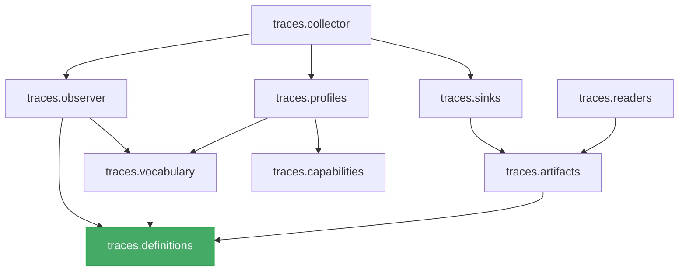

# Trace Architecture

> Canonical design for `ehp_sn.traces` — the subsystem responsible for turning
> runtime model state into a stable, versioned, queryable scientific trace
> artifact.

`ehp_sn.traces` defines a versioned semantic vocabulary for temporal scientific
data, resolves named capture profiles against runtime capabilities, extracts
requested values from rollout execution, persists dense arrays and sparse events
through storage-independent sinks, and exposes completed artifacts through a
backend-neutral reader API.

---

## 1. Scope and ownership

### 1.1 What "traces" means in this repository

The term is overloaded in ML engineering. This package adopts the **scientific
trace** meaning:

> A typed, versioned, selectively captured record of task, model, controller,
> memory, and rollout signals aligned over one or more semantic axes such as
> batch, environment time, deliberation time, layer, slot, and feature.

The correct boundary between related concerns is:

| Concern                 | Owner                        | Purpose                                                      |
| ----------------------- | ---------------------------- | ------------------------------------------------------------ |
| **Scientific traces**   | `ehp_sn.traces`              | Persist model states, activations, trajectories, replay data |
| **Metrics**             | `ehp_sn.metrics`             | Numerical reduction of what happened                         |
| **Diagnostics**         | `ehp_sn.diagnostics`         | Interpretation of whether behaviour is healthy               |
| **Figures**             | `ehp_sn.figures`             | Visual representation of traces and metrics                  |
| **Reports**             | `ehp_sn.reporting`           | Assembled scientific communication                           |
| **Application logging** | `ehp_sn.logging`             | Operational events produced while the program executes       |
| **Execution profiling** | PyTorch Profiler / ecosystem | CPU/CUDA timing, operator shapes, memory allocation          |
| **Distributed tracing** | OpenTelemetry (optional)     | Span trees, latency, service boundaries                      |
| **Experiment tracking** | MLflow / Lightning loggers   | Parameters, metrics, checkpoints, artifact URIs              |

### 1.2 Ownership rule

> Producers expose. Specifications select. Observers extract. Collectors
> coordinate. Sinks persist. Readers retrieve. Consumers interpret.

This rule is the architectural backbone of the package. Every design decision
should respect it:

```
traces      = what happened
metrics     = numerical reduction of what happened
diagnostics = interpretation of whether behaviour is healthy
figures     = visual representation
reports     = assembled scientific communication
logging     = human- or machine-readable operational messages
profiling   = execution timing and memory behaviour
```

The rule implies that a change to _what is stored_ should not force changes
in _how it is interpreted_, and that a new figure should not need to know
whether the data came from an in-memory tree or a Zarr directory.

### 1.3 Package responsibility

`ehp_sn.traces` **owns**:

- the semantic trace vocabulary
- trace field definitions
- trace extraction bindings
- capture profiles
- runtime dependency resolution
- trace collection lifecycle
- dense trace storage
- sparse event storage
- artifact manifests
- artifact versioning
- trace reading and slicing
- validation of trace schemas and artifacts

It does **not** own:

- metric computation
- diagnostic interpretation
- figure construction
- report generation
- experiment orchestration
- checkpoint resolution
- model architecture
- rollout execution
- task scoring
- MLflow run management

### 1.4 Dependency rules

The package dependency graph must remain acyclic:



External packages may depend on `traces`:

```
models / controllers / tasks  →  definitions or producer protocols
rollouts                      →  collector interface
evaluation                    →  reader interface
diagnostics                   →  reader interface
figures                       →  reader interface
```

But `traces` must **not** import:

```
ehp_sn.evaluation
ehp_sn.diagnostics
ehp_sn.figures
ehp_sn.reports
```

---

## 2. Pipeline architecture

The complete trace pipeline:

```
runtime producers
    │
    │ expose traceable values
    ▼
TraceSpec / TraceProfile
    │
    │ resolves requested fields and dependencies
    ▼
TraceObserver
    │
    │ extracts, validates, detaches and normalises
    ▼
TraceCollector
    │
    │ coordinates lifecycle, buffering and sinks
    ▼
TraceSink
    │
    ├── InMemoryTraceSink
    ├── ZarrTraceSink
    └── ParquetEventSink
    ▼
TraceArtifact
    │
    ▼
TraceReader
    │
    ├── evaluation
    ├── diagnostics
    ├── figures
    └── notebooks / reports
```

Each stage has a single responsibility:

| Stage         | Responsibility                                        |
| ------------- | ----------------------------------------------------- |
| Producers     | Expose traceable values conditionally                 |
| Specification | Resolve a named profile against runtime capabilities  |
| Observer      | Extract, validate, detach, and normalise values       |
| Collector     | Coordinate lifecycle, buffering, and sink routing     |
| Sink          | Persist arrays and events to a storage backend        |
| Artifact      | Wrap completed output with manifest and metadata      |
| Reader        | Provide backend-neutral access to completed artifacts |

---

## 3. Submodule map

Given the current implementation, the package uses a compact structure:

```
ehp_sn/traces/
├── __init__.py         # Public API re-exports
├── definitions.py      # Core value objects and protocols
├── vocabulary.py       # Semantic field catalogue (no getters)
├── profiles.py         # Named capture profiles and resolution
├── capabilities.py     # Producer capability declarations
├── observer.py         # Extraction from runtime state
├── collector.py        # Collection lifecycle coordination
├── tree.py             # In-memory dense trace container
├── events.py           # Sparse event types
├── sinks.py            # Storage backends (Zarr, Parquet, in-memory)
├── artifacts.py        # Uniform output handle
├── manifests.py        # Persisted schema contract
├── readers.py          # Backend-neutral consumer interface
├── validation.py       # Definition-, capture- and artifact-time checks
└── rollout.py          # Rollout integration adapter
```

### 3.1 `definitions.py`

Owns the core value objects and protocols. Foundational model — imports only
standard library and generic type utilities. Must not import model families,
tasks, Zarr, Parquet, MLflow, or plotting libraries.

Key types:

- `TraceKey` — validated semantic identifier
- `TraceAxis` — validated axis kind (enum)
- `TraceFieldSpec` — pure semantic schema
- `TraceField` — runtime binding
- `TraceRequest` — producer-facing membership API
- `TraceCoordinates` — temporal and spatial coordinates
- `TraceContribution` — optional explicit producer output
- `TraceValue` — union type for extracted values

### 3.2 `vocabulary.py`

Owns the **semantic field catalogue**: what fields mean, their dtype, axes,
semantic type, and schema version. Contains **no extraction callbacks**.
This is the single source of truth for field identity.

### 3.3 `profiles.py`

Owns named capture profiles and their resolution. A profile is a
declarative, user-facing selection of fields and policies. Resolution
compiles it against capabilities into an executable `TraceSpec`.

Key types:

- `TraceProfile` — declarative user-facing selection
- `TraceSpec` — validated executable plan

### 3.4 `capabilities.py`

Owns producer capability declarations. Declares which fields a model,
controller, or task can provide. Validates profile compatibility before
execution.

Key type:

- `TraceCapabilities` — static declaration for one producer

### 3.5 `observer.py`

Owns extraction from runtime state. Receives a `StepContext`, executes
field getters, normalises values, detaches tensors, transfers to CPU,
produces a `TraceContribution`. Retains no traces and chooses no storage
destinations.

### 3.6 `collector.py`

Owns trace collection lifecycle. This is the coordinating abstraction
between observer, sink, and runner.

Key type:

- `TraceCollector` — begin/record/event/finish/abort lifecycle

### 3.7 `tree.py`

Owns the in-memory hierarchical dense trace container. Aggregates per-step
payloads into stacked arrays with shape enforcement. Supports time slicing
and path-based access.

`TraceTree` must implement the `TraceReader` protocol so that consumers
never need branching logic:

```python
class TraceTree(TraceReader):
    ...
```

or equivalently provide an adapter:

```python
reader = InMemoryTraceReader(tree)
```

In either case the consumer writes exactly one code path:

```python
value = trace.read("controller/act/halted", selection=...)
```

Never:

```python
# Anti-pattern — consumers must not branch on backend type
if isinstance(trace, TraceTree):
    value = trace.get("controller/act/halted")
else:
    value = trace.read("controller/act/halted", selection=...)
```

### 3.8 `events.py`

Owns sparse events — notable occurrences that are not dense tensors:

- episode started / terminated
- controller halted
- memory written
- carry reset
- invalid transition
- numerical anomaly
- prediction failure

Key types:

- `TraceEvent` — one sparse occurrence
- `EventSink` — persistence protocol

### 3.9 `sinks.py`

Owns persistence interfaces and concrete backends.

Key types:

- `TraceSink` — storage protocol (open/append/close/abort)
- `EventSink` — sparse event protocol
- `ZarrTraceSink` — chunked compressed dense arrays
- `InMemoryTraceSink` — bounded RAM-backed trace tree
- `ParquetEventSink` — columnar sparse event table

### 3.10 `artifacts.py`

Owns the uniform output handle returned by every finalised collector or sink.
Replaceable heterogeneous return types (`TraceTree`, `Path`).

Key type:

- `TraceArtifact` — serialisable, transportable output handle

### 3.11 `manifests.py`

Owns the persistent schema contract read by future consumers. Records format
identity, schema version, captured profile, model/task metadata, declared
fields, storage paths, capture policies, and completion status.

Key type:

- `TraceManifest` — JSON-serialisable artifact metadata

### 3.12 `readers.py`

Owns the backend-neutral consumer interface. This is the **only**
persisted-trace interface that evaluation, diagnostics, figures, and
notebooks should depend on.

Key types:

- `TraceReader` — protocol with manifest/keys/read/events/close
- `open_trace()` — factory function

### 3.13 `validation.py`

Owns three kinds of validation:

| Phase      | What is validated                                              |
| ---------- | -------------------------------------------------------------- |
| Definition | Unique keys, valid namespaces, valid axes, declared dtype      |
| Capture    | Tensor rank, dtype compatibility, required axes, detach status |
| Artifact   | Manifest exists, `complete == true`, storage paths resolve     |

### 3.14 `rollout.py`

Owns the integration adapter between rollout execution and tracing. Maps
rollout coordinates to `TraceCoordinates`, observes chunks, preserves
episode and replay-slot identity, triggers flushes, signals resets and
termination events.

---

## 4. Core domain types

### 4.1 `TraceKey`

A validated string-like identifier. Not an enum — the field space grows
across model families and experiments. Constants are used for canonical
keys.

```python
@dataclass(frozen=True, order=True)
class TraceKey:
    value: str

    def __post_init__(self):
        parts = self.value.split("/")
        if len(parts) < 2:
            raise ValueError(
                f"TraceKey must have at least one namespace segment, got {self.value!r}"
            )
        for part in parts:
            if not part:
                raise ValueError(
                    f"TraceKey segments must be non-empty, got {self.value!r}"
                )
            if not part.replace("_", "").isidentifier():
                raise ValueError(
                    f"TraceKey segments must be valid identifiers, "
                    f"got {part!r} in {self.value!r}"
                )

    @classmethod
    def parse(cls, value: str) -> "TraceKey":
        if isinstance(value, cls):
            return value
        return cls(value)

    def __str__(self) -> str:
        return self.value
```

Usage:

```python
ACT_HALTED = TraceKey("controller/act/halted")
HPC_LOCATION_MEAN = TraceKey("representation/hpc/location_mean")
```

### 4.2 `TraceAxis`

Semantically validated axis kind. Distinguishes physical environment time
from internal deliberation time — essential for EHP's multi-timescale model.

```python
class TraceAxis(str, Enum):
    EPISODE = "episode"
    BATCH = "batch"
    ENVIRONMENT_TIME = "environment_time"
    DELIBERATION_TIME = "deliberation_time"
    REPLAY_SLOT = "replay_slot"
    MEMORY_SLOT = "memory_slot"
    QUERY = "query"
    FEATURE = "feature"
    SPATIAL_SLOT = "spatial_slot"
    LAYER = "layer"
    HEAD = "head"
```

### 4.3 `TraceFieldSpec`

Pure semantic schema — what a field means, with no extraction logic.

```python
@dataclass(frozen=True)
class TraceFieldSpec:
    key: TraceKey
    description: str
    dtype: TraceDType
    axes: tuple[TraceAxis, ...]
    semantic_type: TraceSemanticType
    storage: TraceStorageKind
    schema_version: int = 1
    unit: str | None = None
    value_range: tuple[float, float] | None = None
```

Example:

```python
ACT_HALTED = TraceFieldSpec(
    key=TraceKey("controller/act/halted"),
    description="Whether each sample halted at an ACT deliberation step.",
    dtype=TraceDType.BOOL,
    axes=(TraceAxis.ENVIRONMENT_TIME, TraceAxis.BATCH, TraceAxis.DELIBERATION_TIME),
    semantic_type=TraceSemanticType.MASK,
    storage=TraceStorageKind.DENSE,
)
```

```python
HPC_LOCATION_MEAN = TraceFieldSpec(
    key=TraceKey("representation/hpc/location_mean"),
    description="HPC grounded-location codes by frequency.",
    dtype=TraceDType.FLOAT32,
    axes=(TraceAxis.ENVIRONMENT_TIME, TraceAxis.BATCH, TraceAxis.FEATURE),
    semantic_type=TraceSemanticType.REPRESENTATION,
    storage=TraceStorageKind.DENSE,
)
```

### 4.4 `TraceField`

Runtime binding — connects a `TraceFieldSpec` to an extraction getter.

```python
TraceGetter = Callable[[StepContext], TraceValue | None]

@dataclass(frozen=True)
class TraceField:
    spec: TraceFieldSpec
    getter: TraceGetter
    dependencies: frozenset[Dependency] = frozenset()
```

The distinction between spec and binding is deliberate:

```
TraceFieldSpec = what the field means (vocabulary)
TraceField     = how this runtime extracts it (observer wiring)
```

### 4.5 `TraceRequest`

Lightweight producer-facing membership API. Optimised for frequent
runtime checks. A singleton `NO_TRACE` provides the disabled path.

```python
@dataclass(frozen=True)
class TraceRequest:
    keys: frozenset[TraceKey]
    dependencies: frozenset[Dependency]

    def requires(self, key: TraceKeyLike) -> bool:
        return TraceKey.parse(key) in self.keys

    def requires_dependency(self, dependency: Dependency) -> bool:
        return dependency in self.dependencies

NO_TRACE = TraceRequest(
    keys=frozenset(),
    dependencies=frozenset(),
)
```

This enables conditional computation in producers:

```python
if trace.requires("memory/hpc/read_weights"):
    read_weights = compute_read_weights(...)
```

### 4.6 `TraceCoordinates`

Explicitly separates runner-owned and controller-owned coordinates:

```python
@dataclass(frozen=True)
class TraceCoordinates:
    episode_id: int | str
    batch_index: int | None = None
    replay_slot: int | None = None
    environment_step: int | None = None
    deliberation_step: int | None = None
    chunk_index: int | None = None
    rank: int | None = None
```

Ownership rule:

```
runner owns environment_step
controller owns deliberation_step
collector aligns both
```

### 4.7 `TraceContribution`

Optional explicit producer output. Producers may return a contribution
alongside their structured output:

```python
@dataclass(frozen=True)
class TraceContribution:
    values: Mapping[TraceKey, TensorLike]
    events: tuple[TraceEvent, ...] = ()
```

#### Extraction precedence

A trace field can be produced through either explicit contributions or
getter-based extraction. Precedence must be unambiguous:

1. **Explicit contribution wins.** If a producer returns a value for a
   key in its `TraceContribution`, that value is used directly.
2. **Getter is used only when no explicit value exists.** The observer
   invokes the getter from the `TraceField` binding.
3. **Duplicate values are rejected in strict mode.** If both a contribution
   and a getter produce a value for the same key, strict validation raises
   an error. In non-strict mode the contribution wins.
4. **Every resolved field declares exactly one primary extraction mode.**
   A `TraceField` definition may carry a flag `prefers_contribution: bool`
   that documents the intended source.

Prefer pull-based getters for normal model outputs that are always
available from `StepRecord` or `StepContext`. Reserve explicit
`TraceContribution` for values whose computation is expensive and must
be guarded by `TraceRequest.requires()`.

Avoid mixing both modes within a single resolved `TraceSpec` unless the
separation is clearly documented per field.

### 4.8 `TraceProfile` and `TraceSpec`

Separation of concerns:

```python
@dataclass(frozen=True)
class TraceProfile:
    name: str
    version: int
    description: str
    required: tuple[TraceKey, ...]
    optional: tuple[TraceKey, ...] = ()

@dataclass(frozen=True)
class TraceSpec:
    profile: TraceProfile
    fields: tuple[TraceField, ...]
    dependencies: frozenset[Dependency]
    schema_version: int
```

```
TraceProfile = declarative user-facing selection
TraceSpec    = validated executable plan
```

### 4.9 `TraceEvent`

Sparse occurrences with structured attributes:

```python
@dataclass(frozen=True)
class TraceEvent:
    name: str
    episode_id: str | int | None
    environment_step: int | None
    deliberation_step: int | None
    batch_index: int | None
    attributes: Mapping[str, ScalarValue]
    timestamp_ns: int | None = None
```

### 4.10 `TraceCollector`

The package provides a **concrete default implementation** and exposes
a narrower protocol for runners that need only recording capability.

```python
class TraceRecorder(Protocol):
    """Minimal interface exposed to rollout runners."""
    @property
    def request(self) -> TraceRequest: ...

    def record(
        self,
        context: StepContext,
        *,
        coordinates: TraceCoordinates,
    ) -> None: ...

    def emit_event(self, event: TraceEvent) -> None: ...


class DefaultTraceCollector:
    """Standard lifecycle coordinator — concrete, not a protocol."""

    def __init__(
        self,
        spec: TraceSpec,
        sink: TraceSink,
        event_sink: EventSink | None = None,
        *,
        strict: bool = False,
    ) -> None: ...

    @property
    def request(self) -> TraceRequest: ...

    def begin(self, context: TraceContext) -> None: ...

    def record(
        self,
        context: StepContext,
        *,
        coordinates: TraceCoordinates,
    ) -> None: ...

    def emit_event(self, event: TraceEvent) -> None: ...

    def finish(self) -> TraceArtifact: ...

    def abort(self, error: BaseException) -> None: ...
```

`capture_traces()` is a context-manager factory that constructs a
`DefaultTraceCollector` from a profile and sink, calls `begin()` on
entry, and `finish()` on exit.

Extension authors who need custom buffering or routing can implement
`TraceRecorder` or subclass `DefaultTraceCollector`. Most users should
never construct a collector directly.

### 4.11 `TraceArtifact`

Serialisable output handle, returned by every finalised collector or sink:

```python
@dataclass(frozen=True)
class TraceArtifact:
    uri: str
    format: str
    schema_version: int
    manifest_uri: str | None = None
```

### 4.12 `TraceReader`

Backend-neutral consumer interface:

```python
class TraceReader(Protocol):
    @property
    def manifest(self) -> TraceManifest: ...

    def keys(self) -> tuple[TraceKey, ...]: ...

    def has(self, key: TraceKeyLike) -> bool: ...

    def field(self, key: TraceKeyLike) -> TraceFieldSpec: ...

    def read(
        self,
        key: TraceKeyLike,
        *,
        selection: TraceSelection | None = None,
    ) -> ArrayLike: ...

    def events(
        self,
        *,
        query: TraceEventQuery | None = None,
    ) -> EventTable: ...

    def close(self) -> None: ...

def open_trace(
    artifact: TraceArtifact | str | Path,
    *,
    allow_incomplete: bool = False,
) -> TraceReader:
    ...
```

---

## 5. Semantic namespace design

The canonical hierarchy organises fields by **what they represent**, not by
which module produces them:

| Namespace          | Examples                                                              |
| ------------------ | --------------------------------------------------------------------- |
| `task/*`           | `task/position`, `task/action`, `task/reward`, `task/valid_step`      |
| `rollout/*`        | `rollout/environment_step`, `rollout/replay_slot`, `rollout/reset`    |
| `representation/*` | `representation/lec/sensory_code`, `representation/mec/location_mean` |
| `memory/*`         | `memory/hpc/read_weights`, `memory/hpc/write_value`                   |
| `controller/*`     | `controller/act/halted`, `controller/rl/q_values`                     |
| `prediction/*`     | `prediction/observation_logits`, `prediction/prospective_field`       |
| `target/*`         | `target/observation`, `target/prospective_field`                      |
| `debug/*`          | `debug/gradient_norm`, `debug/numerical_warning`                      |

### 5.1 Schema versioning and migration

The current field layout uses a flatter, producer-organised namespace
(e.g. `act/halted`, `pfc/z_H`, `diagnostic/lec/cells`). This is
declared as **schema v1**.

The canonical hierarchy above is introduced as **schema v2** when a
versioned migration is planned. No immediate rename — the existing paths
work and changing them would break consumers.

The manifest maps semantic keys to storage paths in either schema.

### 5.2 Compatibility guarantees for `debug/*`

Any field under `debug/*` explicitly has weaker compatibility guarantees.
These fields may be renamed, removed, or change shape without a schema
version bump. They are suitable for unstable implementation-level values
and temporary inspection outputs.

However, weaker compatibility does not mean weaker self-description:

> `debug/*` fields are excluded from backward-compatibility guarantees,
> but every stored field must remain self-describing in its artifact
> manifest — dtype, axes, and storage path must be accurate for the
> artifact they accompany.

This permits evolution without making readers guess shape or dtype. A
reader encountering an unknown `debug/*` field can skip it gracefully
because the manifest tells it everything needed to interpret the array.

---

## 6. Storage artifact structure

Standardised directory format:

```
trace-artifact/
├── manifest.json
├── episodes.parquet
├── events.parquet
└── arrays.zarr/
    ├── task/
    ├── rollout/
    ├── representation/
    ├── memory/
    ├── controller/
    ├── prediction/
    └── target/
```

### 6.1 Manifest (`manifest.json`)

```json
{
  "format": "ehp-trace",
  "format_version": 1,
  "schema_version": 1,
  "profile": {
    "name": "hrm_act",
    "version": 1
  },
  "run": {
    "model_family": "hrm-v1",
    "task": "mazehard",
    "split": "test",
    "checkpoint": "step=00010000"
  },
  "dimensions": {
    "batch": 32,
    "environment_time": 250,
    "deliberation_time": 16
  },
  "fields": {
    "controller/act/halted": {
      "storage_path": "controller/act/halted",
      "dtype": "bool",
      "axes": ["environment_time", "batch", "deliberation_time"],
      "semantic_type": "mask"
    }
  },
  "storage": {
    "encoding": "zarr",
    "compressor": "zstd",
    "clevel": 3
  }
}
```

### 6.2 Versioning semantics

Three version levels, with precise meanings:

| Version           | Meaning                                          | Example change                                |
| ----------------- | ------------------------------------------------ | --------------------------------------------- |
| `format_version`  | Physical artifact layout and serialisation rules | Switch Zarr → HDF5                            |
| `schema_version`  | Global semantic naming and axis contract         | Rename `act/halted` → `controller/act/halted` |
| `profile.version` | Composition of fields and capture policies       | Add or remove a field from a profile          |

Per-field `schema_version` is **not used** in the initial implementation.
Field evolution is tracked through the global `schema_version`. If
independent field evolution becomes genuinely required, per-field
versions can be added later — but they create complex compatibility
matrices and should not be introduced speculatively.

### 6.3 Artifact commit protocol

`"complete": true` alone does not guarantee atomicity. The correct
protocol depends on the storage backend:

**On a local filesystem (atomic rename available):**

1. Write all arrays, indexes, and events into a temporary directory
   (e.g. `trace-artifact.tmp/`).
2. Flush and close all array files.
3. Write the manifest with `"complete": false`.
4. Reopen, fsync arrays, and confirm all bytes are durable.
5. Write the final manifest with `"complete": true`.
6. Atomically rename the temporary directory to the final path.

**On object storage (no atomic rename):**

1. Write all immutable data objects (arrays, indexes, events).
2. Write the manifest with `"complete": true` **last**.
3. Treat the existence of a valid, complete manifest as the commit marker.
4. Readers ignore artifacts whose manifest is absent or `"complete": false`.

`open_trace()` rejects incomplete artifacts by default. Pass
`allow_incomplete=True` to inspect partial results (e.g. after a crash).

### 6.4 Episodes index (`episodes.parquet`)

Columnar episode-level metadata for indexing and filtering:

| Column         | Type   | Description                      |
| -------------- | ------ | -------------------------------- |
| `episode_id`   | int64  | Episode index within the trace   |
| `split`        | string | Dataset split                    |
| `seed`         | int64  | Episode RNG seed                 |
| `task_name`    | string | Task identifier                  |
| `model_family` | string | Model architecture               |
| `length`       | int64  | Number of environment steps      |
| `success`      | bool   | Episode completed successfully   |
| `rank`         | int64  | Distributed rank (if applicable) |

### 6.5 Events table (`events.parquet`)

Sparse event records, one row per event occurrence:

| Column              | Type   | Description                      |
| ------------------- | ------ | -------------------------------- |
| `episode_id`        | int64  | Episode index                    |
| `environment_step`  | int64  | Physical time step               |
| `deliberation_step` | int64  | ACT deliberation step (nullable) |
| `batch_index`       | int64  | Batch member (nullable)          |
| `event_name`        | string | Event type identifier            |
| `payload_json`      | string | JSON-serialised attributes       |
| `timestamp_ns`      | int64  | Monotonic timestamp (nullable)   |

### 6.6 Array layout (`arrays.zarr/`)

Each `.zarr` group contains one array per field, stored with compression
and chunked for partial access. The hierarchy mirrors the semantic
namespace: `controller/act/halted` is stored at `controller/act/halted`
within the Zarr group.

---

## 7. Axis policy

Every trace field contract must declare its semantic axes. For variable
lengths, padded dense arrays plus validity masks are the default:

| Mask field                          | Declares valid positions for                  |
| ----------------------------------- | --------------------------------------------- |
| `task/valid_step`                   | Environment steps that were actually executed |
| `controller/act/valid_deliberation` | ACT deliberation steps before halt            |
| `memory/hpc/valid_slot`             | Occupied memory slots                         |

Avoid generic ragged tensor infrastructure until a concrete case shows
padding is materially wasteful.

---

## 8. Capture policy evolution

Profiles may eventually support three policy dimensions. None are required
for the first implementation — field selection alone is adequate.

### 8.1 Sampling policy

Controls which executions are captured:

```
sampling:
  episodes: first(16)
  ranks: only(0)
  batch_items: indices([0, 1, 2, 3])
```

### 8.2 Retention policy

Controls how data is held:

```
retention:
  max_buffer_bytes: 268435456   # 256 MB
  flush_on_episode_end: true
  flush_on_chunk_end: false
```

### 8.3 Reduction policy

Controls whether the full tensor or a summary is stored:

```
reduction:
  controller/act/halted: full
  representation/mec/location_mean: mean(axis=feature)
  memory/hpc/read_weights: topk(k=16, axis=memory_slot)
```

Reductions must be recorded in the manifest because they change the
persisted meaning.

---

## 9. Intended usage

### 9.1 Runtime capture

```python
from ehp_sn.traces import capture_traces, resolve_trace_profile
from ehp_sn.traces.sinks import ZarrTraceSink

profile = resolve_trace_profile(
    "ehp_integration",
    model=model,
    task=task,
)

with capture_traces(
    profile=profile,
    sink=ZarrTraceSink(output_dir),
    run_context=run_context,
) as traces:
    result = runner.run(
        model=model,
        batch=batch,
        trace_request=traces.request,
        trace_observer=traces,
    )

artifact = traces.artifact
```

### 9.2 Producer-side conditional values

`TraceRequest.requires()` is useful for expensive diagnostics, but should
**not** become a mandatory parameter in every model method. Three tiers:

**Normal outputs** — always produced because they are part of the model
contract. These do not need a `trace` parameter:

```python
def deliberate(self, inputs, state) -> ControllerOutput:
    ...
    return ControllerOutput(
        action=action,
        state=state,
        halted=halted,      # always produced
    )
```

**Trace-only expensive views** — requested through `TraceRequest` or
dependency resolution. These justify the `trace` parameter:

```python
def deliberate(
    self,
    inputs: ControllerInputs,
    state: ControllerState,
    *,
    trace: TraceRequest = NO_TRACE,
) -> ControllerOutput:
    output = self._compute_output(inputs, state)
    views: dict[TraceKey, Tensor] = {}

    if trace.requires("memory/hpc/read_weights"):
        views[READ_WEIGHTS] = compute_read_weights(state.memory)

    return ControllerOutput(
        action=output.action,
        state=output.state,
        trace_views=views,
    )
```

**Private intermediate activations** — observer hooks or explicit
contribution adapters. These should not appear in the main model call
graph at all:

```python
# Adapter wraps the model, not embedded in its signature
class HRMTraceAdapter:
    def extract_views(self, model, inputs, outputs) -> TraceContribution:
        ...
```

Do not thread `TraceRequest` through every method in a deep call stack.
If tracing becomes a cross-cutting concern across more than two or three
methods, use an adapter or hook-based extraction instead.

### 9.3 Artifact reading

```python
from ehp_sn.traces import open_trace

with open_trace(artifact) as trace:
    halted = trace.read(
        "controller/act/halted",
        selection={
            "episode": 3,
            "environment_time": slice(0, 250),
        },
    )

    z_h = trace.read(
        "representation/pfc/z_h",
        selection={
            "episode": 3,
            "environment_time": slice(None),
            "deliberation_time": slice(None),
        },
    )
```

Consumers never need to know whether data is stored in memory, Zarr, or
another backend.

---

## 10. Validation requirements

Three validation stages. Each check is classified by **requirement level**
and **when it runs**:

| Level         | Meaning                                            |
| ------------- | -------------------------------------------------- |
| **Mandatory** | Always enforced; violation is an error             |
| **Strict**    | Enforced in dev/debug mode; sampled in production  |
| **Optional**  | Available as a validation command; not on hot path |

### 10.1 Definition-time validation

When registering fields and profiles:

| Check                  | Level     |
| ---------------------- | --------- |
| Keys are unique        | Mandatory |
| Namespaces are legal   | Mandatory |
| Axes are declared      | Mandatory |
| Profile fields exist   | Mandatory |
| Schema versions valid  | Mandatory |
| Descriptions non-empty | Strict    |
| No dependency cycles   | Mandatory |

### 10.2 Capture-time validation

During trace collection:

| Check                                      | Level     |
| ------------------------------------------ | --------- |
| Runtime tensor rank matches declaration    | Strict    |
| Dtype compatible                           | Strict    |
| Required axes present                      | Strict    |
| Fixed dimensions match                     | Strict    |
| Tensors detached before retention          | Mandatory |
| No unsupported objects enter dense storage | Mandatory |

In production, `Strict` checks may be sampled (e.g. first 100 steps) or
enabled via an environment variable. `Mandatory` checks must never be
skipped.

### 10.3 Artifact-time validation

Before acceptance:

| Check                                 | Level     |
| ------------------------------------- | --------- |
| Manifest exists                       | Mandatory |
| `complete == true`                    | Mandatory |
| Storage paths resolve                 | Mandatory |
| Array shapes match field declarations | Optional  |
| Required masks exist                  | Optional  |
| Index and array lengths agree         | Optional  |
| Schema version is supported           | Mandatory |

Full artifact shape and mask validation is an `Optional` command intended
for CI or post-hoc inspection, not for every `open_trace()` call.

---

## 11. Relationship to the current implementation

### 11.1 Current type mapping

The current repository provides most of the execution machinery. The mapping
from current types to the design contract is:

| Current type                     | Design role                         | Status   |
| -------------------------------- | ----------------------------------- | -------- |
| `TraceField`                     | `TraceField`                        | Preserve |
| `TraceSpec`                      | `TraceSpec`                         | Preserve |
| `CaptureProfileSpec`             | `TraceProfile`                      | Preserve |
| `TraceObserver`                  | Extraction component                | Preserve |
| `TraceTree`                      | In-memory reader / container        | Preserve |
| `TraceSink`                      | Storage protocol                    | Preserve |
| `EvaluationEvent`                | `TraceEvent`                        | Preserve |
| `ZarrTraceSink`                  | Dense storage backend               | Preserve |
| `ParquetEventSink`               | Sparse event backend                | Preserve |
| `resolve_capture_profile`        | `resolve_trace_profile`             | Rename   |
| `keys.py`                        | Canonical path constants            | Preserve |
| `vocabulary.py` `TraceFieldSpec` | `TraceFieldSpec` (vocabulary entry) | Preserve |
| `capabilities.py`                | Capability declarations             | Preserve |

### 11.2 Phased implementation plan

The design is implemented in three phases. Phase 1 is the minimum viable
addition. Phases 2 and 3 are contingent on demonstrated need.

#### Phase 1 — Artifact boundary (next)

| Priority | Change                                                 | Rationale                                     |
| -------- | ------------------------------------------------------ | --------------------------------------------- |
| 1        | `TraceManifest`                                        | Consumers cannot discover schema otherwise    |
| 2        | `TraceArtifact`                                        | Uniform handle replacing `TraceTree` / `Path` |
| 3        | `TraceReader` + `open_trace()`                         | Backend-neutral consumer API                  |
| 4        | Zarr sink writes committed manifest                    | Complements 1–3                               |
| 5        | `TraceTree` implements `TraceReader`                   | Eliminates consumer branching                 |
| 6        | Schema version + incomplete-artifact detection         | Prevents silent misinterpretation             |
| 7        | Public API cleanup (rename `CaptureProfileSpec`, etc.) | Consistent naming                             |

#### Phase 2 — Collection and semantics

| Priority | Change                                                    | Trigger                                      |
| -------- | --------------------------------------------------------- | -------------------------------------------- |
| 8        | `TraceAxis` and namespace planning for schema v2          | When axis-aware slicing is needed            |
| 9        | `DefaultTraceCollector` + `capture_traces()`              | When runner lifecycle duplication is visible |
| 10       | `TraceKey` validated type                                 | When key validation catches real bugs        |
| 11       | `TraceRequest` / `NO_TRACE` for expensive optional fields | When profiling shows unnecessary compute     |

#### Phase 3 — Policies and events

| Priority | Change                                     | Trigger                                      |
| -------- | ------------------------------------------ | -------------------------------------------- |
| 12       | `TraceCoordinates` with deliberation split | When ACT/HRM traces are actively consumed    |
| 13       | Sampling / retention / reduction policies  | When storage pressure is measured            |
| 14       | Typed event payload schemas                | When generic JSON attributes become unwieldy |

### 11.3 What to preserve

- `TraceSink` as a storage protocol
- `TraceObserver` as the extraction boundary
- `TraceTree` as an in-memory representation
- Required/optional capture fields
- Capability validation
- Zarr for dense traces
- Parquet for sparse events
- Dependency-based selective model views
- Task-specific getter wiring outside model classes

### 11.4 What to defer

- Wholesale namespace renaming (introduce as schema v2, not earlier than Phase 2)
- Complete package rewrite
- Explicit migrations before schema versioning exists
- Sophisticated ragged arrays (padded + masks are sufficient)
- OpenTelemetry or MLflow span integration
- Generic plugin discovery
- Full controller-side `TraceContribution` adoption
- Environment/deliberation structural rewrite (unless ACT traces are actively consumed)

### 11.5 Configuration recommendations

For Zarr in a distributed setting, set `allow_overwrite` to `False` to
avoid silently overwriting existing artifacts. Use Zarr 2.x stable format
(zarr_format 2) for the file format to ensure compatibility.

The directory or object store path for array artifacts should include
both a human-readable component and a unique identifier, for example:
`traces/<experiment_id>/<run_id>`. This prevents accidental overwriting
and allows multiple runs to coexist.

---

## 12. Public API

The public API exposes the smallest set of types and functions that most
consumers need. Internal types, extension protocols, and storage backends
are available through submodule imports but are not part of the root
surface.

### 12.1 Root exports

```
TraceArtifact
TraceProfile
TraceReader

capture_traces(...)
open_trace(...)
resolve_trace_profile(...)
```

These six names are sufficient for the two primary workflows:

1. **Capture:** resolve a profile → call `capture_traces()` → get an artifact.
2. **Read:** call `open_trace(artifact)` → call `trace.read(...)`.

### 12.2 Extension imports

Authors writing new sinks, collectors, or field definitions use submodule
imports:

```python
from ehp_sn.traces.definitions import TraceField, TraceFieldSpec, TraceKey
from ehp_sn.traces.profiles import TraceSpec
from ehp_sn.traces.events import TraceEvent
from ehp_sn.traces.sinks import TraceSink, ZarrTraceSink
from ehp_sn.traces.collector import TraceRecorder, DefaultTraceCollector
```

Runtime-only types such as `TraceCoordinates`, `TraceRequest`, and
`NO_TRACE` are available from `traces.definitions` — they do not belong
at package root because most consumers never construct them directly.

### 12.3 Explicitly not exported at root

The following are internal or extension-only and must **not** appear in
`ehp_sn.traces.__init__`:

- `ZarrTraceSink`, `InMemoryTraceSink`, `ParquetEventSink` — storage backends
- `TraceTree` — in-memory container (consumers use `TraceReader`)
- `TraceObserver` — extraction internals
- `DefaultTraceCollector` — use `capture_traces()` instead
- `TraceManifest` — serialisation detail
- `TraceSink`, `EventSink` — extension protocols
- `TraceGetter`, `TraceValue`, `TraceContribution`, `TraceCoordinates`,
  `TraceRequest`, `NO_TRACE`, `TraceAxis`, `TraceKey`, `TraceField`,
  `TraceFieldSpec`, `TraceSpec` — definition-level types

This is a deliberate constraint. A small root surface preserves the
package's ability to evolve internals without breaking consumers.

---

## 13. Summary

The concise design contract:

> `ehp_sn.traces` defines a versioned semantic vocabulary for temporal
> scientific data, resolves named capture profiles against runtime
> capabilities, extracts requested values from rollout execution, persists
> dense arrays and sparse events through storage-independent sinks, and
> exposes completed artifacts through a backend-neutral reader API.

The main architectural addition over the current implementation is not
another tensor abstraction. It is the stable artifact boundary:

```
TraceManifest + TraceArtifact + TraceReader
```

That boundary allows evaluation, diagnostics, figures, notebooks, and
reports to evolve independently from how traces are captured and stored.

The three-tier implementation plan keeps the first phase minimal:
manifest, artifact, reader, and schema versioning. Collection
abstractions, axis formalisation, and policy machinery are deferred
until their necessity is demonstrated by actual storage pressure,
runner duplication, or ACT trace consumption.
